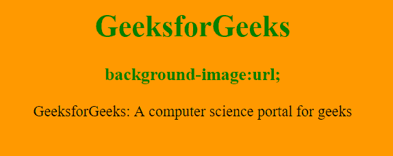
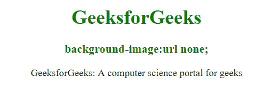
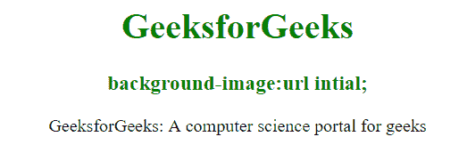

# CSS 背景图像属性

> 原文：[https://www.geeksforgeeks.org/css-background-image-property/](https://www.geeksforgeeks.org/css-background-image-property/)

`background-image` 属性用于为元素设置一个或多个背景图像。默认情况下，它将图像放在左上角。要指定两个或多个图像，我们需要为每个图像指定独立的 URL 并用逗号分隔。

**语法：**

```html
background-image: url('url')|none|initial|inherit;
```

**属性值：**

*   `url('url')`：指定图像的 URL。为了指定多个图像的 URL，请用逗号分隔这些 URL。
*   `none`：这是不能显示图像的默认情况。
*   `initial`：用于将属性设置为默认值。
*   `inherit`：它从其父元素继承属性。

`background-image` 属性也可用于以下值：

*   [`linear-gradient()`](https://www.geeksforgeeks.org/css-combine-background-image-with-gradient-overlay/)：用于设置自上而下定义至少 2 种颜色的线性渐变背景图像。
*   [`radial-gradient()`](https://www.geeksforgeeks.org/css-combine-background-image-with-gradient-overlay/)：用于设置从中心到边缘至少定义 2 种颜色的径向渐变背景图像。

我们将利用上述属性值，并通过示例来理解它们。

## `url('url')`

当背景图像有 URL 时。

**语法：**

```html
background-image: url('url')
```

**示例 1：** 本示例通过将 `url` 值设置为 URL 来说明 `background-image` 属性。

```html
<!DOCTYPE html>
<html>
<head>
    <title>background-image property</title>
    <style>
    body {
        background-image: url("https://media.geeksforgeeks.org/wp-content/uploads/rk.png");
    }

    h1, h3 {
        color: green;
    }

    body {
        text-align: center;
    }
    </style>
</head>

<body>
    <h1>GeeksforGeeks</h1>
    <h3>background-image:url;</h3>
    <div>
      GeeksforGeeks: A computer science portal for geeks
    </div>
</body>
</html>
```

**输出：**



## `none`

此属性用于设置无背景图像，不会显示任何内容，这是默认属性。

**语法：**

```html
background-image: url('url') none
```

**示例 2：** 该示例通过将 `url` 值设置为 `none` 来说明 `background-image` 属性。

```html
<!DOCTYPE html>
<html>
<head>
    <title>background-image property</title>
    <style>
    body {
        background-image: url("https://media.geeksforgeeks.org/wp-content/uploads/rk.png") none;
    }

    h1, h3 {
        color: green;
    }

    body {
        text-align: center;
    }
    </style>
</head>

<body>
    <h1>GeeksforGeeks</h1>
    <h3>background-image:url none;</h3>
    <div>
      GeeksforGeeks: A computer science portal for geeks
    </div>
</body>
</html>
```

**输出：**



## `initial`

将属性设置为默认值。

**语法：**

```html
background-image: url('url') initial;
```

**示例 3：** 该示例通过将 `url` 值设置为 `initial` 来说明 `background-image` 属性。

```html
<!DOCTYPE html>
<html>
<head>
    <title>CSS background-image property</title>
    <style>
    body {
        background-image: url("https://media.geeksforgeeks.org/wp-content/uploads/rk.png") initial;
    }

    h1, h3 {
        color: green;
    }

    body {
        text-align: center;
    }
    </style>
</head>

<body>
    <center>
        <h1>GeeksforGeeks</h1>
        <h3>CSS background-image:url initial;</h3>
   </center>
</body>
</html>
```

**输出：**



## 支持的浏览器

`background-image` 属性支持的浏览器如下：

*   谷歌 Chrome 1.0
*   微软 Edge 4.0
*   Firefox 1.0
*   Opera 3.5
*   Safari 1.0