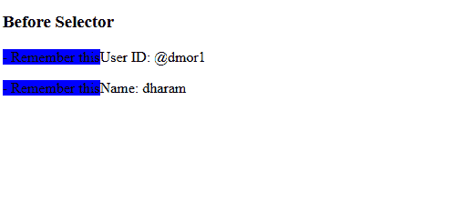

# CSS ::before 选择器

> 原文: [https://www.geeksforgeeks.org/css-before-selector/](https://www.geeksforgeeks.org/css-before-selector/)

[`::before`](https://www.geeksforgeeks.org/css-before-selector/) CSS [伪元素](https://www.geeksforgeeks.org/css-pseudo-elements/) 用于在其他元素的内容之前多次添加相同的内容。该选择器与 [`::after`](https://www.geeksforgeeks.org/css-after-selector/) 选择器相同。它有助于创建表示所选元素的第一个子元素的伪元素，通常用于使用 [`content`](https://www.geeksforgeeks.org/css-content-property/) 属性向元素添加装饰内容。它的默认值是 `inline`。

## 语法

```css
::before{
    content:
}
```

## 示例

下面的 HTML/CSS 代码展示了 `::before` 选择器的功能。

```html
<!DOCTYPE html>
<html>

<head>
    <style>
    p::before {
        content: " - Remember this";
        background-color: blue;
    }
    </style>
</head>

<body>
    <h3>Before Selector</h3>
    <p>User ID: @dmor1</p>
    <p>Name: dharam</p>
</body>

</html>
```

## 输出



## 支持的浏览器

*   `Google Chrome` 4.0
*   `Edge` 12.0
*   `Internet Explorer` 9.0
*   `Firefox` 3.5
*   `Safari` 3.1
*   `Opera` 7.0

## 注意

`Internet Explorer` 8 和 `Opera` 4-6 支持带单冒号 (`:before`)。