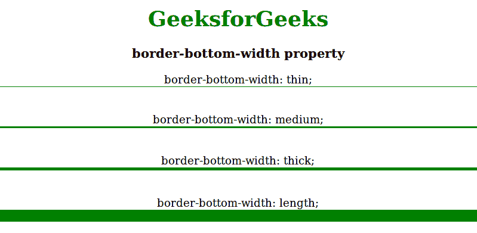

# CSS border-bottom-width 属性

> 原文：[https://www.geeksforgeeks.org/css-border-bottom-width-property/](https://www.geeksforgeeks.org/css-border-bottom-width-property/)

CSS 中的 `border-bottom-width` 属性用于设置元素底部边框的特定宽度。在使用 `border-bottom-width` 属性之前，元素应使用 `border-bottom-style` 或 `border-style` 属性。

## 语法

```html
border-bottom-width: length|thin|medium|thick|initial|inherit;
```

## 属性值

`border-bottom-width` 属性值如下：

*   `thin`：用于设置底部的薄边框。
*   `medium`：用于设置中等大小的下边框。这是默认值。
*   `thick`：用于设置粗底边框。
*   `length`：用于设置边框的宽度。它不取负值。

## 示例

```html
<!DOCTYPE html>
<html>
    <head>
        <title>
            border-bottom-width property
        </title>
        <style>
            #thin {
                border-color: green;
                border-bottom-style: solid;
                border-bottom-width: thin;
            }
            #medium {
                border-color: green;
                border-bottom-style: solid;
                border-bottom-width: medium;
            }
            #thick {
                border-color: green;
                border-bottom-style: solid;
                border-bottom-width:thick;
            }
            #length {
                border-color: green;
                border-bottom-style: solid;
                border-bottom-width: 20px;
            }
        </style>
    </head>
    <body style = "text-align:center">
        <h1 style = "color:green">GeeksforGeeks</h1>
        <h3>border-bottom-width property</h3>
        <div id="thin">
            border-bottom-width: thin;
        </div><br><br>
        <div id="medium">
            border-bottom-width: medium;
        </div><br><br>
        <div id="thick">
            border-bottom-width: thick;
        </div><br><br>
        <div id="length">
            border-bottom-width: length;
        </div>
    </body>
</html>
```

## 输出



## 支持的浏览器

`border-bottom-width` 属性支持的浏览器如下：

*   Google Chrome 1.0
*   Internet Explorer 4.0
*   Firefox 1.0
*   Opera 3.5
*   Safari 1.0