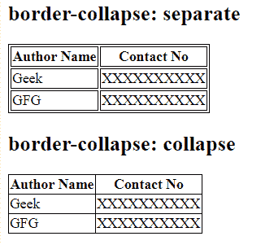
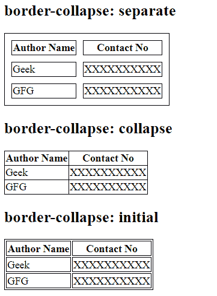

# CSS border-collapse 属性

> 原文：[https://www.geeksforgeeks.org/css-border-collapse-property/](https://www.geeksforgeeks.org/css-border-collapse-property/)

CSS 中的 `border-collapse` 属性用于设置表格内部单元格的边框，并告知这些单元格是否共享一个公共边框。

## 语法

```html
border-collapse: separate|collapse|initial|inherit;
```

## 默认值

其默认值是 `separate`。

## 属性值

*   `separate`：该属性用于设置单元格的分隔边框。
*   `collapse`：用于折叠相邻单元格，制作公共边框。
*   `initial`：用于将 `border-collapse` 属性设置为默认值。
*   `inherit`：当 `border-collapse` 属性从其父元素继承时使用。

## 例 1

### HTML

```html
<!DOCTYPE html>
<html>
    <head>
        <title>
            CSS border-collapse Property
        </title>

<!-- border-collapse CSS property -->
        <style>
            table, td, th {
                border: 1px solid black;
            }
            #separateTable {
                border-collapse: separate;
            }
            #collapseTable {
                border-collapse: collapse;
            }
        </style>
    </head>

<body>
        <h2>
            border-collapse: separate
        </h2>

<table id = "separateTable">
            <tr>
                <th>Author Name</th>
                <th>Contact No</th>
            </tr>
            <tr>
                <td>Geek</td>
                <td>XXXXXXXXXX</td>
            </tr>
            <tr>
                <td>GFG</td>
                <td>XXXXXXXXXX</td>
            </tr>
        </table>

<h2>
            border-collapse: collapse
        </h2>

<table id = "collapseTable">
            <tr>
                <th>Author Name</th>
                <th>Contact No</th>
            </tr>
            <tr>
                <td>Geek</td>
                <td>XXXXXXXXXX</td>
            </tr>
            <tr>
                <td>GFG</td>
                <td>XXXXXXXXXX</td>
            </tr>
        </table>
    </body>
</html>
```

**输出：**



## 例 2

### HTML

```html
<!DOCTYPE html>
<html>
    <head>
        <title>
            CSS border-collapse Property
        </title>

<style>
            table, td, th {
                border: 1px solid black;
            }

/* border spacing is used to specify the
            width between border and adjacent cells */
            #separateTable {
                border-collapse: separate;
                border-spacing: 10px;
            }
            #collapseTable {
                border-collapse: collapse;
                border-spacing: 10px;
            }
            #initialTable {
                border-collapse: initial;
            }
        </style>
    </head>

<body>
        <h2>
            border-collapse: separate
        </h2>

<table id = "separateTable">
            <tr>
                <th>Author Name</th>
                <th>Contact No</th>
            </tr>
            <tr>
                <td>Geek</td>
                <td>XXXXXXXXXX</td>
            </tr>
            <tr>
                <td>GFG</td>
                <td>XXXXXXXXXX</td>
            </tr>
        </table>

<h2>
            border-collapse: collapse
        </h2>

<!-- border spacing property has no
        effect on border-collapse property-->
        <table id="collapseTable">
            <tr>
                <th>Author Name</th>
                <th>Contact No</th>
            </tr>
            <tr>
                <td>Geek</td>
                <td>XXXXXXXXXX</td>
            </tr>
            <tr>
                <td>GFG</td>
                <td>XXXXXXXXXX</td>
            </tr>
        </table>

<h2>
            border-collapse: initial
        </h2>

<table id="initialTable">
            <tr>
                <th>Author Name</th>
                <th>Contact No</th>
            </tr>
            <tr>
                <td>Geek</td>
                <td>XXXXXXXXXX</td>
            </tr>
            <tr>
                <td>GFG</td>
                <td>XXXXXXXXXX</td>
            </tr>
        </table>
    </body>
</html>
```

**输出：**



## 支持的浏览器

支持的 `border-collapse` 属性的浏览器如下：

*   Google Chrome 1.0
*   Internet Explorer/Edge 5.0
*   Firefox 1.0
*   Opera 4.0
*   Apple Safari 1.2