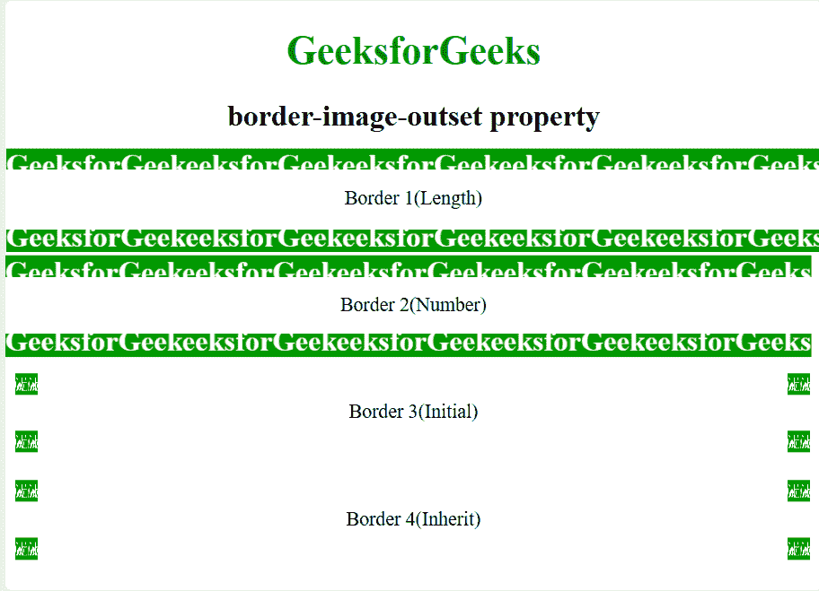

# CSS border-image-outset 属性

> 原文：[https://www.geeksforgeeks.org/css-border-image-outset-property/](https://www.geeksforgeeks.org/css-border-image-outset-property/)

`border-image-outset` 属性是一个简写属性，用于指定元素的[边框图像](https://www.geeksforgeeks.org/css-border-images/)放置在其框外的距离。

**注：** `border-image-outset` 对 `border-image-source` 指定的图片生效。

## 语法

```html
border-image-outset: value;
```

## 属性值

| 值 | 影响 |
| --- | --- |
| `length` | 将边界起点的大小指定为尺寸。 |
| `number` | 将边框的大小指定为相应边框宽度的倍数。 |
| `initial` | 将边框的大小指定为默认大小。 |
| `inherit` | 从其父元素继承值。 |

## 示例程序

```html
<!DOCTYPE html>
<html>
    <head>
        <style>
            body {
                text-align:center;
            }
            h1 {
                color:green;
            }
            .border1 {
                border: 10px solid transparent;
                padding: 15px;
                border-image-source: url(https://media.geeksforgeeks.org/wp-content/uploads/border1-2.png);
                border-image-repeat: round;
                border-image-width: 20px;
                border-image-slice: 30;
                border-image-outset: 10px 20px 12px 9px;
            }
            .border2 {
                border: 10px solid transparent;
                padding: 15px;
                border-image-source: url(https://media.geeksforgeeks.org/wp-content/uploads/border1-2.png);
                border-image-repeat: round;
                border-image-outset: 1;
                border-image-slice: 30;
                border-image-width: 20px;
            }
            .border3 {
                border: 10px solid transparent;
                padding: 15px;
                border-image-source: url(https://media.geeksforgeeks.org/wp-content/uploads/border1-2.png);
                border-image-repeat: round;
                border-image-outset: initial;
                border-image-width: 20px;
            }
            .border4 {
                border: 10px solid transparent;
                padding: 15px;
                border-image-source: url(https://media.geeksforgeeks.org/wp-content/uploads/border1-2.png);
                border-image-repeat: round;
                border-image-outset: inherit;
                border-image-width: 20px;
            }
            div {
                margin-top:20px;
            }
        </style>
    </head>
    <body>
        <h1>GeeksforGeeks</h1>
        <h2>border-image-outset property</h2>
        <div class = "border1">Border 1(Length)</div>
        <div class = "border2">Border 2(Number)</div>
        <div class = "border3">Border 3(Initial)</div>
        <div class = "border4">Border 4(Inherit)</div>
    </body>
</html>
```

## 输出



## 浏览器支持

由 `border-image-outset` 属性支持的浏览器如下：

*   Chrome - 15.0
*   Edge - 11.0
*   Firefox - 15.0
*   Opera - 15.0
*   Safari - 6.0