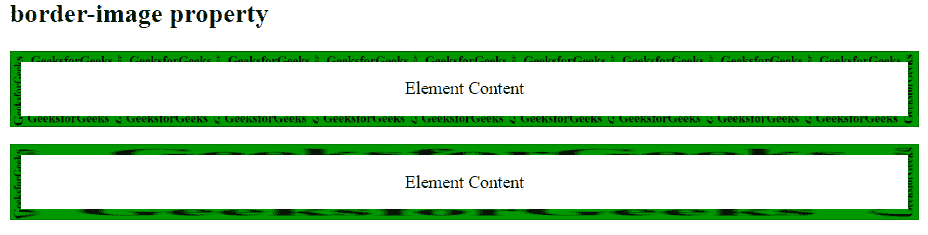
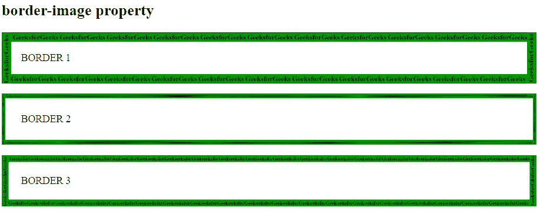

# CSS border-image 属性

> 原文: [https://www.geeksforgeeks.org/css-border-image-property/](https://www.geeksforgeeks.org/css-border-image-property/)

CSS 中的 `border-image` 属性用于设置元素的边框。

## 语法

```html
border-image: source slice width outset repeat|initial|inherit;
```

`border-image` 属性是下面列出的许多属性的组合:

*   `border-image-source`
*   `border-image-slice`
*   `border-image-width`
*   `border-image-outset`
*   `border-image-repeat`

## 属性值

*   **`border-image-source`**: 该属性用于设置边框图像的来源位置。
    **语法:**
    ```html
    border-image-source: url(image source location);
    ```

*   **`border-image-slice`**: `border-image-slice` 属性用于分割或切片由 `border-image-source` 属性指定的图像。
    `border-slice` 属性将给定图像划分为:
    *   9 个地区
    *   4 个角
    *   4 条边
    *   中部地区

    **语法:**
    ```html
    border-image-slice: value;
    ```

*   **`border-image-width`**: `border-image-width` 属性用于设置边框的宽度。
    **语法:**
    ```html
    border-image-width: value;
    ```

*   **`border-image-outset`**: `border-image-outset` 属性设置元素边框图像从其边框框开始的距离。
    **语法:**
    ```html
    border-image-outset: value;
    ```

*   **`border-image-repeat`**: `border-image-repeat` 属性定义如何调整源图像的边缘区域以适合元素边框图像的尺寸。
    **语法:**
    ```html
    border-image-repeat: value;
    ```

*   **`initial`**: 用于将 `border-image` 属性设置为默认值。
*   **`inherit`**: 用于从其父元素设置 `border-image` 属性。

## 例 1

```html
<!DOCTYPE html>
<html>
    <head>
        <title>
            CSS border-image Property
        </title>
        <style>
            #borderimg1 {
                border: 10px solid transparent;
                padding: 15px;
                -webkit-border-image: url('https://media.geeksforgeeks.org/wp-content/uploads/border2-2.png') 30 round;
                border-image: url('https://media.geeksforgeeks.org/wp-content/uploads/border2-2.png') 30 round;
                text-align:center;
            }
            #borderimg2 {
                border: 10px solid transparent;
                padding: 15px;
                -webkit-border-image: url('https://media.geeksforgeeks.org/wp-content/uploads/border2-2.png') 30 stretch;
                border-image: url('https://media.geeksforgeeks.org/wp-content/uploads/border2-2.png') 30 stretch;
                text-align:center;
            }
        </style>
    </head>
    <body>
        <h2>border-image property</h2>
        <p id = "borderimg1">
            Element Content
        </p>
        <p id = "borderimg2">
            Element Content
        </p>
    </body>
</html>
```

**输出:**


## 例 2

```html
<!DOCTYPE html>
<html>
    <head>
        <title>
            CSS border-image Property
        </title>
        <style>
            #borderimg1 {
                border: 15px solid transparent;
                padding: 15px;
                border-image:url('https://media.geeksforgeeks.org/wp-content/uploads/border2-2.png') 50 round;
            }
            #borderimg2 {
                border: 15px solid transparent;
                padding: 15px;
                border-image:url('https://media.geeksforgeeks.org/wp-content/uploads/border2-2.png') 40% stretch;
            }
            #borderimg3 {
                border: 15px solid transparent;
                padding: 15px;
                border-image:url('https://media.geeksforgeeks.org/wp-content/uploads/border2-2.png') 70 round;
            }
        </style>
    </head>
    <body>
        <h2>border-image property</h2>
        <p id = "borderimg1">BORDER 1</p>
        <p id = "borderimg2">BORDER 2</p>
        <p id = "borderimg3">BORDER 3</p>
    </body>
</html>
```

**输出:**


## 支持的浏览器

`border-image` 属性支持的浏览器如下:

*   Google Chrome 16.0，4.0 -webkit-
*   Internet Explorer 11.0
*   Firefox 15.0，3.5 -moz-
*   Opera 15.0，11.0 -o-
*   Safari 6.0，3.1 -webkit-