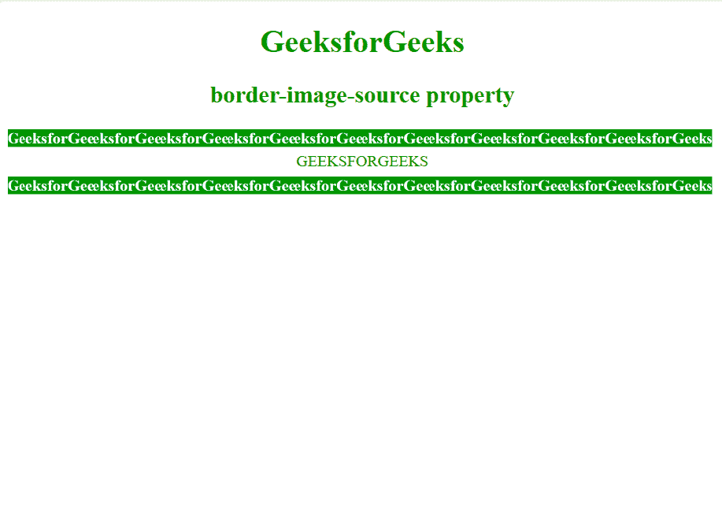

# CSS border-image-source属性

> 原文：`https://www.geeksforgeeks.org/css-border-image-source-property/`

`border-image-source`属性用于指定要设置为元素边框的图像源。

**语法：**

```html
border-image-source: url(image-path.png) | none | initial | inherit;
```

**注意：** 如果值为`none`，将使用边框样式。借助[`border-image-slice`](https://www.geeksforgeeks.org/css-border-image-slice-property/)属性，可以将指定的图像划分为多个区域。

**默认值：** 默认值为`none`。

**取值：**

*   `none`：未指定图像。
*   `image`：用于指定要用作元素边框的图像的路径。
*   `initial`：用默认值初始化属性。
*   `inherit`：从父元素取值。

**示例：**

```html
<!DOCTYPE html>
<html>
    <head>
        <title>
            CSS | border-image-source Property
        </title>
        <style>
            body {
                text-align:center;
                color:green;
            }

            .border1 {
                border: 10px solid transparent;
                padding: 15px;
                border-image-source: url(
                    https://media.geeksforgeeks.org/wp-content/uploads/border1-2.png);
                border-image-repeat: round;
                border-image-slice: 50;
                border-image-width: 20px;
            }
        </style>
    </head>
    <body>
        <h1>GeeksforGeeks</h1>
        <h2>border-image-source property</h2>
        <div class = "border1">GEEKSFORGEEKS</div>
    </body>
</html>
```

**输出：**



**支持的浏览器：** CSS `border-image-source`属性支持的浏览器如下：

*   Chrome 15.0
*   Edge 11.0
*   Firefox 15.0
*   Opera 15.0
*   Safari 6.0