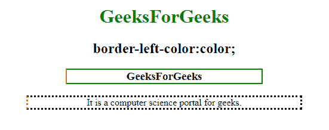
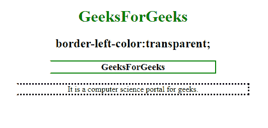
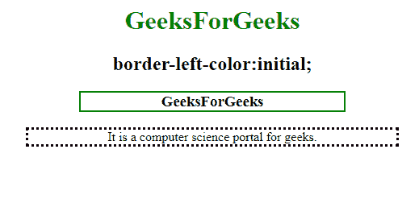

# CSS border-left-color 属性

> 原文：[https://www.geeksforgeeks.org/css-border-left-color-property/](https://www.geeksforgeeks.org/css-border-left-color-property/)

`border-left-color` 属性用于设置元素中左边框的颜色。必须在 `border-left-color` 属性之前声明 `border-style` 或 `border-left-style` 属性。

## 语法

```html
border-left-color: color|transparent|initial|inherit;
```

## 默认值

元素的当前颜色。

## 属性值

### color

设置元素左边框的颜色。

**语法：**

```html
border-left-color: color
```

**示例：**

```html
<!DOCTYPE html>
<html>
<head>
    <title>
        CSS | border-left-color Property
    </title>
    <style>
        h1 {
            color: green;
        }

        h3 {
            border: 2px solid green;
            border-left-color: red;
            width: 50%;
        }
    </style>
</head>
<body>
    <center>
        <h1>GeeksForGeeks</h1>
        <h2>border-left-color:color;</h2>
        <h3>GeeksForGeeks</h3>
        <!-- Sets the color-->
        <p style="border-style:dotted;
                  border-left-color:coral;
                  width:70%;">
          It is a computer science portal for geeks.
        </p>
    </center>
</body>
</html>
```

**输出：**



### transparent

**语法：**

```html
border-left-color:transparent;
```

**示例：**

```html
<!DOCTYPE html>
<html>
<head>
    <title>
        CSS | border-left-color Property
    </title>
    <style>
        h1 {
            color: green;
        }

        h3 {
            border: 2px solid green;
            border-left-color: transparent;
            width: 50%;
        }
    </style>
</head>
<body>
    <center>
        <h1>GeeksForGeeks</h1>
        <h2>border-left-color:transparent</h2>
        <h3>GeeksForGeeks</h3>
        <!-- Sets the color to transparent-->
        <p style="border-style:dotted;
                  border-left-color:transparent;
                  width:70%;">
          It is a computer science portal for geeks.
        </p>
    </center>
</body>
</html>
```

**输出：**



### initial

**语法：**

```html
border-left-color:initial;
```

**示例：**

```html
<!DOCTYPE html>
<html>
<head>
    <title>
        CSS | border-left-color Property
    </title>
    <style>
        h1 {
            color: green;
        }

        h3 {
            border: 2px solid green;
            border-left-color: initial;
            width: 50%;
        }
    </style>
</head>
<body>
    <center>
        <h1>GeeksForGeeks</h1>
        <h2>border-left-color:initial;</h2>
        <h3>GeeksForGeeks</h3>
        <!-- Sets the color to its default value-->
        <p style="border-style:dotted;
                  border-left-color:initial;
                  width:70%;">
          It is a computer science portal for geeks.
        </p>
    </center>
</body>
</html>
```

**输出：**



## 支持的浏览器

CSS `border-left-color` 属性支持的浏览器如下：

*   Google Chrome 1.0
*   Internet Explorer 4.0
*   Firefox 1.0
*   Opera 3.5
*   Safari 1.0