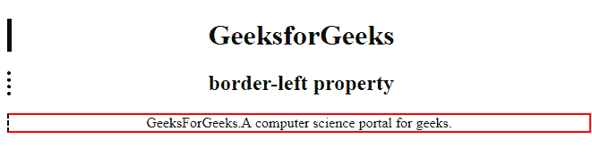

# CSS `border-left` 属性

> 原文: [https://www.geeksforgeeks.org/css-border-left-property/](https://www.geeksforgeeks.org/css-border-left-property/)

CSS 中的 `border-left` 属性用于设置一行中所有的左下属性。它用于设置左边框的宽度、样式和颜色。

**语法:**

```html
border-left: border-width border-style border-color|initial|inherit;
```

`border-left` 是设置以下属性值的简写。

**属性值:**

*   **`border-width`**: 用于设置边框的宽度。
*   **`border-style`**: 用于设置边框的样式。它的默认值是 `none`。
*   **`border-color`**: 用于设置边框的颜色。
*   **`initial`**: 该属性用于将边框底部设置为默认值。
*   **`inherit`**: 此属性从其父级继承。

**示例-1:**

## 超文本标记语言

```html
<!DOCTYPE html>
<html>

<head>
    <title>border-left property</title>

    <!-- border-left CSS property -->
    <style>
        h1 {
            border-left: 5px solid green;
        }

        h2 {
            border-left: 4px dotted black;
        }

        div {
            border: 2px solid red;
            border-left: 2px dashed black;
        }
    </style>
</head>

<body style="text-align:center">

    <h1>GeeksforGeeks</h1>
    <h2>border-left property</h2>
    <div>
        GeeksForGeeks.
        A computer science portal for geeks.
    </div>
</body>

</html>
```

**输出:**



**支持的浏览器:**
`border-left` 属性支持的浏览器如下:

*   谷歌 Chrome 1.0
*   Internet Explorer 4.0
*   Firefox 1.0
*   Opera 1.0
*   Safari 3.5