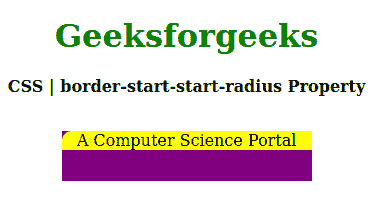
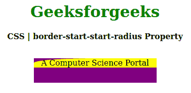

# CSS `border-start-start-radius` 属性

> 原文：[https://www.geeksforgeeks.org/css-border-start-start-radius-property/](https://www.geeksforgeeks.org/css-border-start-start-radius-property/)

CSS 中的 `border-start-start-radius` 属性用于指定块开始边界（左上角）的逻辑边界半径。它可以通过元素的 `writing-mode`、`direction` 和 `text-orientation` 进行调整。

## 语法

```html
border-start-start-radius: length | percentage;
```

## 属性值

*   `length`：该属性以特定单位保存边界半径长度。
*   `percentage`：此属性保存与父元素相比的百分比值。

以下示例说明了 CSS 中的 `border-start-start-radius` 属性：

### 例 1

```html
<!DOCTYPE html>
<html>

<head>
    <title>CSS | border-start-start-radius Property</title>
    <style>
        h1 {
            color: green;
        }

        div {
            background-color: purple;
            width: 250px;
            height: 50px;
        }
        .one {
            background-color: yellow;
            border-start-start-radius: 10px;
        }
    </style>
</head>

<body>
    <center>
        <h1>Geeksforgeeks</h1>
        <b>CSS | border-start-start-radius Property</b>
        <br><br>
        <div>
            <p class="one">A Computer Science Portal</p>
        </div>
    </center>
</body>

</html>
```

**输出：**



### 例 2

```html
<!DOCTYPE html>
<html>

<head>
    <title>CSS | border-start-start-radius Property</title>
    <style>
        h1 {
            color: green;
        }

        div {
            background-color: purple;
            width: 250px;
            height: 50px;
        }
        .one {
            background-color: yellow;
            border-start-start-radius: 50%;
        }
    </style>
</head>

<body>
    <center>
        <h1>Geeksforgeeks</h1>
        <b>CSS | border-start-start-radius Property</b>
        <br><br>
        <div>
            <p class="one">A Computer Science Portal</p>
        </div>
    </center>
</body>

</html>
```

**输出：**



## 支持的浏览器

`border-start-start-radius` 属性支持的浏览器如下：

*   Firefox