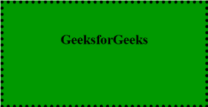
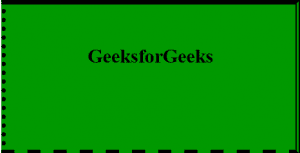

# CSS 边框样式属性

> 原文: [https://www.geeksforgeeks.org/css-border-style-property/](https://www.geeksforgeeks.org/css-border-style-property/)

`border-style` CSS 属性是一个简写属性，用于设置元素边框的所有四条边的线条样式。

**注:** `border-style` 属性一次可以取**一个**到**四个**值。

**语法:**

```html
border-style: value;
```

**默认值**

*   `none`

**属性值:**

*   `none`: 不创建边框，保持空白。
*   `hidden`: 就像 `none` 一样，不显示任何边框，除非添加背景图片，那么边框顶宽将设置为 0，与用户定义的值无关。
*   `dotted`: 一系列的点显示成一条线作为边框。
*   `solid`: 单个实线加粗线作为边框。
*   `dashed`: 一系列方形虚线作为边框。
*   `double`: 相互平行放置的两条线作为边框。
*   `groove`: 显示一个三维凹槽边框，其效果取决于边框颜色值。
*   `ridge`: 显示一个三维脊状边框，其效果取决于边框颜色值。
*   `inset`: 显示一个三维嵌入边框，其效果取决于边框颜色值。
*   `outset`: 显示一个 3D 开始边框，其效果取决于边框颜色值。

`border-style` 属性是以下 CSS 属性的简写:

*   [`border-bottom-style`](https://www.geeksforgeeks.org/css-border-bottom-style-property/): 用于设置元素底部边框的样式。
*   [`border-top-style`](https://www.geeksforgeeks.org/css-border-top-style-property/): 用于指定顶部边框的样式。
*   [`border-left-style`](https://www.geeksforgeeks.org/css-border-left-style-property/): 用于设置元素左边框的样式。
*   [`border-right-style`](https://www.geeksforgeeks.org/css-border-right-style-property/): 用于改变元素边框右线段的外观。
*   [`border-block-style`](https://www.geeksforgeeks.org/css-border-block-style-property/): 用于在样式表中的单一位置设置单个逻辑块边框样式属性值。
*   [`border-inline-style`](https://www.geeksforgeeks.org/css-border-inline-style-property/): 它是 CSS 中的一个内置属性，用于在样式表的单个位置设置单个逻辑块的边框内联样式属性值。

`border-style` 属性可以通过使用一个、两个、三个或四个值来定义，如下所示:

*   如果分配了单个值，它将为所有 4 条边设置样式。
*   如果分配了两个值，第一个样式将设置为顶部和底部，第二个样式将设置为左侧和右侧。
*   如果分配了三个值，第一个样式设置为顶部，第二个设置为左右，第三个设置为底部。
*   如果分配了四个样式值，样式将设置为顶部、右侧、底部和左侧，这遵循顺时针顺序。

下面的示例说明了 `border-style` 属性的使用。

**示例 1:** 本示例对所有边框仅使用一个值。

### HTML

```html
<!DOCTYPE html>
<html>
<head>
    <title>Dotted Borders</title>
    <style>
    .GFG {
        border-style: dotted;
        border-width: 6px;
        background: #009900;
        padding: 30px;
        text-align: center;
        width: 300px;
        height: 120px;
    }
    </style>
</head>

<body>
    <div class="GFG">
        <h2>GeeksforGeeks</h2> </div>
</body>
</html>
```

**输出:**



**示例 2:** 本示例使用多个值作为边框。

### HTML

```html
<!DOCTYPE html>
<html>
<head>
    <title>Dotted Borders</title>
    <style>
    .GFG {
        border-style: solid double dashed dotted;
        border-width: 6px;
        background: #009900;
        padding: 30px;
        text-align: center;
        width: 300px;
        height: 120px;
    }
    </style>
</head>

<body>
    <div class="GFG">
        <h2>GeeksforGeeks</h2> </div>
</body>
</html>
```

**输出:**



**支持的浏览器:** `border-style` 属性支持的浏览器如下:

*   Chrome 1.0
*   Edge 12.0
*   IE 4.0
*   Firefox 1.0
*   Safari 1.0
*   Opera 3.5