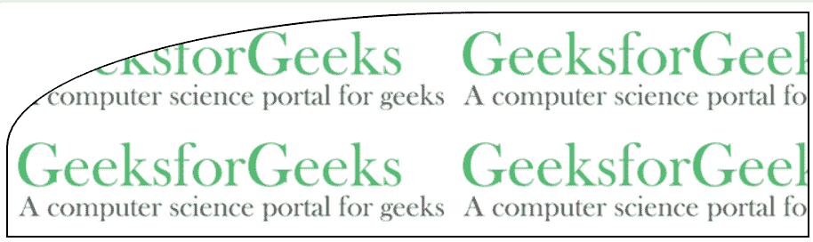

# CSS border-top-left-radius 属性

> 原文：[https://www.geeksforgeeks.org/css-border-top-left-radius-property/](https://www.geeksforgeeks.org/css-border-top-left-radius-property/)

在 CSS 中，`border-top-left-radius` 属性用于指定元素左上角的半径。

**注意：** 根据属性的值，边框圆角可以是圆形或椭圆形。如果值为 `0`，则边框没有变化，仍然是方形边框。

**语法：**

```html
border-top-left-radius: value;
```

**默认值：** 有默认值即 `0`。

**属性值：**

| value | functionality |
| --- | --- |
| `length` | Used to specify the radius in numerical form. |
| `percentage` | Used to specify the radius as a percentage. |
| `initial` | Used to initialize the property to its initial value. |
| `inherit` | Used to inherit values from its parent element. |

### 例-1：使用 `length`

```html
<!DOCTYPE html>
<html>

<head>
    <title>
        CSS | border-top-left-radius Property
    </title>
    <style>
        .gfg {
            border: 2px solid black;
            background: url(https://media.geeksforgeeks.org/wp-content/uploads/20190405121202/GfGLH.png);
            padding: 100px;
            border-top-left-radius: 75px;
        }
    </style>
</head>

<body>
    <div class="gfg">
    </div>
</body>

</html>
```

**输出：**


### 例-2：使用 `percentage`

```html
<!DOCTYPE html>
<html>

<head>
    <title>
        CSS | border-top-left-radius Property
    </title>
    <style>
        .gfg {
            border: 2px solid black;
            background: url(https://media.geeksforgeeks.org/wp-content/uploads/20190405121202/GfGLH.png);
            padding: 100px;
            border-top-left-radius: 60%;
        }
    </style>
</head>

<body>
    <div class="gfg">
    </div>
</body>

</html>
```

**输出：**



### 浏览器支持

浏览器支持 `CSS border-top-left-radius` 属性如下：

*   `Chrome`: 5.0，4.0 -webkit-
*   `Edge`: 9.0
*   `Firefox`: 4.0，3.0 -moz-
*   `Opera`: 10.5
*   `Safari`: 5.0，3.1 -webkit-