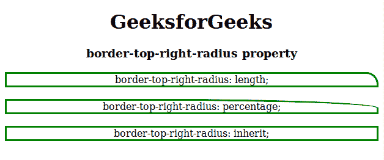

# CSS border-top-right-radius 属性

> 原文：[https://www.geeksforgeeks.org/css-border-top-right-radius-property/](https://www.geeksforgeeks.org/css-border-top-right-radius-property/)

CSS 中的 `border-top-right-radius` 属性用于定义给定元素边框右上角的半径。右上角的边框半径用于在容器的右上角绘制圆角。`border-radius` 用于一次性设置半径值相同的容器所有半径角，而 `border-top-right-radius` 专门设置右上角边框。

### 语法

```html
border-top-right-radius: length | [value%] | initial | inherit;
```

### 默认值

有默认值即 `0`。

### 属性值

`border-top-right-radius` 属性值如下：

*   **length**：用于在 `px`、`em` 等中指定固定长度的右上角半径。默认值为 `0`。
*   **百分比%**：用于以百分比的形式指定边框右上角的半径。
*   **initial**：用于将 `border-top-right-radius` 属性设置为默认值。
*   **inherit**：该属性从其父元素继承而来。

### 示例

```html
<!DOCTYPE html>
<html>
    <head>
        <title>
            border-top-right-radius property
        </title>

        <style>
            #length {
                border-color: green;
                border-style: solid;
                border-top-right-radius: 20px;
            }
            #percentage {
                border-color: green;
                border-style: solid;
                border-top-right-radius:59%;
            }
            #inherit {
                border-color: green;
                border-style: solid;
                border-top-right-radius: inherit;
            }
        </style>
    </head>

    <body style = "text-align:center">

        <h1>GeeksforGeeks</h1>
        <h3>border-top-right-radius property</h3>

        <div id="length">
            border-top-right-radius: length;
        </div><br>

        <div id="percentage">
            border-top-right-radius: percentage;
        </div><br>

        <div id="inherit">
            border-top-right-radius: inherit;
        </div>
    </body>
</html>
```

### 输出



### 支持的浏览器

支持 `border-top-right-radius` 属性的浏览器如下：

*   Google Chrome 5.0，4.0-webkit-
*   Internet Explorer 9.0
*   Firefox 4.0，3.0-moz-
*   Safari 5.0，3.1-webkit-
*   Opera 10.5