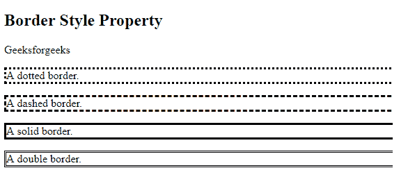
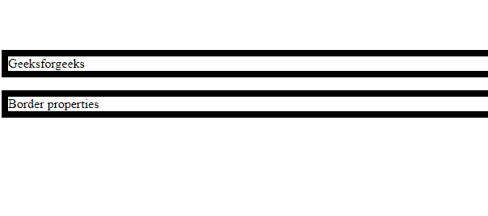
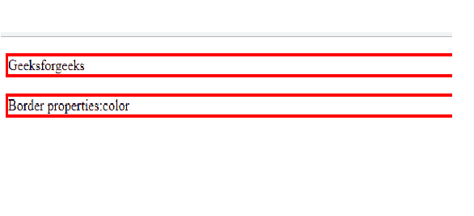
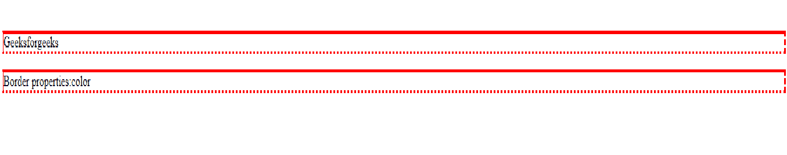
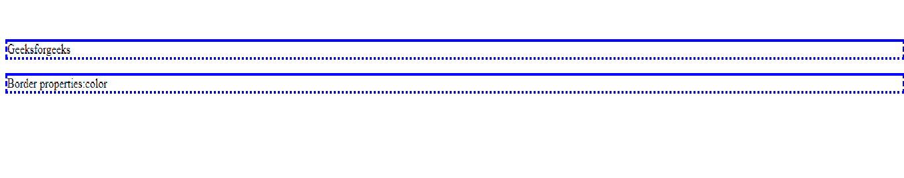
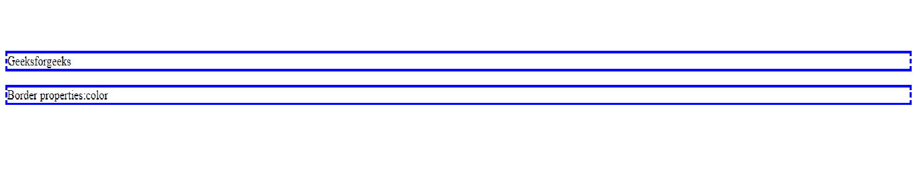
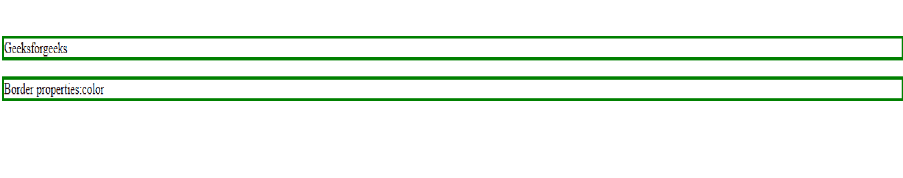

# CSS 边框

> 原文: [https://www.geeksforgeeks.org/css-borders/](https://www.geeksforgeeks.org/css-borders/)

CSS 边框属性允许我们设置边框的样式、颜色和宽度。

**注意:** 可以为所有不同的边框设置不同的属性，即上边框、右边框、下边框和左边框。

## CSS 边框属性

### 1. 边框样式

`border-style` 属性指定边框的类型。如果不设置边框样式，其他任何边框属性都不起作用。

**以下是边框类型:**
* `dotted` – 定义虚线边框
* `dashed` – 定义虚线边框
* `solid` – 定义实心边框
* `double` – 定义双边框
* `groove` – 定义三维凹槽边框。
* `ridge` – 定义三维脊状边界。
* `inset` – 定义三维插图边框。
* `outset` – 定义 3D 开头边框。
* `none` – 定义无边框
* `hidden` – 定义隐藏边框

**示例:**

```html
<!DOCTYPE html>
<html>
<head>
    <style>
        p.dotted {
            border-style: dotted;
        }
        p.dashed {
            border-style: dashed;
        }
        p.solid {
            border-style: solid;
        }
        p.double {
            border-style: double;
        }
    </style>
</head>
<body>
    <h2>The border-style Property</h2>
    <p>Geeksforgeeks</p>
    <p class="dotted">A dotted border.</p>
    <p class="dashed">A dashed border.</p>
    <p class="solid">A solid border.</p>
    <p class="double">A double border.</p>
</body>
</html>
```

**输出:**



### 2. 边框宽度

`border-width` 设置边框的宽度。边框的宽度可以是 `px`、`pt`、`cm`，也可以是 `thin`、`medium`、`thick`。

**示例:**

```html
<!DOCTYPE html>
<html>
<head>
    <style>
        p {
            border-style: solid;
            border-width: 8px;
        }
    </style>
</head>
<body>
    <p>Geeksforgeeks</p>
    <p>Border properties</p>
</body>
</html>
```

**输出:**



### 3. 边框颜色

`border-color` 属性用于设置边框的颜色。可以使用颜色名称、十六进制值或 RGB 值来设置颜色。如果未指定颜色，边框将继承元素本身的颜色。

**示例:**

```html
<!DOCTYPE html>
<html>
<head>
    <style>
        p {
            border-style: solid;
            border-color: red;
        }
    </style>
</head>
<body>
    <p>Geeksforgeeks</p>
    <p>Border properties: color</p>
</body>
</html>
```

**输出:**



### 4. 边框单边

单边可以设置不同的属性。

**语法:** 如果边框属性有 4 个值，那么：

```html
border-style: solid dashed dotted double
Solid: top border
Dashed: right border
Dotted: bottom border
Double: left border
```

**示例:**

```html
<!DOCTYPE html>
<html>
<head>
    <style>
        p {
            border-style: solid dashed dotted double;
            border-color: red;
        }
    </style>
</head>
<body>
    <p>Geeksforgeeks</p>
    <p>Border properties: color</p>
</body>
</html>
```

**输出:**



**语法:** 如果边框属性有 3 个值，则：

```html
border-style: solid dotted double
Solid: top border
Dotted: Left and right border
Double: bottom border
```

**示例:**

```html
<!DOCTYPE html>
<html>
<head>
    <style>
        p {
            border-style: solid dashed dotted;
            border-color: blue;
        }
    </style>
</head>
<body>
    <p>Geeksforgeeks</p>
    <p>Border properties: color</p>
</body>
</html>
```

**输出:**



**语法:** 如果边框属性有 2 个值：

```html
border-style: solid dotted
Solid: top and bottom border
Dotted: right and left border
```

**示例:**

```html
<!DOCTYPE html>
<html>
<head>
    <style>
        p {
            border-style: solid dashed;
            border-color: blue;
        }
    </style>
</head>
<body>
    <p>Geeksforgeeks</p>
    <p>Border properties: color</p>
</body>
</html>
```

**输出:**



**语法:** 如果边框属性有 1 个值：

```html
border-style: dotted
Dotted: top, bottom, left and right border
```

**示例:**

```html
<!DOCTYPE html>
<html>
<head>
    <style>
        p {
            border-style: solid;
            border-color: green;
        }
    </style>
</head>
<body>
    <p>Geeksforgeeks</p>
    <p>Border properties: color</p>
</body>
</html>
```

**输出:**



**支持的浏览器:**

*   Google Chrome
*   Microsoft Edge
*   Firefox
*   Opera
*   Safari