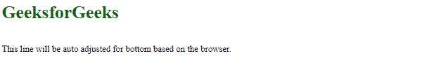
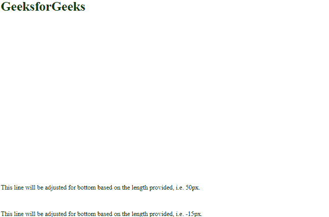
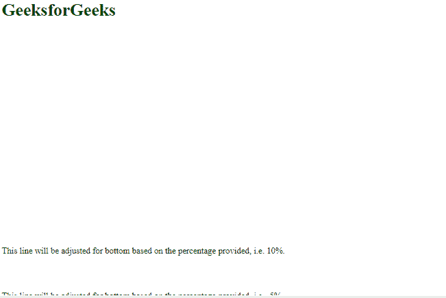
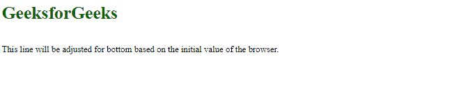
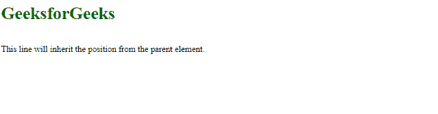

# CSS 底部属性

> 原文: [https://www.geeksforgeeks.org/css-bottom-property/](https://www.geeksforgeeks.org/css-bottom-property/)

`bottom` CSS 属性允许改变元素的垂直位置。`bottom` 属性用于设置从视口底部开始的元素位置值。

*   如果 `position` 值是 `fixed` 或 `absolute`，则元素相对于其父元素或包含它的块的底部边缘调整其底部边缘。
*   如果 `position` 值是 `relative`，那么元素相对于它自己的当前底边定位。
*   如果 `position` 值是 `sticky`，那么当元素在视口内时，元素调整相对位置，它的位置将是固定的，它在视口外。
*   如果 `position` 值是 `static`，那么由于 `bottom` 属性，元素没有任何影响。

## 语法

```html
bottom: auto| length| %| initial| inherit;
```

## 属性值

下面的例子很好地描述了所有的属性。

### `auto`

这是 `bottom` 属性的默认值。它基于浏览器设置 `bottom` 属性，浏览器将决定底边位置。

**语法:**

```html
bottom: auto;
```

**示例:** 此示例说明了 `bottom` 属性的使用，该属性的值设置为 `auto`。

#### HTML

```html
<html>
<head>
    <title> Bottom Property</title>
</head>

<body>
    <h1 style="color:darkgreen;">GeeksforGeeks</h1>
     <p style="position: fixed; 
              bottom: auto;"> 
      This line will be auto adjusted for bottom based on the browser. 
     </p>

</body>
</html>
```

**输出:**



### `length`

以像素为单位设置底边位置，厘米也允许负值。

**语法:**

```html
bottom: 5px;
```

**示例:** 此示例说明了 `bottom` 属性的使用，其中属性值被指定为 `px`。

#### HTML

```html
<html>
<head>
    <title> Bottom Property</title>
</head>

<body>
    <h1 style="color:darkgreen;">GeeksforGeeks</h1>
    <p style="position: fixed; 
              bottom: 50px;"> 
     This line will be adjusted for bottom based 
     on the length provided, i.e. 50px. 
    </p>

    <p style="position: fixed; 
              bottom: -15px;"> 
     This line will be adjusted for bottom based 
     on the length provided, i.e. -15px.
    </p>

</body>
</html>
```

**输出:**



### `%`

设置包含元素的底边位置，单位为 `%`。它接受负值。

**语法:**

```html
bottom: 10%;
```

**示例:** 此示例说明了 `bottom` 属性的使用，该属性的值被指定为百分比。

#### HTML

```html
<html>
<head>
    <title> Bottom Property</title>
</head>

<body>
    <h1 style="color:darkgreen;">GeeksforGeeks</h1>
    <p style="position: 
              fixed; bottom: 10%;"> 
    This line will be adjusted for bottom based 
    on the percentage provided, i.e. 10%.
    </p>

    <p style="position: 
              fixed; bottom: -5%;"> 
    This line will be adjusted for bottom based 
    on the percentage provided, i.e. -5%.
    </p>

</body>
</html>
```

**输出:**



### `initial`

用于将元素的 CSS 属性设置为默认值。`initial` 关键字可以用于任何 CSS 属性和任何 HTML 元素。

**语法:**

```html
bottom: initial;
```

**示例:** 此示例说明了 `bottom` 属性的使用，该属性的值设置为默认值。

#### HTML

```html
<html>
<head>
    <title> Bottom </title>
</head>

<body>
    <h1 style="color:darkgreen;">GeeksforGeeks</h1>
    <p style="position: fixed;
              bottom: initial;"> 
     This line will be adjusted for bottom based 
     on the initial value of the browser. 
    </p>

</body>
</html>
```

**输出:**



### `inherit`

用于从元素的父元素属性值继承元素的属性。`inherit` 关键字可用于继承任何 CSS 属性和任何 HTML 元素。

**语法:**

```html
bottom: inherit;
```

**示例:** 此示例说明了其值被设置为 `inherit` 的 `bottom` 属性的使用。

#### HTML

```html
<html>
<head>
    <title> Bottom </title>
</head>

<body>
    <h1 style="color:darkgreen;">GeeksforGeeks</h1>
    <p style="position: fixed; 
              bottom: inherit;"> 
     This line will inherit the position from the parent element. 
    </p>

</body>
</html>
```

**输出:**



## 支持的浏览器

*   谷歌 Chrome 1.0
*   Internet Explorer 5.0
*   微软边缘 12.0
*   Firefox 1.0
*   Opera 6.0
*   Safari 1.0