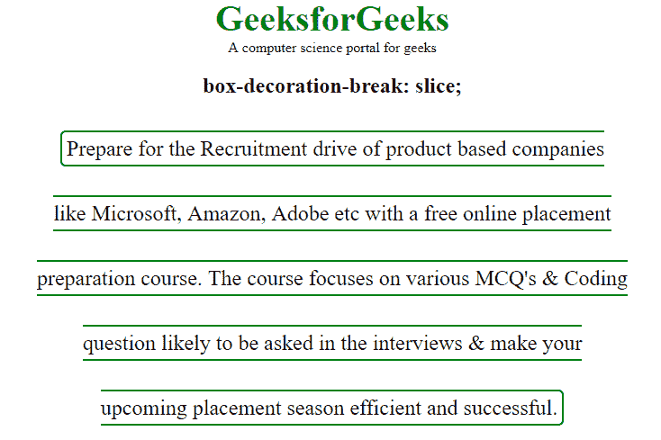
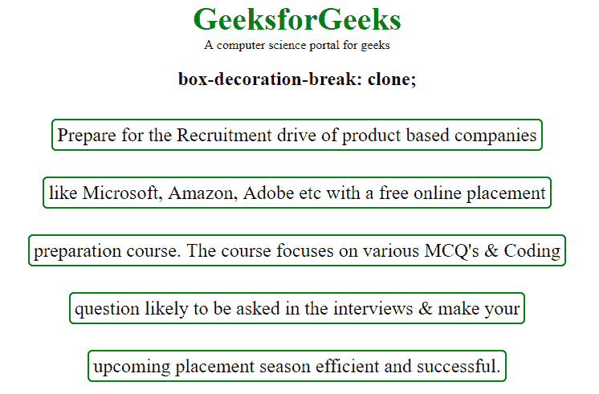
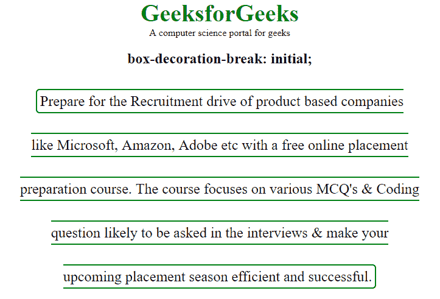

# CSS `box-decoration-break` 属性

> 原文: [https://www.geeksforgeeks.org/css-box-decoration-break-property/](https://www.geeksforgeeks.org/css-box-decoration-break-property/)

`box-decoration-break` 属性用于控制元素框在分片（例如跨行、跨列或跨页）后的装饰效果。它定义了当元素的框被分成独立的部分时，元素的背景、填充、边框、边距和剪辑路径将如何应用。

**默认值:**

*   `slice`

**语法:**

```html
box-decoration-break: slice|clone|initial|inherit;
```

**属性值:**

`slice`: 该属性值将元素片段的边缘作为一个整体断开。

*   **语法:**

```html
box-decoration-break: slice;
```

*   **示例:**

```html
<!DOCTYPE html>
<html>
    <head>
        <title>box-decoration-break property</title>
        <style>
            body {
               text-align:center;
               width:80%;
            }
            span {
                border: 2px solid green;
                padding: 5px;
                border-radius: 6px;
                font-size: 24px;
                line-height: 3;
            }
            span.geek{
                -webkit-box-decoration-break: slice;
                -o-box-decoration-break: slice;
                box-decoration-break: slice;
            }
            .gfg {
                font-size: 40px;
                color: green;
                font-weight: bold;
            }
        </style>
    </head>
    <body>
        <div class = "gfg">GeeksforGeeks</div>
        <div class = "geeks">
          A computer science portal for geeks
        </div>
        <h2>box-decoration-break: slice;</h2>
        <span class="geek">
            Prepare for the Recruitment drive
            of product based companies<br>
            like Microsoft, Amazon, Adobe etc
            with a free online placement<br>
            preparation course. The course focuses
            on various MCQ's & Coding<br>
            question likely to be asked in the
            interviews & make your<br>
            upcoming placement season efficient
            and successful.
        </span>
    </body>
</html>
```

*   **输出:**



`clone`: 它用于修饰元素的每个片段，就好像片段是完整的、独立的元素。边框环绕元素每个片段的四条边，每个片段的背景被完全重绘。

*   **语法:**

```html
box-decoration-break: clone;
```

*   **示例:**

```html
<!DOCTYPE html>
<html>
    <head>
        <title>box-decoration-break property</title>
        <style>
            body {
               text-align:center;
               width:80%;
            }
            span {
                border: 2px solid green;
                padding: 5px;
                border-radius: 6px;
                font-size: 24px;
                line-height: 3;
            }
            span.geek{
                -webkit-box-decoration-break: clone;
                -o-box-decoration-break: clone;
                box-decoration-break: clone;
            }
            .gfg {
                font-size: 40px;
                color: green;
                font-weight: bold;
            }
        </style>
    </head>
    <body>
        <div class = "gfg">GeeksforGeeks</div>
        <div class = "geeks">
            A computer science portal for geeks
        </div>
        <h2>box-decoration-break: clone;</h2>
        <span class="geek">
            Prepare for the Recruitment drive
            of product based companies<br>
            like Microsoft, Amazon, Adobe etc
            with a free online placement<br>
            preparation course. The course focuses
            on various MCQ's & Coding<br>
            question likely to be asked in the
            interviews & make your<br>
            upcoming placement season efficient
            and successful.
        </span>
    </body>
</html>
```

*   **输出:**



`initial`: 将属性设置为默认值。

*   **语法:**

```html
box-decoration-break: initial;
```

*   **示例:**

```html
<!DOCTYPE html>
<html>
    <head>
        <title>box-decoration-break property</title>
        <style>
            body {
               text-align:center;
               width:80%;
            }
            span {
                border: 2px solid green;
                padding: 5px;
                border-radius: 6px;
                font-size: 24px;
                line-height: 3;
            }
            span.geek{
                -webkit-box-decoration-break: initial;
                -o-box-decoration-break: initial;
                box-decoration-break: initial;
            }
            .gfg {
                font-size: 40px;
                color: green;
                font-weight: bold;
            }
        </style>
    </head>
    <body>
        <div class = "gfg">GeeksforGeeks</div>
        <div class = "geeks">
            A computer science portal for geeks
        </div>
        <h2>box-decoration-break: initial;</h2>
        <span class="geek">
            Prepare for the Recruitment drive
            of product based companies<br>
            like Microsoft, Amazon, Adobe etc
            with a free online placement<br>
            preparation course. The course focuses
            on various MCQ's & Coding<br>
            question likely to be asked in the
            interviews & make your<br>
            upcoming placement season efficient
            and successful.
        </span>
    </body>
</html>
```

*   **输出:**



**支持的浏览器:**

`box-decoration-break` 属性支持的浏览器如下:

*   Chrome 22.0 (需要 `-webkit-` 前缀)
*   Firefox 32.0
*   Opera 11.5 (需要 `-webkit-` 前缀)
*   Safari 6.1 (需要 `-webkit-` 前缀)