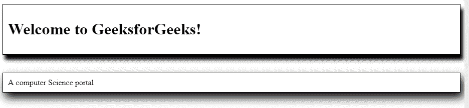
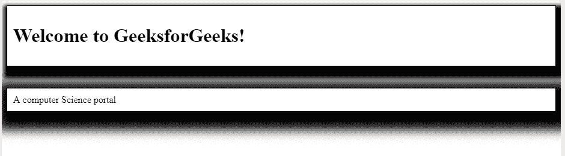
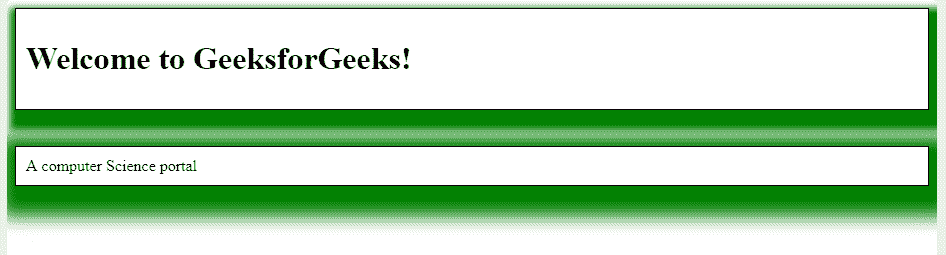
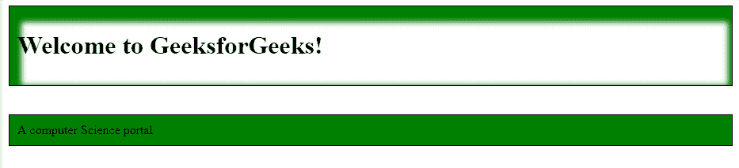
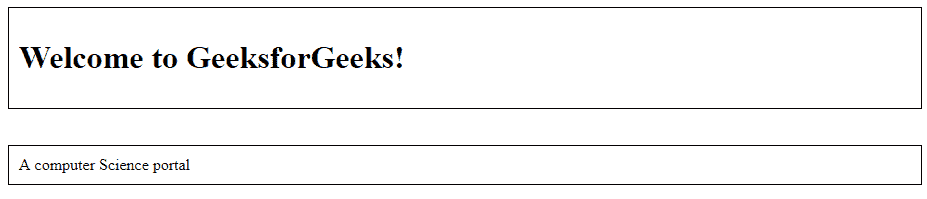

# CSS `box-shadow` 属性

> 原文: [https://www.geeksforgeeks.org/css-box-shadow-property/](https://www.geeksforgeeks.org/css-box-shadow-property/)

CSS 中的 `box-shadow` 属性用于给元素的框架一个类似阴影的效果。多种效果可以应用于由逗号分隔的元素框架。可以使用相对于元素的 X 和 Y 偏移、模糊和扩散半径以及颜色来描述箱形阴影。

**语法:**

```html
box-shadow: h-offset v-offset blur spread color |none|inset|initial|
inherit;
```

**默认值:** 默认值为 `none`。

**属性值:** 下面的例子很好地描述了所有的属性。

*   **h-offset:** 要求水平设置阴影的位置。正值用于设置框右侧的阴影，负值用于设置框左侧的阴影。
*   **v-offset:** 要求垂直设置阴影值的位置。正值用于将下方的阴影设置为方框，负值用于将阴影设置为方框上方。
*   **blur:** 它是一个可选属性，这个属性的工作就是模糊盒子的阴影。

**语法:**

```html
box-shadow: h-offset v-offset blur;
```

**示例:** 此示例说明了 `box-shadow` 属性的使用，其中诸如 `h-offset`、`v-offset` 和 `blur` 等属性与其值一起应用。

### 超文本标记语言

```html
<!DOCTYPE html>
<html>
<head>
    <title>CSS box-shadow Property</title>
    <style>
    .gfg1 {
        border: 1px solid;
        padding: 10px;

        /* box-shadow: h-offset v-offset blur */
        box-shadow: 5px 10px 10px;
    }

    .gfg2 {
        border: 1px solid;
        padding: 10px;

        /* box-shadow: h-offset v-offset blur */
        box-shadow: 5px 10px 28px;
    }
    </style>
</head>

<body>
    <div class="gfg1">
        <h1>Welcome to GeeksforGeeks!</h1> </div>
    <br><br>
    <div class="gfg2"> A computer Science portal </div>
</body>
</html>
```

**输出:**



**spread:** 用于设置阴影的大小。利差的大小取决于利差的价值。

**语法:**

```html
box-shadow: h-offset v-offset blur spread;
```

**示例:** 此示例说明了 `box-shadow` 属性的使用，其中应用了 `spread` 属性来设置阴影的大小。

### 超文本标记语言

```html
<!DOCTYPE html>
<html>
<head>
    <title>CSS box-shadow Property</title>
    <style>
    .gfg1 {
        border: 1px solid;
        padding: 10px;

        /* box-shadow: h-offset
                       v-offset blur spread */
        box-shadow: 5px 10px 10px 10px;
    }

    .gfg2 {
        border: 1px solid;
        padding: 10px;

        /* box-shadow: h-offset
                       v-offset blur spread */
        box-shadow: 5px 10px 28px 20px;
    }
    </style>
</head>

<body>
    <div class="gfg1">
        <h1>Welcome to GeeksforGeeks!</h1> </div>
    <br><br>
    <div class="gfg2"> A computer Science portal </div>
</body>
</html>
```

**输出:**



**color:** 可选属性，用于设置阴影的颜色。

**语法:**

```html
box-shadow: h-offset v-offset color;
```

**示例:** 该示例说明了 `box-shadow` 属性的使用，其中应用了不同的颜色阴影。

### 超文本标记语言

```html
<!DOCTYPE html>
<html>
<head>
    <title>CSS box-shadow Property</title>
    <style>
    .gfg1 {
        border: 1px solid;
        padding: 10px;

        /* box-shadow: h-offset v-offset blur
                spread color */
        box-shadow: 5px 10px 10px 10px green;
    }

    .gfg2 {
        border: 1px solid;
        padding: 10px;

        /* box-shadow: h-offset v-offset blur
                spread color */
        box-shadow: 5px 10px 28px 20px green;
    }
    </style>
</head>

<body>
    <div class="gfg1">
        <h1>Welcome to GeeksforGeeks!</h1> </div>
    <br><br>
    <div class="gfg2"> A computer Science portal </div>
</body>
</html>
```

**输出:**



**inset:** 默认情况下，阴影在框外生成。但是使用 `inset`，我们可以在盒子内部创建阴影。

**语法:**

```html
box-shadow: h-offset v-offset color inset;
```

**示例:** 此示例说明了 `box-shadow` 属性的使用，其中应用了 `inset` 属性来使阴影位于框内。

### 超文本标记语言

```html
<!DOCTYPE html>
<html>
<head>
    <title>CSS box-shadow Property</title>
    <style>
    .gfg1 {
        border: 1px solid;
        padding: 10px;
        /* box-shadow: h-offset v-offset blur
                spread color inset */
        box-shadow: 5px 10px 10px 10px green inset;
    }

    .gfg2 {
        border: 1px solid;
        padding: 10px;

        /* box-shadow: h-offset v-offset blur
                spread color inset */
        box-shadow: 5px 10px 28px 20px green inset;
    }
    </style>
</head>

<body>
    <div class="gfg1">
        <h1>Welcome to GeeksforGeeks!</h1> </div>
    <br><br>
    <div class="gfg2"> A computer Science portal </div>
</body>
</html>
```

**输出:**



**initial:** 用于将 `box-shadow` 属性设置为默认值。

**语法:**

```html
box-shadow: initial;
```

**示例:** 此示例说明了 `box-shadow` 属性的使用，其中应用了 `initial` 属性将其值设置为默认值。

### 超文本标记语言

```html
<!DOCTYPE html>
<html>
<head>
    <title>CSS box-shadow Property</title>
    <style>
    .gfg1 {
        border: 1px solid;
        padding: 10px;

        /* box-shadow: initial */
        box-shadow: initial;
    }

    .gfg2 {
        border: 1px solid;
        padding: 10px;

        /* box-shadow: initial */
        box-shadow: initial;
    }
    </style>
</head>

<body>
    <div class="gfg1">
        <h1>Welcome to GeeksforGeeks!</h1> </div>
    <br><br>
    <div class="gfg2"> A computer Science portal </div>
</body>
</html>
```

**输出:**



**inherit:** 此属性从其父属性继承。

**none:** 为默认值，不包含任何阴影属性。

**支持的浏览器:** 由 `box-shadow` 属性支持的浏览器如下:

*   Google Chrome 10.0 4.0 -webkit-
*   Internet Explorer 9.0 及更高版本(使用 `border-collapse`)
*   Microsoft Edge 12.0
*   Firefox 4.0 3.5 -moz-
*   Safari 5.1 3.1 -webkit-
*   Opera 10.5