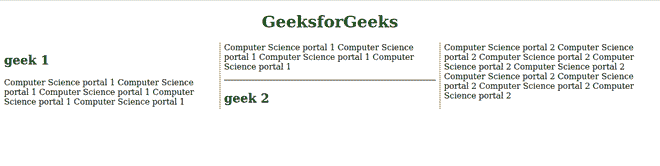

# CSS 断后属性

> 原文: [https://www.geeksforgeeks.org/css-break-after-property/](https://www.geeksforgeeks.org/css-break-after-property/)

`break-after` 属性允许您在多区域上下文、分页媒体和多列布局上放置中断。此属性描述区域、列或分页符在生成的框之后的行为。如果根本没有生成的框，则忽略此属性。

## 语法

```css
break-after: Generic break values;
/* Or */
break-after: Page break values;
/* Or */
break-after: Column break values;
/* Or */
break-after: Region break values;
/* Or */
break-after: Global values;
```

## 默认值

其默认值为 `auto`。

## 属性值

该属性接受上面提到的和下面描述的属性值：

*   **通用中断值:** 该属性是指由 `auto`、`avoid`、`always`、`all` 等定义的值。
*   **分页符值:** 该属性是指 `page`、`avoid-page`、`left`、`right`、`recto`、`verso` 等定义的值。
*   **分栏值:** 该属性指的是 `column`、`avoid-column` 等定义的值。
*   **区域中断值:** 该属性是指 `region`、`avoid-region` 等定义的值。
*   **全局值:** 该属性是指定义的值 `inherit`、`initial`、`unset` 等。

## 示例

以下是说明使用 `break-after` 属性的示例。

### HTML

```html
<!DOCTYPE html>
<html lang="en">
    <head>
        <style>
            .Container {
                column-count: 3;
                column-rule: 2px dotted olivedrab;
            }
            .Container hr {
                break-after: column;
            }
        </style>
    </head>
    <body>
        <h1 style="text-align: center; color: green;">
            GeeksforGeeks
        </h1>
        <div class="Container">
            <h2>geek 1</h2>
            <p>
                Computer Science portal 1
                Computer Science portal 1
                Computer Science portal 1
                Computer Science portal 1
                Computer Science portal 1
                Computer Science portal 1
                Computer Science portal 1
                Computer Science portal 1
                Computer Science portal 1
            </p>
            <hr />
            <h2>geek 2</h2>
            <p>
                Computer Science portal 2
                Computer Science portal 2
                Computer Science portal 2
                Computer Science portal 2
                Computer Science portal 2
                Computer Science portal 2
                Computer Science portal 2
                Computer Science portal 2
                Computer Science portal 2
            </p>
        </div>
    </body>
</html>
```

## 输出



## 支持的浏览器

*   Chrome
*   `Safari(部分支持)`
*   Opera
*   `Firefox(部分支持)`
*   Edge