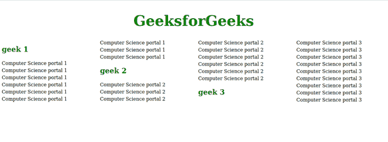

# CSS break-before 属性

> 原文: [https://www.geeksforgeeks.org/css-break-before-property/](https://www.geeksforgeeks.org/css-break-before-property/)

CSS `break-before` 属性用于设置分页符、区域分隔符或分栏符是否应该出现在元素之前。如果没有生成的框，则忽略此属性。

**语法:**

```css
break-before: Generic break values;
```

或者

```css
break-before: Page break values;
```

或者

```css
break-before: Column break values;
```

或者

```css
break-before: Region break values;
```

或者

```css
break-before: Global values;
```

**默认值:**

*   `auto`

**属性值:** 该属性接受上面提到的和下面描述的属性值。

*   **通用中断值:** 该属性是指由 `auto`、`avoid`、`always`、`all` 等定义的值。
*   **分页符值:** 该属性是指 `page`、`avoid-page`、`left`、`right`、`recto`、`verso` 等定义的值。
*   **分栏值:** 该属性指的是 `column`、`avoid-column` 等定义的值。
*   **区域中断值:** 该属性是指 `region`、`avoid-region` 等定义的值。
*   **全局值:** 该属性是指 `inherit`、`initial`、`unset` 等定义的值。

**示例:** 以下示例说明了 `break-before` 属性的使用。

## 示例代码

```html
<!DOCTYPE html>
<html lang="en">

<head>
    <style>
        h1 {
            color: #008000;
            text-align: center;
            font-size: 3rem;
            column-span: all;
        }

        h2 {
            color: green;
            break-before: column;
        }

        p {
            line-height: 1.5;
        }

        div {
            column-width: 250px;
            gap: 30px;
        }
    </style>
</head>

<body>
    <div>
        <h1>GeeksforGeeks</h1>
        <h2>geek 1</h2>
        <p>
            Computer Science portal 1
            Computer Science portal 1
            Computer Science portal 1
            Computer Science portal 1
            Computer Science portal 1
            Computer Science portal 1
            Computer Science portal 1
            Computer Science portal 1
            Computer Science portal 1
        </p>
        <h2>geek 2</h2>
        <p>
            Computer Science portal 2
            Computer Science portal 2
            Computer Science portal 2
            Computer Science portal 2
            Computer Science portal 2
            Computer Science portal 2
            Computer Science portal 2
            Computer Science portal 2
            Computer Science portal 2
        </p>
        <h2>geek 3</h2>
        <p>
            Computer Science portal 3
            Computer Science portal 3
            Computer Science portal 3
            Computer Science portal 3
            Computer Science portal 3
            Computer Science portal 3
            Computer Science portal 3
            Computer Science portal 3
            Computer Science portal 3
        </p>
    </div>
</body>

</html>
```

**输出:**



**支持的浏览器:**

*   Chrome
*   Firefox (部分支持)
*   Safari (部分支持)
*   Opera
*   Internet Explorer
*   Edge