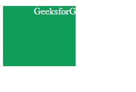
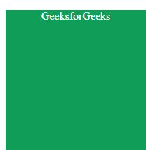
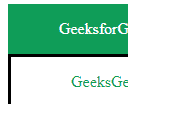

# CSS 剪辑属性

> 原文: [https://www.geeksforgeeks.org/css-clip-property/](https://www.geeksforgeeks.org/css-clip-property/)

**剪辑属性**指定定义要使绝对定位元素的哪一部分可见。除了指定的区域，其余所有其他区域都被隐藏。`clip` 属性仅适用于绝对定位的元素，即具有 `position: absolute` 或 `position: fixed` 的元素。

**语法:**

```html
clip: auto|shape|initial|inherit;
```

**注:**

*   CSS 剪辑属性对 `overflow: visible` 不起作用。
*   剪辑属性现在被弃用，将被 [`clip-path`](https://www.geeksforgeeks.org/css-clip-path-property/) 属性取代。

**属性值:** 下面的例子很好地描述了所有的属性。

## 自动 (`auto`)

`auto` 是默认值，不会有任何裁剪。元素按原样显示。

**语法:**

```html
clip: auto;
```

**示例:** 此示例说明了**剪辑属性**的使用，该属性的值设置为 `auto`，不会对指定区域应用任何剪辑。

### HTML

```html
<!DOCTYPE html>
<html>
<head>
    <title> CSS | clip Property </title>
    <style>
    .shape {
        position: absolute;
        background: #0F9D58;
        width: 200px;
        height: 200px;
        color: #ffffff;
        text-align: center;
    }

    #clip_property {
        clip: auto;
    }
    </style>
</head>

<body>
    <p class="shape" id="clip_property"> GeeksforGeeks </p>

</body>
</html>
```

**输出:**


## 形状 (`rect()`)

`shape` 裁剪元素的定义部分。`rect(top, right, bottom, left)` 用于定义可见部分。

**语法:**

```html
clip: rect(top, right, bottom, left);
```

**示例:** 此示例说明了**裁剪属性**的使用，该属性的值被设置为裁剪元素指定部分的特定形状。

### HTML

```html
<!DOCTYPE html>
<html>
<head>
    <title> CSS | clip Property </title>
    <style>
    .shape {
        position: absolute;
        background: #0F9D58;
        width: 200px;
        height: 200px;
        color: #ffffff;
        text-align: center;
    }

    #clip_property {
        clip: rect(0px, 120px, 100px, 0px);
    }
    </style>
</head>

<body>
    <p class="shape" id="clip_property"> GeeksforGeeks </p>

</body>
</html>
```

**输出:**



## 初始 (`initial`)

`initial` 设置默认值，即不会有任何裁剪，因为默认值是 `auto`。

**语法:**

```html
clip: initial;
```

**示例:** 该示例说明了**剪辑属性**的使用，该属性的值设置为 `initial`。

### HTML

```html
<!DOCTYPE html>
<html>
<head>
    <title> CSS | clip Property </title>
    <style>
    .shape {
        position: absolute;
        background: #0F9D58;
        width: 200px;
        height: 200px;
        color: #ffffff;
        text-align: center;
    }

    #clip_property {
        clip: initial;
    }
    </style>
</head>

<body>
    <p class="shape" id="clip_property"> GeeksforGeeks </p>

</body>
</html>
```

**输出:**



## 继承 (`inherit`)

`inherit` 从父元素接收属性。当它与根元素一起使用时，将使用初始属性。

**语法:**

```html
clip: inherit;
```

**示例:** 该示例说明了**剪辑属性**的使用，该属性的值被设置为继承。

### HTML

```html
<!DOCTYPE html>
<html>
<head>
    <title> CSS | clip Property </title>
    <style>
    .shape {
        position: absolute;
        background: #0F9D58;
        width: 200px;
        height: 200px;
        color: #ffffff;
        text-align: center;
    }

    .shape1 {
        border: solid;
        border-color: black;
        position: absolute;
        background: #ffffff;
        width: 200px;
        height: 200px;
        color: #0F9D58;
        text-align: center;
    }

    #clip_property {
        clip: rect(0px, 120px, 100px, 0px);
    }

    #clip_property1 {
        clip: inherit;
    }
    </style>
</head>

<body>
    <div class="shape" id="clip_property">
        <p> GeeksforGeeks </p>
        <div class="shape1" id="clip_property1">
            <p> GeeksGeeks </p>
        </div>
    </div>

    <!-- Here clip_property1 inherits the
    clip property from clip_property -->
</body>
</html>
```

**输出:**



## 支持的浏览器

**剪辑属性**支持的浏览器如下:

*   `Chrome` 1.0
*   `Edge` 12.0
*   `Internet Explorer` 4.0
*   `Firefox` 1.0
*   `Opera` 7.0
*   `Safari` 1.0