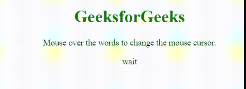

# CSS 光标属性

> 原文:[https://www.geeksforgeeks.org/css-cursor-property/](https://www.geeksforgeeks.org/css-cursor-property/)

`cursor`属性用于指定当指向一个元素时要显示的鼠标光标。该属性由零个或多个`<url>`值定义，这些值由逗号分隔，后跟 1 个关键字值作为强制的。每个`<url>`将指向图像文件。

**语法:**

```html
cursor: value;
```

**属性值:**

*   `auto`: 这是浏览器设置光标的默认属性。
*   `alias`: 该属性用于显示光标指示要创建的内容。
*   `all-scroll`: 在该属性中，光标表示滚动。
*   `cell`: 在该属性中，光标表示选择了一个单元格或一组单元格。
*   `context-menu`: 在该属性中，光标表示上下文菜单可用。
*   `col-resize`: 在该属性中，光标表示可以水平调整列的大小。
*   `copy`: 在该属性中，光标表示要复制的内容。
*   `crosshair`: 在该属性中，光标呈现为十字准线。
*   `default`: 默认光标。
*   `e-resize`: 在此属性中，光标指示框的边缘将向右移动。
*   `ew-resize`: 在该属性中，光标表示双向调整光标大小。
*   `help`: 在该属性中，光标表示帮助可用。
*   `move`: 在该属性中，光标表示要移动的东西。
*   `n-resize`: 在该属性中，光标指示要上移的框的边缘。
*   `ne-resize`: 在该属性中，光标指示框的一条边要向上和向右移动。
*   `nesw-resize`: 该属性表示双向调整光标大小。
*   `ns-resize`: 该属性表示双向调整光标大小。
*   `nw-resize`: 在该属性中，光标指示框的边缘将上下移动。
*   `nwse-resize`: 该属性表示双向调整光标大小。
*   `no-drop`: 在该属性中，光标表示被拖动的项目不能放在这里。
*   `none`: 该属性表示没有为元素渲染光标。
*   `not-allowed`: 在该属性中，光标表示不会执行请求的动作。
*   `pointer`: 在该属性中，光标是指针，表示链接。
*   `progress`: 在该属性中，光标表示程序正忙。
*   `row-resize`: 在该属性中，光标表示行可以垂直调整大小。
*   `s-resize`: 在该属性中，光标指示要向下移动的框的边缘。
*   `se-resize`: 在该属性中，光标指示要向下和向右移动的框的边缘。
*   `sw-resize`: 在该属性中，光标指示框的边缘将被向下和向左移动。
*   `text`: 在该属性中，光标表示可以选择的文本。
*   `url`: 在该属性中，自定义游标的 URL 列表以逗号分隔，列表末尾有一个通用游标。
*   `vertical-text`: 在该属性中，光标表示可以选择的竖排文字。
*   `w-resize`: 在此属性中，光标指示框的边缘将向左移动。
*   `wait`: 在该属性中，光标表示程序正忙。
*   `zoom-in`: 在该属性中，光标表示有东西可以放大。
*   `zoom-out`: 在该属性中，光标表示有东西可以缩小。
*   `initial`: 该属性用于设置为默认值。
*   `inherit`: 从其父元素继承。

**示例:** 该示例说明了`cursor`属性的使用，其值被设置为`wait`，这表明程序正忙。

## 超文本标记语言

```html
<!DOCTYPE html>
<html>
<head>
    <title> CSS | cursor property </title>
    <style>
    .wait {
        cursor: wait;
    }

    h1 {
        color: green;
    }
    </style>
</head>

<body>
    <center>
        <h1>GeeksforGeeks</h1>
        <p>Mouse over the words to change the mouse cursor.</p>
        <p class="wait">wait</p>
    </center>
</body>
</html>
```

**输出:**



**支持的浏览器:**

*   谷歌 Chrome 1.0
*   微软边缘 12.0
*   Mozilla Firefox 1.0
*   ie4.0
*   Opera 7.0
*   Safari1.2