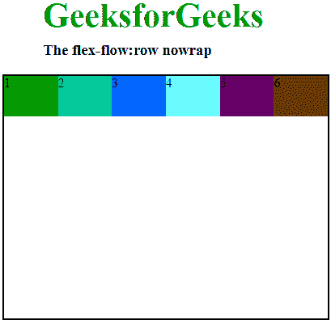
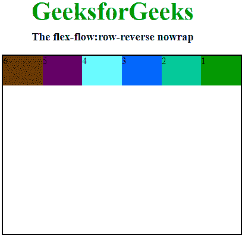
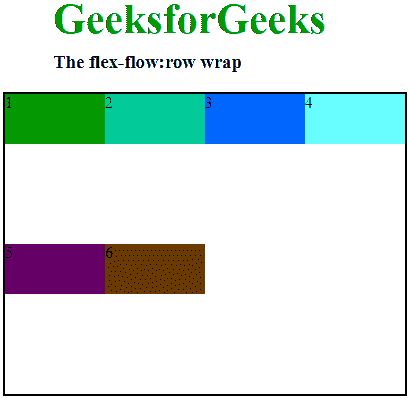
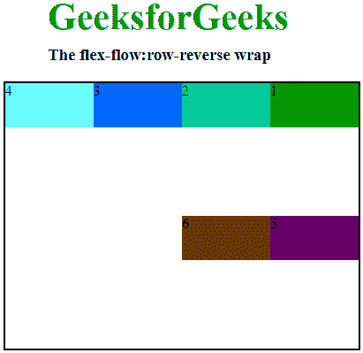
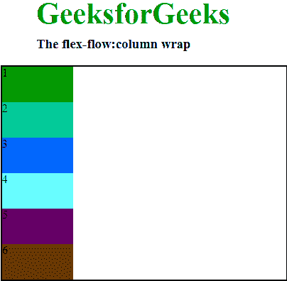
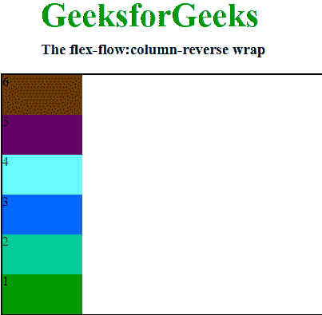
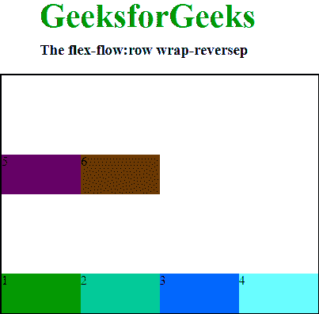
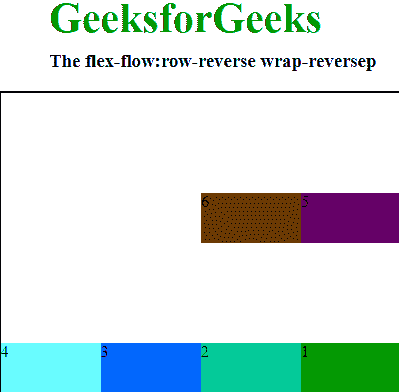
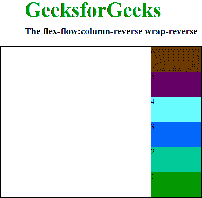

# CSS flex-flow 属性

> 原文: [https://www.geeksforgeeks.org/css-flex-flow-property/](https://www.geeksforgeeks.org/css-flex-flow-property/)

`flex-flow` 属性是 CSS Flexible Box Layout Module 的子属性，是 `flex-wrap` 和 `flex-direction` 的简写属性。
**注意:** 当元素不是 flex 项时，`flex-flow` 属性没有用。

## 语法

```html
flex-flow: flex-direction flex-wrap;
```

## `flex-flow` 属性的值

### `row nowrap`
它按照文本方向排列行，`wrap-flex` 的默认值是 `nowrap`。它用于指定项目不换行，使项目保持在单行内。

**语法:**

```html
flex-flow: row nowrap;
```

**示例:**

```html
<!DOCTYPE html>
<head>
    <title>flex-flow property</title>
    <style>
        #main {
            width: 400px;
            height: 300px;
            border: 2px solid black;
            display: flex;
            flex-flow: row nowrap;
        }
        #main div {
            width: 100px;
            height: 50px;
        }
        h1 {
            color: #009900;
            font-size: 42px;
            margin-left: 50px;
        }
        h3 {
            margin-top: -20px;
            margin-left: 50px;
        }
    </style>
</head>
<body>
    <h1>GeeksforGeeks</h1>
    <h3>The flex-flow:row nowrap</h3>
    <div id="main">
        <div style="background-color:#009900;">1</div>
        <div style="background-color:#00cc99;">2</div>
        <div style="background-color:#0066ff;">3</div>
        <div style="background-color:#66ffff;">4</div>
        <div style="background-color:#660066;">5</div>
        <div style="background-color:#663300;">6</div>
    </div>
</body>
</html>
```

**输出:**


### `row-reverse nowrap`
它将行排列在文本方向的相反方向，`wrap-flex` 的默认值是 `nowrap`。它用于指定项目不换行，使项目保持在单行内。

**语法:**

```html
flex-flow: row-reverse nowrap;
```

**示例:**

```html
<!DOCTYPE html>
<head>
    <title>flex-flow property</title>
    <style>
        #main {
            width: 400px;
            height: 300px;
            border: 2px solid black;
            display: flex;
            flex-flow: row-reverse nowrap;
        }
        #main div {
            width: 100px;
            height: 50px;
        }
        h1 {
            color: #009900;
            font-size: 42px;
            margin-left: 50px;
        }
        h3 {
            margin-top: -20px;
            margin-left: 50px;
        }
    </style>
</head>
<body>
    <h1>GeeksforGeeks</h1>
    <h3>The flex-flow:row-reverse nowrap</h3>
    <div id="main">
        <div style="background-color:#009900;">1</div>
        <div style="background-color:#00cc99;">2</div>
        <div style="background-color:#0066ff;">3</div>
        <div style="background-color:#66ffff;">4</div>
        <div style="background-color:#660066;">5</div>
        <div style="background-color:#663300;">6</div>
    </div>
</body>
</html>
```

**输出:**


### `column nowrap`
与 `row` 相同，但方向是从上到下，`wrap-flex` 的默认值是 `nowrap`。它用于指定项目不换行，使项目保持在单行内。

**语法:**

```html
flex-flow: column nowrap;
```

**示例:**

```html
<!DOCTYPE html>
<head>
    <title>flex-flow property</title>
    <style>
        #main {
            width: 400px;
            height: 300px;
            border: 2px solid black;
            display: flex;
            flex-flow: column nowrap;
        }
        #main div {
            width: 100px;
            height: 50px;
        }
        h1 {
            color: #009900;
            font-size: 42px;
            margin-left: 50px;
        }
        h3 {
            margin-top: -20px;
            margin-left: 50px;
        }
    </style>
</head>
<body>
    <h1>GeeksforGeeks</h1>
    <h3>The flex-flow:column nowrap</h3>
    <div id="main">
        <div style="background-color:#009900;">1</div>
        <div style="background-color:#00cc99;">2</div>
        <div style="background-color:#0066ff;">3</div>
        <div style="background-color:#66ffff;">4</div>
        <div style="background-color:#660066;">5</div>
        <div style="background-color:#663300;">6</div>
    </div>
</body>
</html>
```

**输出:**


### `column-reverse nowrap`
与 `row-reverse` 相同，但方向是从上到下，`wrap-flex` 的默认值是 `nowrap`。它用于指定项目不换行，使项目保持在单行内。

**语法:**

```html
flex-flow: column-reverse nowrap;
```

**示例:**

```html
<!DOCTYPE html>
<head>
    <title>flex-flow property</title>
    <style>
        #main {
            width: 400px;
            height: 300px;
            border: 2px solid black;
            display: flex;
            flex-flow: column-reverse nowrap;
        }
        #main div {
            width: 100px;
            height: 50px;
        }
        h1 {
            color: #009900;
            font-size: 42px;
            margin-left: 50px;
        }
        h3 {
            margin-top: -20px;
            margin-left: 50px;
        }
    </style>
</head>
<body>
    <h1>GeeksforGeeks</h1>
    <h3>The flex-flow:column-reverse nowrap</h3>
    <div id="main">
        <div style="background-color:#009900;">1</div>
        <div style="background-color:#00cc99;">2</div>
        <div style="background-color:#0066ff;">3</div>
        <div style="background-color:#66ffff;">4</div>
        <div style="background-color:#660066;">5</div>
        <div style="background-color:#663300;">6</div>
    </div>
</body>
</html>
```

**输出:**


### `row wrap`
它按照文本方向排列行，`wrap` 属性用于将 flex 项拆分为多行。它使 flex 项根据其宽度自动换行。

**语法:**

```html
flex-flow: row wrap;
```

**示例:**

```html
<!DOCTYPE html>
<head>
    <title>flex-flow property</title>
    <style>
        #main {
            width: 400px;
            height: 300px;
            border: 2px solid black;
            display: flex;
            flex-flow: row wrap;
        }
        #main div {
            width: 100px;
            height: 50px;
        }
        h1 {
            color: #009900;
            font-size: 42px;
            margin-left: 50px;
        }
        h3 {
            margin-top: -20px;
            margin-left: 50px;
        }
    </style>
</head>
<body>
    <h1>GeeksforGeeks</h1>
    <h3>The flex-flow:row wrap</h3>
    <div id="main">
        <div style="background-color:#009900;">1</div>
        <div style="background-color:#00cc99;">2</div>
        <div style="background-color:#0066ff;">3</div>
        <div style="background-color:#66ffff;">4</div>
        <div style="background-color:#660066;">5</div>
        <div style="background-color:#663300;">6</div>
    </div>
</body>
</html>
```

**输出:**


### `row-reverse wrap`
它将行排列在文本方向的相反方向，`wrap` 属性用于在 flex 项换行时反转它们的流向。

**语法:**

```html
flex-flow: row-reverse wrap;
```

**示例:**

```html
<!DOCTYPE html>
<head>
    <title>flex-flow property</title>
    <style>
        #main {
            width: 400px;
            height: 300px;
            border: 2px solid black;
            display: flex;
            flex-flow: row-reverse wrap;
        }
        #main div {
            width: 100px;
            height: 50px;
        }
    </style>
</head>
<body>
    <h1>GeeksforGeeks</h1>
    <h3>The flex-flow:row-reverse wrap</h3>
    <div id="main">
        <div style="background-color:#009900;">1</div>
        <div style="background-color:#00cc99;">2</div>
        <div style="background-color:#0066ff;">3</div>
        <div style="background-color:#66ffff;">4</div>
        <div style="background-color:#660066;">5</div>
        <div style="background-color:#663300;">6</div>
    </div>
</body>
</html>
```

# flex-flow 属性的不同取值示例

## row-reverse wrap

它按照与文本相反的方向排列行，并使用 `wrap` 属性在弹性项目换行时反转其流动方向。

**语法:**

```html
flex-flow:row-reverse wrap;
```

**示例:**

```html
<!DOCTYPE html>
<html>
<head>
    <title>flex-flow property</title>
    <style>
        #main {
            width: 400px;
            height: 300px;
            border: 2px solid black;
            display: flex;
            flex-flow: row-reverse wrap;
        }

        #main div {
            width: 100px;
            height: 50px;
        }

        h1 {
            color: #009900;
            font-size: 42px;
            margin-left: 50px;
        }

        h3 {
            margin-top: -20px;
            margin-left: 50px;
        }
    </style>
</head>
<body>
    <h1>GeeksforGeeks</h1>
    <h3>The flex-flow:row-reverse wrap</h3>
    <div id="main">
        <div style="background-color:#009900;">1</div>
        <div style="background-color:#00cc99;">2</div>
        <div style="background-color:#0066ff;">3</div>
        <div style="background-color:#66ffff;">4</div>
        <div style="background-color:#660066;">5</div>
        <div style="background-color:#663300;">6</div>
    </div>
</body>
</html>
```

**输出:**


## column wrap

它按照从上到下的方向排列行（与 `row` 方向相同），并使用 `wrap` 属性在弹性项目换行时反转其流动方向。

**语法:**

```html
flex-flow:column wrap;
```

**示例:**

```html
<!DOCTYPE html>
<html>
<head>
    <title>flex-flow property</title>
    <style>
        #main {
            width: 400px;
            height: 300px;
            border: 2px solid black;
            display: flex;
            flex-flow: column wrap;
        }

        #main div {
            width: 100px;
            height: 50px;
        }

        h1 {
            color: #009900;
            font-size: 42px;
            margin-left: 50px;
        }

        h3 {
            margin-top: -20px;
            margin-left: 50px;
        }
    </style>
</head>
<body>
    <h1>GeeksforGeeks</h1>
    <h3>The flex-flow:column wrap</h3>
    <div id="main">
        <div style="background-color:#009900;">1</div>
        <div style="background-color:#00cc99;">2</div>
        <div style="background-color:#0066ff;">3</div>
        <div style="background-color:#66ffff;">4</div>
        <div style="background-color:#660066;">5</div>
        <div style="background-color:#663300;">6</div>
    </div>
</body>
</html>
```

**输出:**


## column-reverse wrap

它按照与 `row-reverse` 相同的方向（从上到下）排列行，并使用 `wrap` 属性在弹性项目换行时反转其流动方向。

**语法:**

```html
flex-flow:column-reverse wrap;
```

**示例:**

```html
<!DOCTYPE html>
<html>
<head>
    <title>flex-flow property</title>
    <style>
        #main {
            width: 400px;
            height: 300px;
            border: 2px solid black;
            display: flex;
            flex-flow: column-reverse wrap;
        }

        #main div {
            width: 100px;
            height: 50px;
        }

        h1 {
            color: #009900;
            font-size: 42px;
            margin-left: 50px;
        }

        h3 {
            margin-top: -20px;
            margin-left: 50px;
        }
    </style>
</head>
<body>
    <h1>GeeksforGeeks</h1>
    <h3>The flex-flow:column-reverse wrap</h3>
    <div id="main">
        <div style="background-color:#009900;">1</div>
        <div style="background-color:#00cc99;">2</div>
        <div style="background-color:#0066ff;">3</div>
        <div style="background-color:#66ffff;">4</div>
        <div style="background-color:#660066;">5</div>
        <div style="background-color:#663300;">6</div>
    </div>
</body>
</html>
```

**输出:**


## row wrap-reverse

它按照文本方向排列行，并使用 `wrap-reverse` 属性在弹性项目换行时反转其流动方向。

**语法:**

```html
flex-flow:row wrap-reverse;
```

**示例:**

```html
<!DOCTYPE html>
<html>
<head>
    <title>flex-flow property</title>
    <style>
        #main {
            width: 400px;
            height: 300px;
            border: 2px solid black;
            display: flex;
            flex-flow: row wrap-reverse;
        }

        #main div {
            width: 100px;
            height: 50px;
        }

        h1 {
            color: #009900;
            font-size: 42px;
            margin-left: 50px;
        }

        h3 {
            margin-top: -20px;
            margin-left: 50px;
        }
    </style>
</head>
<body>
    <h1>GeeksforGeeks</h1>
    <h3>The flex-flow:row wrap-reversep</h3>
    <div id="main">
        <div style="background-color:#009900;">1</div>
        <div style="background-color:#00cc99;">2</div>
        <div style="background-color:#0066ff;">3</div>
        <div style="background-color:#66ffff;">4</div>
        <div style="background-color:#660066;">5</div>
        <div style="background-color:#663300;">6</div>
    </div>
</body>
</html>
```

**输出:**


## row-reverse wrap-reverse

它按照与文本相反的方向排列行，并使用 `wrap-reverse` 属性在弹性项目换行时反转其流动方向。

**语法:**

```html
flex-flow:row-reverse wrap-reverse;
```

**示例:**

```html
<!DOCTYPE html>
<html>
<head>
    <title>flex-flow property</title>
    <style>
        #main {
            width: 400px;
            height: 300px;
            border: 2px solid black;
            display: flex;
            flex-flow: row-reverse wrap-reverse;
        }

        #main div {
            width: 100px;
            height: 50px;
        }

        h1 {
            color: #009900;
            font-size: 42px;
            margin-left: 50px;
        }

        h3 {
            margin-top: -20px;
            margin-left: 50px;
        }
    </style>
</head>
<body>
    <h1>GeeksforGeeks</h1>
    <h3>The flex-flow:row-reverse wrap-reversep</h3>
    <div id="main">
        <div style="background-color:#009900;">1</div>
        <div style="background-color:#00cc99;">2</div>
        <div style="background-color:#0066ff;">3</div>
        <div style="background-color:#66ffff;">4</div>
        <div style="background-color:#660066;">5</div>
        <div style="background-color:#663300;">6</div>
    </div>
</body>
</html>
```

**输出:**


## column wrap-reverse

它按照从上到下的方向排列行（与 `row` 方向相同），并使用 `wrap-reverse` 属性在弹性项目换行时反转其流动方向。

**语法:**

```html
flex-flow:column wrap-reverse;
```

**示例:**

```html
<!DOCTYPE html>
<html>
<head>
    <title>flex-flow property</title>
    <style>
        #main {
            width: 400px;
            height: 300px;
            border: 2px solid black;
            display: flex;
            flex-flow: column wrap-reverse;
        }

        #main div {
            width: 100px;
            height: 50px;
        }

        h1 {
            color: #009900;
            font-size: 42px;
            margin-left: 50px;
        }

        h3 {
            margin-top: -20px;
            margin-left: 50px;
        }
    </style>
</head>
<body>
    <h1>GeeksforGeeks</h1>
    <h3>The flex-flow:column wrap-reverse</h3>
    <div id="main">
        <div style="background-color:#009900;">1</div>
        <div style="background-color:#00cc99;">2</div>
        <div style="background-color:#0066ff;">3</div>
        <div style="background-color:#66ffff;">4</div>
        <div style="background-color:#660066;">5</div>
        <div style="background-color:#663300;">6</div>
    </div>
</body>
</html>
```

## flex-flow: column-reverse wrap-reverse

### 语法

```html
flex-flow:column-reverse wrap-reverse; 
```

### 示例

```html
<!DOCTYPE html>
<html>
<head>
    <title>flex-flow property</title>
    <style>
        #main {
            width: 400px;
            height: 300px;
            border: 2px solid black;
            display: flex;
            flex-flow: column-reverse wrap-reverse;
        }

        #main div {
            width: 100px;
            height: 50px;
        }

        h1 {
            color: #009900;
            font-size: 42px;
            margin-left: 50px;
        }

        h3 {
            margin-top: -20px;
            margin-left: 50px;
        }
    </style>
</head>
<body>
    <h1>GeeksforGeeks</h1>
    <h3>The flex-flow:column-reverse wrap-reverse</h3>
    <div id="main">
        <div style="background-color:#009900;">1</div>
        <div style="background-color:#00cc99;">2</div>
        <div style="background-color:#0066ff;">3</div>
        <div style="background-color:#66ffff;">4</div>
        <div style="background-color:#660066;">5</div>
        <div style="background-color:#663300;">6</div>
    </div>
</body>
</html>
```

**输出:**


`column-reverse wrap-reverse` 将按与 `row-reverse` 相同的方式（从上到下）排列行，并结合 `wrap-reverse` 属性。此属性用于在弹性项目换行时反转其流动方向。

### 支持的浏览器

*   谷歌 Chrome 29.0
*   Internet Explorer 11.0
*   Mozila Firefox 28.0
*   Safari 9.0
*   Opera 17.0