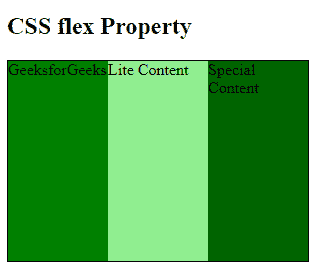
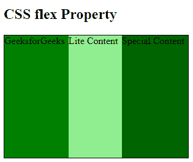

# CSS 伸缩属性

> 原文:[https://www.geeksforgeeks.org/css-flex-property/](https://www.geeksforgeeks.org/css-flex-property/)

`flex` CSS [简写属性](https://www.geeksforgeeks.org/css-shorthand-properties/)是 `flex-grow`、`flex-shrink` 和 `flex-basis` 属性的组合。用于设置伸缩项目的长度。`flex` 属性响应速度快，对移动设备友好。定位子元素和主容器很容易。页边距不会随着内容页边距而折叠。无需编辑 HTML 部分，任何元素的顺序都可以轻松更改。

**语法:**

```html
flex: flex-grow flex-shrink flex-basis|auto|initial|inherit;
```

**属性值:**

*   [**【flex-grow 属性】**](https://www.geeksforgeeks.org/css-flex-grow-property/) **:** 一个数字，指定相对于其余伸缩项目，项目将增长多少。
*   [**【flex-shrink 属性】**](https://www.geeksforgeeks.org/css-flex-shrink-property/): 一个数字，它指定了相对于其他伸缩项目，项目会缩小多少。
*   [**【flex-basis 属性】**](https://www.geeksforgeeks.org/css-flex-basis-property/): 设置项目长度。`flex-basis` 的合法值是:`auto`、`inherit` 或后跟 `%`、`em`、`px` 或任何其他长度单位的数字。
    *   [**flex-wrap 属性:**](https://www.geeksforgeeks.org/css-flex-wrap-property/)CSS `flex-wrap` 属性用于指定伸缩项目是强制成单行还是折多行。

可以借助 1、2 或 3 个值来指定 `flex` 属性:

*   **单值语法:**该值应包含以下内容之一:
    *   [**数字**](https://www.geeksforgeeks.org/css-number-data-type/): 如果表示为 `flex: <number>`，则 `flex-shrink`、`flex-basis` 的值分别为 1 和 0。
    *   可以通过其中一个关键字指定为 `auto`、`none` 或 `initial`。
*   **双值语法:**必须包含以下值:
    *   第一个值应该是*数字*，它将代表 `flex-grow`。
    *   第二个值应包含以下内容之一:
        *   **数字:**如果是数字，则表示为 `flex-shrink`。
        *   一个带有有效值的 [*width*](https://www.geeksforgeeks.org/css-width-property/) 将代表 `flex-basis`。
*   **三值语法:**值的顺序应该相同:
    *   第一个数字代表 `flex-grow`。
    *   第二个数字代表 `flex-shrink`。
    *   带有有效值的 *width* 将代表 `flex-basis`。

**示例:**本示例借助单个值来描述 `flex` 属性，以表示 `flex`。

### 示例 1

```html
<!DOCTYPE html>
<html>

<head>
    <title> CSS flex Property </title>
    <style>
    #Geeks {
        width: 300px;
        height: 200px;
        border: 1px solid black;
        display: flex;
    }

    #Geeks div {
        flex: 1;
    }

    .GFG1 {
        background-color: green;
    }

    .GFG2 {
        background-color: lightgreen;
    }

    .GFG3 {
        background-color: darkgreen;
    }
    </style>
</head>

<body>
    <h2>CSS flex Property</h2>
    <div id="Geeks">
        <div class="GFG1"> GeeksforGeeks </div>
        <div class="GFG2"> Lite Content </div>
        <div class="GFG3"> Special Content </div>
    </div>
</body>

</html>
```

**输出:**



### 示例 2

本示例借助 3 个值来描述 `flex` 属性，这 3 个值代表 `flex-grow`、`flex-shrink` 和 `flex-basis` 属性。

```html
<!DOCTYPE html>
<html>

<head>
    <title> CSS flex Property </title>
    <style>
    #Geeks {
        width: 300px;
        height: 200px;
        border: 1px solid black;
        display: flex;
    }

    #Geeks div {
        flex: 1 0 auto;
    }

    .GFG1 {
        background-color: green;
    }

    .GFG2 {
        background-color: lightgreen;
    }

    .GFG3 {
        background-color: darkgreen;
    }
    </style>
</head>

<body>
    <h2>CSS flex Property</h2>
    <div id="Geeks">
        <div class="GFG1"> GeeksforGeeks </div>
        <div class="GFG2"> Lite Content </div>
        <div class="GFG3"> Special Content </div>
    </div>
</body>

</html>
```

**输出:**



**支持的浏览器:**

*   谷歌 Chrome 29.0，21.0 -webkit-
*   微软 Edge 12.0，12.0-webkit-
*   Internet Explorer 11.0，10.0 -ms-
*   火狐 28.0， 18.0 -moz-
*   Safari 9.0，6.1 -webkit-
*   Opera 17.0