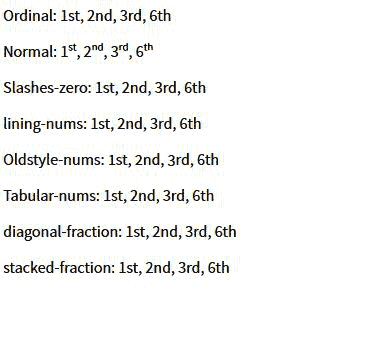

# CSS 字体-变体-数字属性

> 原文：[https://www.geeksforgeeks.org/css-font-variant-numeric-property/](https://www.geeksforgeeks.org/css-font-variant-numeric-property/)

CSS 的`font-variant-numeric`属性用于控制替换字形的使用。这是根据单位或标记，如数字或分数来完成的。

## 语法：

```html
font-variant-numeric: value
```

## 属性值：

*   `normal`：使用正常会移除`font-variant-numeric`属性的每个效果。
*   `ordinal`：该值直接表示开放式值，即`ordn`。该术语使用特殊的符号作为序数标记。
*   `slashed-zero`：`slashed-zero`使用了带斜线的零。该属性值在区分`0`和`O`时非常有用。
*   `lining-nums`：`lining-nums`属性对应于开放类型值，即`lnum`。该关键字激活基线上的数字。
*   `oldstyle-nums`：`oldstyle-nums`属性对应于开放类型值，即`onum`。此关键字激活一些数字有后代的图形集。
*   `proportional-nums`：该属性激活那些不是每个数都是相同大小的规范。它的开放类型值是`pnum`。
*   `tabular-nums`：`tabular-nums`开放类型值为`tnum`。它激活那些数字集大小相同的数字集。
*   `diagonal-fractions`：开型值为`frac`。这将激活分子和分母变小并用斜线隔开的那组数字。
*   `stacked-fractions`：其开型值为`arac`。这将激活那些分子和分母变小、堆叠并由水平线分隔的图形集。

## 示例：

```html
<!DOCTYPE html>
<html lang="en">
    <head>
        <meta charset="UTF-8" />
        <meta name="viewport" 
              content="width=device-width,
                       initial-scale=1.0" />
        <link
            href=
"https://fonts.googleapis.com/css2?family=Source+Sans+Pro:ital,
              wght@0, 200;0, 400;1, 400&display=swap"
            rel="stylesheet"
        />
        <title>Document</title>
    </head>
    <style>
        * {
            font-family: "Source Sans Pro";
        }
        .value1 {
            font-variant-numeric: normal;
        }
        .value2 {
            font-variant-numeric: ordinal;
        }
        .value3 {
            font-variant-numeric: slashed-zero;
        }
        .value4 {
            font-variant-numeric: lining-nums;
        }
        .value5 {
            font-variant-numeric: oldstyle-nums;
        }
        .value6 {
            font-variant-numeric: tabular-nums;
        }
        .value7 {
            font-variant-numeric: diagonal-fractions;
        }
        .value7 {
            font-variant-numeric: stacked-fractions;
        }
    </style>
    <body>
        <p>
            <span>Ordinal: </span>
            <span class="value1">1st, 2nd, 3rd, 6th</span>
        </p>
        <p>
            <span>Normal: </span>
            <span class="value2">1st, 2nd, 3rd, 6th</span>
        </p>
        <p>
            <span>Slashes-zero: </span>
            <span class="value3">1st, 2nd, 3rd, 6th</span>
        </p>
        <p class="value4">
            <span>lining-nums: </span>
            1st, 2nd, 3rd, 6th
        </p>
        <p class="value5">
            <span>Oldstyle-nums: </span>
            1st, 2nd, 3rd, 6th
        </p>
        <p class="value6">
            <span>Tabular-nums: </span>
            1st, 2nd, 3rd, 6th
        </p>
        <p class="value7">
            <span>diagonal-fraction: </span>
            1st, 2nd, 3rd, 6th
        </p>
        <p class="value7">
            <span>stacked-fraction: </span>
            1st, 2nd, 3rd, 6th
        </p>
    </body>
</html>
```

## 输出：



## 支持的浏览器：

*   `Google Chrome`
*   `Edge`
*   `Mozilla Firefox`
*   `Opera`
*   `Safari`