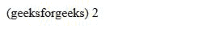
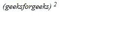
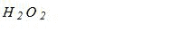

# CSS font-variant-position 属性

> 原文：[https://www.geeksforgeeks.org/css-font-variant-position-property/](https://www.geeksforgeeks.org/css-font-variant-position-property/)

CSS 的 `font-variant-position` 属性用于将字体的位置更改为上标、下标或普通字体。它们相对于字体基线定位，保持不变。

## 语法

```html
font-variant-position: normal | sub | super
```

## 属性值

### Normal
`Normal` 会停用上标和下标字形。如果不存在任何上标或下标，则字体样式将保持在基线。

**语法：**

```html
font-variant-position: normal
```

**示例：**

```html
<!DOCTYPE html>
<html lang="en">
<head>
  <meta charset="UTF-8">
  <meta name="viewport"
        content="width=device-width,
                 initial-scale=1.0">
  <title>Document</title>
</head>
<style>
  em{
    font-style: unset;
  }
  .font{
    font-variant-position: normal;
  }
</style>
<body>
  <em>
    (geeksforgeeks)
    <em class="font">
    </em>
  </em>
</body>
</html>
```

**输出：**



### Super
`Super` 会激活上标和替代字形。

**语法：**

```html
font-variant-position: super
```

**示例：**

```html
<!DOCTYPE html>
<html lang="en">
<head>
  <meta charset="UTF-8">
  <meta name="viewport"
        content="width=device-width,
                 initial-scale=1.0">
  <title>Document</title>
</head>
<style>
  .font{
    font-variant-position: super;
  }
</style>
<body>
  <em>
    (geeksforgeeks)
    <em class="font">
    </em>
  </em>
</body>
</html>
```

**输出：**



### Sub
`Sub` 会激活下标和替代字形。

**语法：**

```html
font-variant-position: sub
```

**示例：**

```html
<!DOCTYPE html>
<html lang="en">
<head>
  <meta charset="UTF-8">
  <meta name="viewport"
        content="width=device-width,
                 initial-scale=1.0">
  <title>Document</title>
</head>
<style>
  .font{
    font-variant-position: sub;
  }
</style>
<body>
  <em>
    H
    <em class="font">
    </em>
    O
    <em class="font">
    </em>
  </em>
</body>
</html>
```

**输出：**



## 支持的浏览器

*   Mozilla Firefox