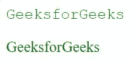
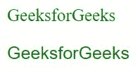
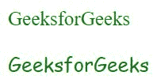
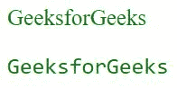
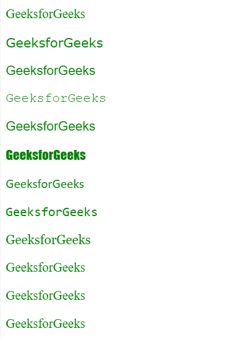

# CSS 通用字体系列集合

> 原文: [https://www.geeksforgeeks.org/css-generic-font-family-collection/](https://www.geeksforgeeks.org/css-generic-font-family-collection/)

字体系列属性用于设置 HTML 文档中文本的字体。不同的字体系列用于创建吸引人的网页。有许多字体可以从字体池中选择，如谷歌字体、Adobe 字体等，并且需要字体应用编程接口链接和自定义。通用字体系列主要分为以下几类，如下所示:

*   衬线
*   无衬线字体
*   草书
*   单一间隔
*   幻想

通用字体系列的详细描述如下:

## serif

`serif` 主要用于印刷目的的文本，如书籍、报纸、杂志等。文本字符的末端带有装饰性的笔画。`serif` 字体系列的例子有 Times New Roman、Garamond、Georgia、Literata、Minion、Perpetua 等。

**语法:**

```html
element {
    font-family:serif;
}
```

**示例:**

```html
<!DOCTYPE html>
<html>
<head>
    <title>
        Generic Font Family
    </title>
    <style>
        .GFG {
            font-family:serif ;
        }
        body {
            color:green;
            font-size:20px;
        }
    </style>
</head>
<body>
    <p>GeeksforGeeks</p>
    <p class = "GFG">GeeksforGeeks</p>
</body>
</html>
```

**输出:**


## sans-serif

`sans-serif` 的风格现代、正式且外观简洁。与“Serif”不同，它的末端没有笔画。它有广泛的用途，但最常用于数字形式的文本。`sans-serif` 的例子有 Verdana、Arial、Calibri、Helvetica、Futura、Impact、Lato、Optima、Skia 等。

**语法:**

```html
element {
    font-family: sans-serif;
}
```

**示例:**

```html
<!DOCTYPE html>
<html>
<head>
    <title>
        Generic Font Family
    </title>
    <style>
        .GFG {
            font-family:sans-serif ;
        }
        body {
            color:green;
            font-size:20px;
        }
    </style>
</head>
<body>
    <p>GeeksforGeeks</p>
    <p class = "GFG">GeeksforGeeks</p>
</body>
</html>
```

**输出:**


## cursive

这种字体主要用于邀请函、非正式消息、标题等。它的外观类似于使用钢笔或画笔的手写文本。`cursive` 字体系列的例子有 Flanella、Belluccia、Insolente、Corsiva、Zapfino 等。

**语法:**

```html
element {
    font-family:cursive;
}
```

**示例:**

```html
<!DOCTYPE html>
<html>
<head>
    <title>
        Generic Font Family
    </title>
    <style>
        .GFG {
            font-family:cursive;
        }
        body {
            color:green;
            font-size:20px;
        }
    </style>
</head>
<body>
    <p>GeeksforGeeks</p>
    <p class = "GFG">GeeksforGeeks</p>
</body>
</html>
```

**输出:**


## monospace

`monospace` 用于示例、打字机文本、说明、邮寄地址、代码样本等。文本的每个字符都具有相同的宽度。`monospace` 字体系列的例子有 Courier、Consolas、Monaco、SimSun、Terminal、Menlo、Inconsolata 等。

**语法:**

```html
element {
    font-family:monospace;
}
```

**示例:**

```html
<!DOCTYPE html>
<html>
<head>
    <title>
        Generic Font Family
    </title>
    <style>
        .GFG {
            font-family:monospace;
        }
        body {
            color:green;
            font-size:20px;
        }
    </style>
</head>
<body>
    <p>GeeksforGeeks</p>
    <p class = "GFG">GeeksforGeeks</p>
</body>
</html>
```

**输出:**


## fantasy

`fantasy` 用于使文本更具装饰性、冲击力和表现力。这种字体应用于较短的文本，因为它通常不容易阅读。`fantasy` 字体系列的例子有 Impact、Cracked、Critter、Studz、Copperplate 等。

**语法:**

```html
element {
    font-family:fantasy;
}
```

**示例:**

```html
<!DOCTYPE html>
<html>
<head>
    <title>
        Generic Font Family
    </title>
    <style>
        .GFG {
            font-family:fantasy;
        }
        body {
            color:green;
            font-size:20px;
        }
    </style>
</head>
<body>
    <p>GeeksforGeeks</p>
    <p class = "GFG">GeeksforGeeks</p>
</body>
</html>
```

**输出:**


以下是上述通用字体系列中作为示例提到的一些字体系列的描述，如下所示:

*   `Verdana`:
    *   **设计者:** 马修·卡特
    *   **类别:** 无衬线
    *   **发布时间:** 1996
*   `helvetica`:
    *   **设计人:** 马克斯·米丁格，爱德华·霍夫曼
    *   **类别:** 无衬线
    *   **发布于:** 1957 年
*   `courier`:
    *   **设计者:** 霍华德“巴德”凯特勒
    *   **类别:** 等宽
    *   **发布时间:** ~1956
*   `arial`:
    *   **设计者:** 罗宾·尼古拉斯和帕特里夏·桑德斯
    *   **类别:** 无衬线
    *   **发布时间:** 1982 年
*   `impact`:
    *   **设计人:** 杰弗里·李
    *   **类别:** 无衬线
    *   **发布于:** 1965 年
*   `calibri`:
    *   **设计人:** 吕克·德·格鲁特
    *   **类别:** 无衬线
    *   **发布时间:** 2007
*   `consolas`:
    *   **设计人:** 吕克·德·格鲁特
    *   **类别:** 等宽
    *   **发布时间:** 2002
*   `georgia`:
    *   **设计者:** 马修·卡特
    *   **类别:** 衬线
    *   **发布时间:** 1996
*   `garamond`:
    *   **设计人:** 保罗·希克森
    *   **类别:** 衬线
    *   **发布时间:** 1993 年
*   `perpetua`:
    *   **设计者:** 埃里克·吉尔
    *   **类别:** 衬线
    *   **发布于:** 1929-32
*   `onyx`:
    *   **设计人:** 格里·鲍威尔
    *   **类别:** 衬线
    *   **发布于:** 1955 年

**示例:** 本示例使用不同类型的字体系列。

```html
<!DOCTYPE html>
<html>
<head>
    <title>
        Generic Font Family
    </title>
    <style>
        body {
            color:green;
            font-size:20px;
        }
    </style>
</head>
<body>
    <p>GeeksforGeeks</p>
    <p style="font-family:verdana;">GeeksforGeeks</p>
    <p style="font-family:helvetica;">GeeksforGeeks</p>
    <p style="font-family:courier;">GeeksforGeeks</p>
    <p style="font-family:arial;">GeeksforGeeks</p>
    <p style="font-family:impact;">GeeksforGeeks</p>
    <p style="font-family:calibri;">GeeksforGeeks</p>
    <p style="font-family:consolas;">GeeksforGeeks</p>
    <p style="font-family:georgia;">GeeksforGeeks</p>
    <p style="font-family:garamond;">GeeksforGeeks</p>
    <p style="font-family:perpetua;">GeeksforGeeks</p>
    <p style="font-family:onyx;">GeeksforGeeks</p>
</body>
</html>
```

**输出:**
