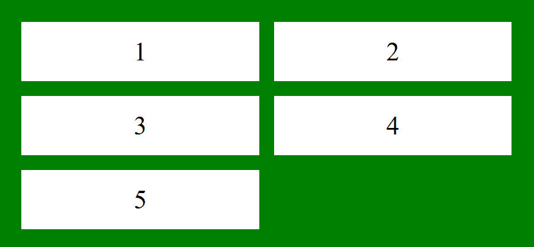
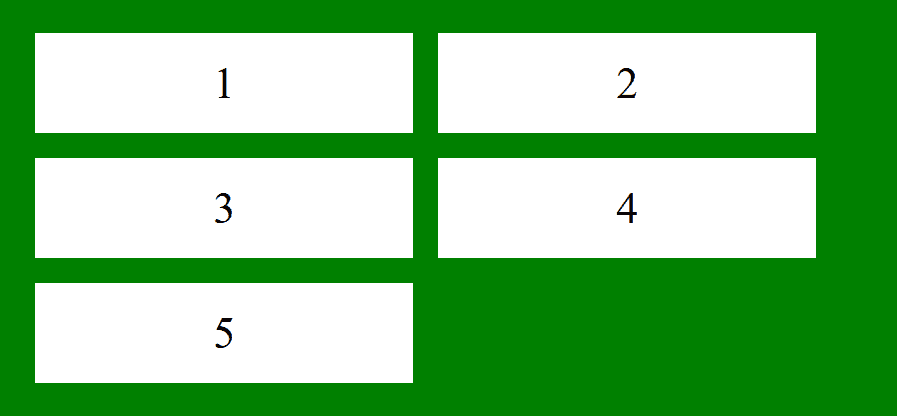
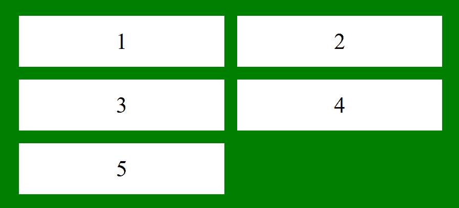

# CSS 网格-自动列属性

> 原文: [https://www.geeksforgeeks.org/css-grid-auto-columns-property/](https://www.geeksforgeeks.org/css-grid-auto-columns-property/)

CSS 中的 `grid-auto-columns` 属性用于指定隐式生成的网格容器的列大小。

## 语法

```html
grid-auto-columns: auto|max-content|min-content|length|
percentage|minmax(min, max)|initial|inherit;
```

## 属性值

### `auto`
这是默认值。尺寸根据容器的大小隐式确定。

**例 1:**

```html
<!DOCTYPE html>
<html>
    <head>
        <title>
            CSS grid-auto-column Property
        </title>
        <style>
            .main {
                display: grid;
                grid-template-areas: "a a";
                grid-gap: 20px;
                padding: 30px;
                background-color: green;
                grid-auto-columns: auto;
            }
            .GFG {
                text-align: center;
                font-size: 35px;
                background-color: white;
                padding: 20px 0;
            }
        </style>
    </head>
    <body>
        <div class="main">
            <div class="GFG">1</div>
            <div class="GFG">2</div>
            <div class="GFG">3</div>
            <div class="GFG">4</div>
            <div class="GFG">5</div>
        </div>
    </body>
</html>
```

**输出:**


### `length`
用于将尺寸指定为整数长度。不允许负值。

**示例:**

```html
<!DOCTYPE html>
<html>
    <head>
        <title>
            CSS grid-auto-column Property
        </title>
        <style>
            .main {
                display: grid;
                grid-template-areas: "a a";
                grid-gap: 20px;
                padding: 30px;
                background-color: green;
                grid-auto-columns: 8.5cm;
            }
            .GFG {
                text-align: center;
                font-size: 35px;
                background-color: white;
                padding: 20px 0;
            }
        </style>
    </head>
    <body>
        <div class="main">
            <div class="GFG">1</div>
            <div class="GFG">2</div>
            <div class="GFG">3</div>
            <div class="GFG">4</div>
            <div class="GFG">5</div>
        </div>
    </body>
</html>
```

**输出:**


### `percentage`
将尺寸指定为百分比值。

**示例:**

```html
<!DOCTYPE html>
<html>
    <head>
        <title>
            CSS grid-auto-column container Property
        </title>
        <style>
            .main {
                display: grid;
                grid-template-areas: "a a";
                grid-gap: 20px;
                padding: 30px;
                background-color: green;
                grid-auto-columns: 30%;
            }
            .GFG {
                text-align: center;
                font-size: 35px;
                background-color: white;
                padding: 20px 0;
            }
        </style>
    </head>
    <body>
        <div class="main">
            <div class="GFG">1</div>
            <div class="GFG">2</div>
            <div class="GFG">3</div>
            <div class="GFG">4</div>
            <div class="GFG">5</div>
        </div>
    </body>
</html>
```

**输出:**


### `max-content`
它根据容器中最大的物品来指定尺寸。

### `min-content`
根据容器中最小的物品指定尺寸。

### `minmax(min, max)`
它在 `[min, max]` 范围内指定尺寸。大于或等于 `min` 且小于或等于 `max`。

**示例:**

```html
<!DOCTYPE html>
<html>
    <head>
        <title>
            CSS grid-auto-column Property
        </title>
        <style>
            .main {
                display: grid;
                grid-template-areas: "a a";
                grid-gap: 20px;
                padding: 30px;
                background-color: green;
                grid-auto-columns: minmax(100px, 4cm);
            }
            .GFG {
                text-align: center;
                font-size: 35px;
                background-color: white;
                padding: 20px 0;
            }
        </style>
    </head>
    <body>
        <div class="main">
            <div class="GFG">1</div>
            <div class="GFG">2</div>
            <div class="GFG">3</div>
            <div class="GFG">4</div>
            <div class="GFG">5</div>
        </div>
    </body>
</html>
```

**输出:**


### `initial`
它将 `grid-auto-columns` 属性设置为其默认值。

**示例:**

```html
<!DOCTYPE html>
<html>
    <head>
        <title>
            CSS grid-auto-column Property
        </title>
        <style>
            .main {
                display: grid;
                grid-template-areas: "a a";
                grid-gap: 20px;
                padding: 30px;
                background-color: green;
                grid-auto-columns: initial;
            }
            .GFG {
                text-align: center;
                font-size: 35px;
                background-color: white;
                padding: 20px 0;
            }
        </style>
    </head>
    <body>
        <div class="main">
            <div class="GFG">1</div>
            <div class="GFG">2</div>
            <div class="GFG">3</div>
            <div class="GFG">4</div>
            <div class="GFG">5</div>
        </div>
    </body>
</html>
```

**输出:**


### `inherit`
它从父元素继承 `grid-auto-columns` 属性的值。

**示例:**

```html
<!DOCTYPE html>
<html>
    <head>
        <title>
            CSS grid-auto-column Property
        </title>
        <style>
            .main {
                display: grid;
                grid-template-areas: "a a";
                grid-gap: 20px;
                padding: 30px;
                background-color: green;
                grid-auto-columns: inherit;
            }
            .GFG {
                text-align: center;
                font-size: 35px;
                background-color: white;
                padding: 20px 0;
            }
        </style>
    </head>
    <body>
        <div class="main">
            <div class="GFG">1</div>
            <div class="GFG">2</div>
            <div class="GFG">3</div>
            <div class="GFG">4</div>
            <div class="GFG">5</div>
        </div>
    </body>
</html>
```

**输出:**


## 支持的浏览器
`grid-auto-columns` 属性支持的浏览器如下:

*   Chrome 57.0
*   Edge 16.0
*   Firefox 52.0
*   Safari 10.0
*   Opera 44.0