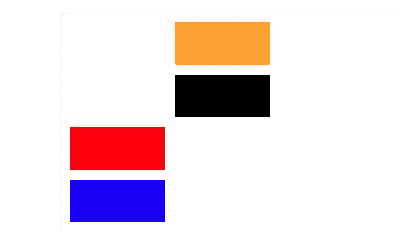
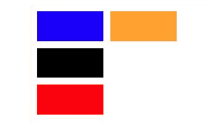

# CSS `grid-auto-flow` 属性

> 原文: [https://www.geeksforgeeks.org/css-grid-auto-flow-property/](https://www.geeksforgeeks.org/css-grid-auto-flow-property/)

`grid-auto-flow` 属性，精确指定自动放置的项目如何流入网格。

## 语法

```html
grid-auto-flow: row|column|row dense|column dense;
```

### 1. `row`
自动放置算法按顺序填充每一行来放置项目，必要时添加新行。

**语法:**

```html
grid-auto-flow: row;
```

**示例-1:**

```html
<!DOCTYPE html>
<html>
<head>
    <title>
        CSS grid-auto-flow Property
    </title>
    <style>
        .main {
            height: 200px;
            width: 200px;
            display: grid;
            grid-gap: 10px;
            grid-template: repeat(4, 1fr) / repeat(2, 1fr);
            /* grid-auto-flow property used here */
            grid-auto-flow: row;
        }
        .Geeks1 {
            background-color: red;
            grid-row-start: 3;
        }
        .Geeks2 {
            background-color: blue;
        }
        .Geeks3 {
            background-color: black;
        }
        .Geeks4 {
            grid-column-start: 2;
            background-color: orange;
        }
    </style>
</head>
<body>
    <div class="main">
        <div class="Geeks1"></div>
        <div class="Geeks2"></div>
        <div class="Geeks3"></div>
        <div class="Geeks4"></div>
    </div>
</body>
</html>
```

**输出:**


### 2. `column`
自动放置算法按顺序填充每一列来放置项目，必要时添加新列。

**语法:**

```html
grid-auto-flow: column;
```

**示例-2:**

```html
<!DOCTYPE html>
<html>
<head>
    <title>
        CSS grid-auto-flow Property
    </title>
    <style>
        .main {
            height: 200px;
            width: 200px;
            display: grid;
            grid-gap: 10px;
            grid-template: repeat(4, 1fr) / repeat(2, 1fr);
            /* grid-auto-flow property used here */
            grid-auto-flow: column;
        }
        .Geeks1 {
            background-color: red;
            grid-row-start: 3;
        }
        .Geeks2 {
            background-color: blue;
        }
        .Geeks3 {
            background-color: black;
        }
        .Geeks4 {
            grid-column-start: 2;
            background-color: orange;
        }
    </style>
</head>
<body>
    <div class="main">
        <div class="Geeks1"></div>
        <div class="Geeks2"></div>
        <div class="Geeks3"></div>
        <div class="Geeks4"></div>
    </div>
</body>
</html>
```

**输出:**


### 3. `column dense`
指定自动放置算法对列使用“密集”打包算法。

**语法:**

```html
grid-auto-flow: column dense;
```

**示例-3:**

```html
<!DOCTYPE html>
<html>
<head>
    <title>
        CSS grid-auto-flow Property
    </title>
    <style>
        .main {
            height: 200px;
            width: 200px;
            display: grid;
            grid-gap: 10px;
            grid-template: repeat(4, 1fr) / repeat(2, 1fr);
            /* grid-auto-flow property used here */
            grid-auto-flow: column dense;
        }
        .Geeks1 {
            background-color: red;
            grid-row-start: 3;
        }
        .Geeks2 {
            background-color: blue;
        }
        .Geeks3 {
            background-color: black;
        }
        .Geeks4 {
            grid-column-start: 2;
            background-color: orange;
        }
    </style>
</head>
<body>
    <div class="main">
        <div class="Geeks1"></div>
        <div class="Geeks2"></div>
        <div class="Geeks3"></div>
        <div class="Geeks4"></div>
    </div>
</body>
</html>
```

**输出:**


### 4. `row dense`
指定自动放置算法对行使用“密集”打包算法。

**语法:**

```html
grid-auto-flow: row dense;
```

**示例-4:**

```html
<!DOCTYPE html>
<html>
<head>
    <title>
        CSS grid-auto-flow Property
    </title>
    <style>
        .main {
            height: 200px;
            width: 200px;
            display: grid;
            grid-gap: 10px;
            grid-template: repeat(4, 1fr) / repeat(2, 1fr);
            /* grid-auto-flow property used here */
            grid-auto-flow: row dense;
        }
        .Geeks1 {
            background-color: red;
            grid-row-start: 3;
        }
        .Geeks2 {
            background-color: blue;
        }
        .Geeks3 {
            background-color: black;
        }
        .Geeks4 {
            grid-column-start: 2;
            background-color: orange;
        }
    </style>
</head>
<body>
    <div class="main">
        <div class="Geeks1"></div>
        <div class="Geeks2"></div>
        <div class="Geeks3"></div>
        <div class="Geeks4"></div>
    </div>
</body>
</html>
```

**输出:**


## 支持的浏览器
支持 `grid-auto-flow` 属性的浏览器如下：

*   谷歌 Chrome 57
*   Mozilla Firefox 52
*   边缘 16
*   Safari 10
*   歌剧 44