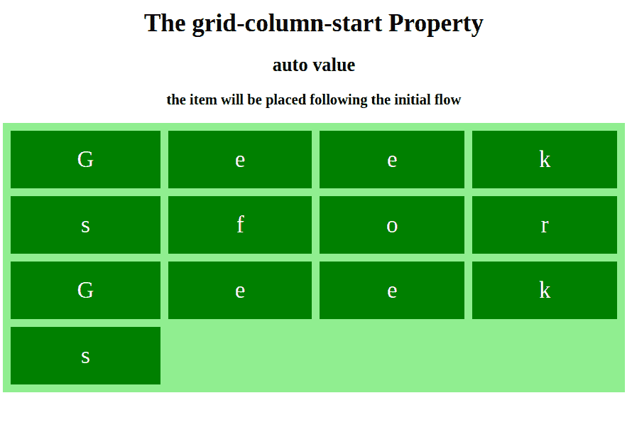
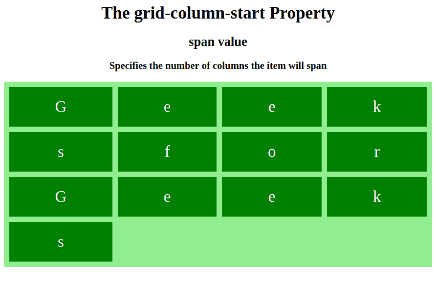
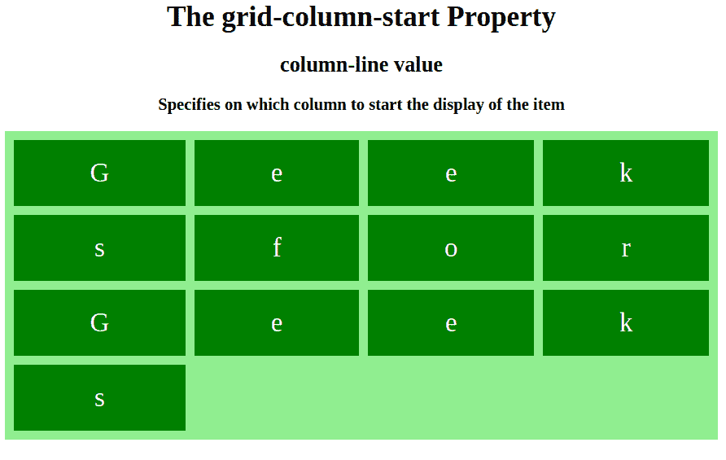

# CSS `grid-column-start` 属性

> 原文: [https://www.geeksforgeeks.org/css-grid-column-start-property/](https://www.geeksforgeeks.org/css-grid-column-start-property/)

`grid-column-start` 属性定义将从哪个列开始放置网格项目。该属性有不同的值，用户可以从任何地方开始使用不同的值。在同一个命名块上也有一个特定的值。

## 语法

```html
grid-column-start: auto|span n|column-line;
```

## 默认值

*   `auto`

## 属性值

### `auto`

一个关键字，指定属性对网格项的放置没有任何影响。默认值，项目将按照流程放置。

*   **语法:**

```html
grid-column-start: auto; 
```

*   **示例:**

```html
<!DOCTYPE html>
<html>
<head>
    <title>
        CSS | grid-column-start Property
    </title>
    <style>
        .grid-container {
            display: grid;
            grid-template-columns: auto auto auto auto;
            grid-gap: 10px;
            background-color: lightgreen;
            padding: 10px;
        }
        .grid-container div {
            background-color: green;
            text-align: center;
            padding: 20px 0;
            font-size: 30px;
            color: white;
        }
        .item1 {
            <!-- grid-column-start property with auto value -->
            grid-column-start: auto;
        }
    </style>
</head>
<body>
    <center>
        <h1>
            The grid-column-start Property
        </h1>
        <h3>auto value</h3>
        <strong>the item will be placed following the initial flow</strong>
    </center>
    <div class="grid-container">
        <div class="item1">G</div>
        <div class="item2">e</div>
        <div class="item2">e</div>
        <div class="item3">k</div>
        <div class="item4">s</div>
        <div class="item5">f</div>
        <div class="item6">o</div>
        <div class="item6">r</div>
        <div class="item1">G</div>
        <div class="item2">e</div>
        <div class="item2">e</div>
        <div class="item3">k</div>
        <div class="item4">s</div>
    </div>
</body>
</html>
```

*   **输出:**



### `span n`

一个关键字，指定项目将跨越的列数。如果名称是 `A`，则只计算具有该名称的行。

*   **语法:**

```html
grid-column-start: span n; 
```

*   **示例:**

```html
<!DOCTYPE html>
<html>
<head>
    <title>
        CSS | grid-column-start Property
    </title>
    <style>
        .grid-container {
            display: grid;
            grid-template-columns: auto auto auto auto;
            grid-gap: 10px;
            background-color: lightgreen;
            padding: 10px;
        }
        .grid-container div {
            background-color: green;
            text-align: center;
            padding: 20px 0;
            font-size: 30px;
            color: white;
        }
        .item1 {
            <!-- grid-column-start property with span value -->
            grid-column-start: span 4;
        }
    </style>
</head>
<body>
    <center>
        <h1>
            The grid-column-start Property
        </h1>
        <h3>auto value</h3>
        <strong>the item will be placed following the initial flow</strong>
    </center>
    <div class="grid-container">
        <div class="item1">G</div>
        <div class="item2">e</div>
        <div class="item2">e</div>
        <div class="item3">k</div>
        <div class="item4">s</div>
        <div class="item5">f</div>
        <div class="item6">o</div>
        <div class="item6">r</div>
        <div class="item1">G</div>
        <div class="item2">e</div>
        <div class="item2">e</div>
        <div class="item3">k</div>
        <div class="item4">s</div>
    </div>
</body>
</html>
```

*   **输出:**



### `column-line`

一个关键字，指定在哪个列开始显示项目。用户可以设置开始列。

*   **语法:**

```html
grid-column-start: column-line; 
```

*   **示例:**

```html
<!DOCTYPE html>
<html>
<head>
    <title>
        CSS | grid-column-start Property
    </title>
    <style>
        .grid-container {
            display: grid;
            grid-template-columns: auto auto auto auto;
            grid-gap: 10px;
            background-color: lightgreen;
            padding: 10px;
        }
        .grid-container div {
            background-color: green;
            text-align: center;
            padding: 20px 0;
            font-size: 30px;
            color: white;
        }
        .item1 {
            <!-- grid-column-start property with column-line value -->
            grid-column-start: 2;
        }
    </style>
</head>
<body>
    <center>
        <h1>
            The grid-column-start Property
        </h1>
        <h3>auto value</h3>
        <strong>the item will be placed following the initial flow</strong>
    </center>
    <div class="grid-container">
        <div class="item1">G</div>
        <div class="item2">e</div>
        <div class="item2">e</div>
        <div class="item3">k</div>
        <div class="item4">s</div>
        <div class="item5">f</div>
        <div class="item6">o</div>
        <div class="item6">r</div>
        <div class="item1">G</div>
        <div class="item2">e</div>
        <div class="item2">e</div>
        <div class="item3">k</div>
        <div class="item4">s</div>
    </div>
</body>
</html>
```

*   **输出:**



## 支持的浏览器

`grid-column-start` 属性支持的浏览器如下:

*   Google Chrome 57.0
*   Internet Explorer 16.0
*   Mozilla Firefox 52.0
*   Safari 10.0
*   Opera 44.0