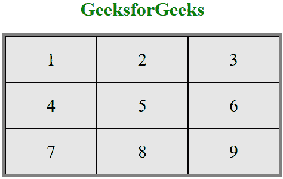
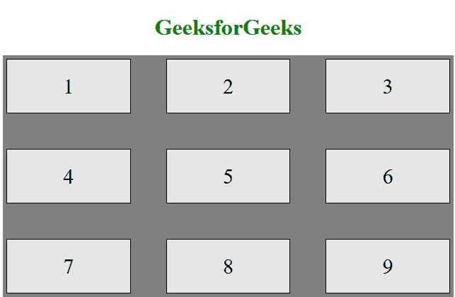
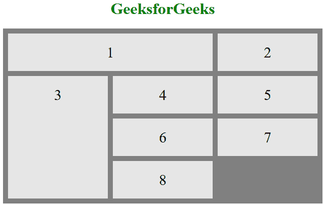

# CSS 网格布局模块

> 原文: [https://www.geeksforgeeks.org/css-grid-layout-module/](https://www.geeksforgeeks.org/css-grid-layout-module/)

CSS 网格布局模块用于创建基于网格的布局系统，借助行和列，在不使用浮动和定位的情况下，更容易设计任何网页。

## 语法

```html
.class {
    display:grid;
}
```

## 注意

如果一个 HTML 元素设置了 `display: grid`，则该元素成为网格容器。在样式部分或内联样式中设置均可。下面你会看到两个例子。

## CSS 网格布局属性

以下是网格布局属性：

*   `column-gap`：用于指定使用 `column-count` 属性划分给定文本的列之间的间距。
*   `gap`：它用来设置行与列之间的间距，也叫网格间隙。
*   `grid`：它提供了一个基于网格的布局系统，有行有列，更容易设计没有浮动和定位的网页。
*   `grid-area`：用于设置网格布局中网格项目的大小和位置。
*   `grid-auto-columns`：用于指定隐式生成的网格容器的列的大小。
*   `grid-auto-flow`：它精确地指定了自动放置的项目如何流入网格。
*   `grid-auto-rows`：用于指定隐式生成的网格容器的行的大小。
*   `grid-column`：描述了允许设计网格结构和使用 CSS 控制网格项目放置的属性数量。
*   `grid-column-end`：它解释了一个项目将跨越的列数，或者该项目将在哪个列线结束。
*   `grid-column-gap`：用于设置网格布局中各列之间的间隙大小。
*   `grid-column-start`：定义开始哪个列的行项目。
*   `grid-gap`：用于设置网格布局中行与列之间的间隙大小。
*   `grid-row`：用于指定网格布局中的尺寸和位置。
*   `grid-row-end`：通过指定网格区域的内联边来定义网格项在网格行内的结束位置。
*   `grid-row-gap`：用于定义网格元素之间的间隙大小。
*   `grid-row-start`：通过指定网格区域的内联开始边，定义网格项目在网格行内的开始位置。
*   `grid-template`：这是一个简写属性，用于定义网格列、行和区域。
*   `grid-template-areas`：用于指定网格布局内的区域。
*   `grid-template-columns`：用于设置网格的列数和列的大小。
*   `grid-template-rows`：用于设置网格中的行数和行高。

## 示例 1

本示例说明了 `display: grid` 属性的使用。

### 超文本标记语言

```html
<!DOCTYPE html>
<html>

<head>
    <style>
        /* Designing all grid */
        .grid-container {
            display: grid;
            grid-template-columns: auto auto auto;
            background-color: gray;
            padding: 5px;
        }

        /* Designing all grid-items */
        .grid-item {
            background-color: rgba(255, 255, 255, 0.8);
            border: 1px solid black;
            padding: 20px;
            font-size: 30px;
            text-align: center;
        }

        /* Designing h1 element */
        h1 {
            color: green;
            text-align: center;
        }
    </style>
</head>

<body>
    <h1>GeeksforGeeks</h1>

    <!-- Creating grid -->
    <div class="grid-container">
        <div class="grid-item">1</div>
        <div class="grid-item">2</div>
        <div class="grid-item">3</div>
        <div class="grid-item">4</div>
        <div class="grid-item">5</div>
        <div class="grid-item">6</div>
        <div class="grid-item">7</div>
        <div class="grid-item">8</div>
        <div class="grid-item">9</div>
    </div>
</body>

</html>
```

### 输出



## 示例 2

该示例说明了 `display: inline-grid` 属性的使用。

### 超文本标记语言

```html
<!DOCTYPE html>
<html>

<head>
    <style>
        /* Designing all grid */
        .grid-container {
            display: inline-grid;
            grid-template-columns: auto auto auto;
            background-color: gray;
            padding: 5px;
        }

        /* Designing all grid-items */
        .grid-item {
            background-color: rgba(255, 255, 255, 0.8);
            border: 1px solid black;
            padding: 20px;
            font-size: 30px;
        }

        /* Designing h1 element */
        h1 {
            color: green;
            text-align: center;
        }
    </style>
</head>

<body>
    <center>
        <h1>GeeksforGeeks</h1>

        <!-- Creating grids -->
        <div class="grid-container">
            <div class="grid-item">1</div>
            <div class="grid-item">2</div>
            <div class="grid-item">3</div>
            <div class="grid-item">4</div>
            <div class="grid-item">5</div>
            <div class="grid-item">6</div>
            <div class="grid-item">7</div>
            <div class="grid-item">8</div>
            <div class="grid-item">9</div>
        </div>
    </center>
</body>

</html>
```

### 输出


您可以在网格系统上控制以下内容：

*   `grid-column-gap`
*   `grid-row-gap`
*   `grid-gap`

## 示例 3

在下面的代码中，我们同时使用了 `grid-column-gap` 和 `grid-row-gap`。

### 超文本标记语言

```html
<!DOCTYPE html>
<html>

<head>
    <style>
        /* Designing all grid */
        .grid-container {
            display: grid;
            grid-template-columns: auto auto auto;
            background-color: gray;
            grid-column-gap: 50px;
            grid-row-gap: 50px;
            padding: 5px;
        }

        /* Designing all grid-items */
        .grid-item {
            background-color: rgba(255, 255, 255, 0.8);
            border: 1px solid black;
            padding: 20px;
            font-size: 30px;
            text-align: center;
        }

        /* Designing h1 element */
        h1 {
            color: green;
            text-align: center;
        }
    </style>
</head>

<body>
    <h1>GeeksforGeeks</h1>

    <!-- Creating grids -->
    <div class="grid-container">
        <div class="grid-item">1</div>
        <div class="grid-item">2</div>
        <div class="grid-item">3</div>
        <div class="grid-item">4</div>
        <div class="grid-item">5</div>
        <div class="grid-item">6</div>
        <div class="grid-item">7</div>
        <div class="grid-item">8</div>
        <div class="grid-item">9</div>
    </div>
</body>

</html>
```

### 输出



**注：** 同样 `grid-gap` 也起作用。

您可以在网格系统上控制以下内容：

*   `grid-column-line`
*   `grid-row-line`

## 示例 4

在下面的代码中，我们同时使用了 `grid-column-line` 和 `grid-row-line`。

### 超文本标记语言

```html
<!DOCTYPE html>
<html>

<head>
    <style>
        /* Designing all grid */
        .grid-container {
            display: grid;
            grid-template-columns: auto auto auto;
            grid-gap: 10px;
            background-color: gray;
            padding: 10px;
        }

        /* Designing all grid-items */
        .grid-container > div {
            background-color: rgba(255, 255, 255, 0.8);
            text-align: center;
            padding: 20px 0;
            font-size: 30px;
        }

        /* Grid Column */
        .item1 {
            grid-column-start: 1;
            grid-column-end: 3;
        }

        /* Grid row */
        .item3 {
            grid-row-start: 2;
            grid-row-end: 5;
        }

        /* Designing h1 element */
        h1 {
            color: green;
            text-align: center;
        }
    </style>
</head>

<body>
    <h1>GeeksforGeeks</h1>

    <!-- Creating grids -->
    <div class="grid-container">
        <div class="item1">1</div>
        <div class="item2">2</div>
        <div class="item3">3</div>
        <div class="item4">4</div>
        <div class="item5">5</div>
        <div class="item6">6</div>
        <div class="item7">7</div>
        <div class="item8">8</div>
    </div>
</body>

</html>
```

### 输出



## 支持的浏览器

CSS 网格布局模块支持的浏览器如下：

*   `Google Chrome 57.0`
*   `Microsoft Edge 16.0`
*   `Firefox 52.0`
*   `Safari 10.1`
*   `Opera 44.0`