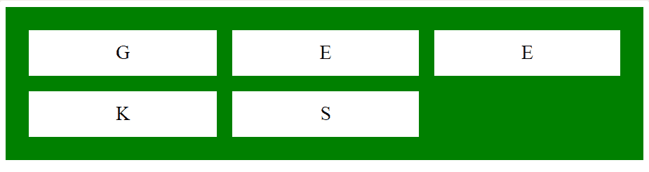
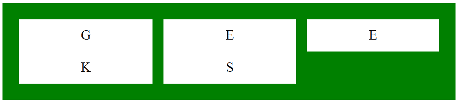

# CSS `grid-row-gap` 属性

> 原文: [https://www.geeksforgeeks.org/css-grid-row-gap-property/](https://www.geeksforgeeks.org/css-grid-row-gap-property/)

CSS 中的 `grid-row-gap` 属性用于定义网格元素之间的间隙大小。用户可以通过向 `grid-row-gap` 提供值来指定分隔行的间隙的宽度。

## 语法

```html
grid-row-gap: length | percentage | global-values;
```

## 属性值

### `length`

用户可以将 `grid-row-gap` 值设置为固定的长度，如 `px`、`cm` 等。

**示例:**

```html
<!DOCTYPE html>
<html>
    <head>
        <title>
            CSS grid-row-gap Property
        </title>
        <style>
            .main {
                display: grid;
                grid-template-columns: auto auto auto;
                grid-row-gap: 20px;
                grid-column-gap: 20px;
                background-color: green;
                padding: 30px;
            }
            .main > div {
                background-color: white;
                text-align: center;
                padding: 15px;
                font-size: 25px;
            }
        </style>
    </head>
    <body>
        <div class="main">
            <div>G</div>
            <div>E</div>
            <div>E</div>
            <div>K</div>
            <div>S</div>
        </div>
    </body>
</html>
```

**输出:**


### `percentage (%)`

此属性用于以百分比形式设置 `grid-row-gap` 值，其中百分比值相对于元素的尺寸。

**示例:**

```html
<!DOCTYPE html>
<html>
    <head>
        <title>
            CSS grid-row-gap Property
        </title>
        <style>
            .main {
                display: grid;
                grid-template-columns: auto auto auto;
                grid-row-gap: 20%;
                grid-column-gap: 2%;
                background-color: green;
                padding: 30px;
            }
            .main > div {
                background-color: white;
                text-align: center;
                padding: 15px;
                font-size: 25px;
            }
        </style>
    </head>
    <body>
        <div class="main">
            <div>G</div>
            <div>E</div>
            <div>E</div>
            <div>K</div>
            <div>S</div>
        </div>
    </body>
</html>
```

**输出:**


### `global-value`

此属性用于以一些固定术语的形式设置 `grid-row-gap` 值，包括 `inherit`、`initial`。

**示例:**

```html
<!DOCTYPE html>
<html>
    <head>
        <title>
            CSS grid-row-gap Property
        </title>
        <style>
            .main {
                display: grid;
                grid-template-columns: auto auto auto;
                grid-row-gap: initial;
                grid-column-gap: 20px;
                background-color: green;
                padding: 30px;
            }
            .main > div {
                background-color: white;
                text-align: center;
                padding: 15px;
                font-size: 25px;
            }
        </style>
    </head>
    <body>
        <div class="main">
            <div>G</div>
            <div>E</div>
            <div>E</div>
            <div>K</div>
            <div>S</div>
        </div>
    </body>
</html>
```

**输出:**


## 支持的浏览器

CSS `grid-row-gap` 属性支持的浏览器如下:

*   谷歌 Chrome 57.0
*   Internet Explorer 16.0
*   Firefox 52.0
*   Safari 10.0
*   Opera 44.0