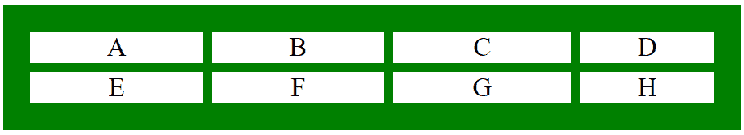
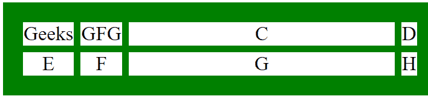

# CSS grid-template-columns 属性

> 原文：[https://www.geeksforgeeks.org/css-grid-template-columns-property/](https://www.geeksforgeeks.org/css-grid-template-columns-property/)

CSS 中的 `grid-template-columns` 属性用于设置网格的列数和列大小。此属性接受多个值。列的数量由赋予该属性的值的数量来设置。

## 语法

```html
grid-template-columns: none|auto|max-content|min-content|length|initial|inherit;
```

## 属性值

- **`none`**：是 `grid-template-columns` 属性的默认值。除非需要，否则网格不包含任何列。
  **语法：**
  ```html
  grid-template-columns: none;
  ```

- **`length`**：设置 `grid-template-columns` 属性的长度。长度可以设置为 `px`、`em`、百分比等形式，指定列的大小。
  **语法：**
  ```html
  grid-template-columns: length;
  ```

- **`auto`**：列的大小是根据内容和元素大小自动设置的。
  **语法：**
  ```html
  grid-template-columns: auto;
  ```

- **`min-content`**：根据最大最小内容大小设置栏目大小。
  **语法：**
  ```html
  grid-template-columns: min-content;
  ```

- **`max-content`**：根据最大最大内容大小设置栏目大小。
  **语法：**
  ```html
  grid-template-columns: max-content;
  ```

- **`initial`**：将 `grid-template-columns` 属性设置为默认值。
  **语法：**
  ```html
  grid-template-columns: initial;
  ```

- **`inherit`**：从其父元素继承 `grid-template-columns` 属性。
  **语法：**
  ```html
  grid-template-columns: inherit;
  ```

## 例 1

```html
<!DOCTYPE html>
<html>
    <head>
        <title>
            CSS grid-template-columns Property
        </title>
        <style>
            .geeks {
                background-color:green;
                padding:30px;
                display: grid;
                grid-template-columns: auto auto 200px 150px;
                grid-gap: 10px;
            }
            .GFG {
                background-color: white;
                border: 1px solid white;
                font-size: 30px;
                text-align: center;
            }
        </style>
    </head>
    <body>
        <div class="geeks">
            <div class="GFG">A</div>
            <div class="GFG">B</div>
            <div class="GFG">C</div>
            <div class="GFG">D</div>
            <div class="GFG">E</div>
            <div class="GFG">F</div>
            <div class="GFG">G</div>
            <div class="GFG">H</div>
        </div>
    </body>
</html>
```

**输出：**


## 例 2

```html
<!DOCTYPE html>
<html>
    <head>
        <title>
            CSS grid-template-columns Property
        </title>
        <style>
            .geeks {
                background-color:green;
                padding:30px;
                display: grid;
                grid-template-columns: min-content max-content 400px min-content;
                grid-gap: 10px;
            }
            .GFG {
                background-color: white;
                border: 1px solid white;
                font-size: 30px;
                text-align: center;
            }
        </style>
    </head>
    <body>
        <div class="geeks">
            <div class="GFG">Geeks</div>
            <div class="GFG">GFG</div>
            <div class="GFG">C</div>
            <div class="GFG">D</div>
            <div class="GFG">E</div>
            <div class="GFG">F</div>
            <div class="GFG">G</div>
            <div class="GFG">H</div>
        </div>
    </body>
</html>
```

**输出：**


## 支持的浏览器

`grid-template-columns` 属性支持的浏览器如下：

- Google Chrome 57.0
- Internet Explorer 16.0
- Firefox 52.0
- Opera 44.0
- Safari 10.0