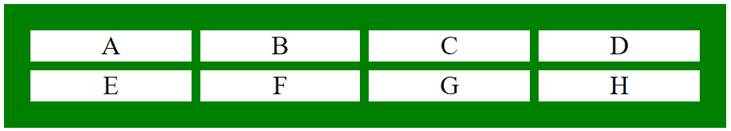
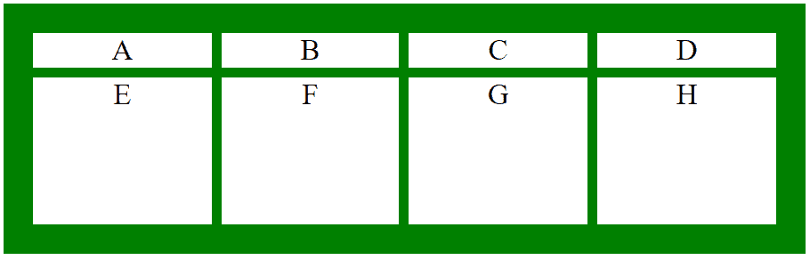

# CSS grid-template-rows 属性

> 原文：[https://www.geeksforgeeks.org/css-grid-template-rows-property/](https://www.geeksforgeeks.org/css-grid-template-rows-property/)

CSS 中的 `grid-template-rows` 属性用于设置网格中的行数和行高。网格模板行的值用空格分隔，其中每个值代表行的高度。

## 语法

```html
grid-template-rows: none|auto|max-content|min-content|length|initial|inherit;
```

## 属性值

### none
不设置 `grid-template-rows` 属性的高度。它在需要时创建行。

**语法：**

```html
grid-template-rows: none;
```

### auto
用于自动设置行的大小，即取决于容器的大小及行中的内容。

**语法：**

```html
grid-template-rows: auto;
```

### max-content
代表网格中项目的最大内容。

**语法：**

```html
grid-template-rows: max-content;
```

### min-content
它代表网格中项目的最小内容。

**语法：**

```html
grid-template-rows: min-content;
```

### length
行的大小根据指定的长度设置。

**语法：**

```html
grid-template-rows: length;
```

## 例 1

```html
<!DOCTYPE html>
<html>
    <head>
        <title>
            CSS grid-template-rows Property
        </title>
        <style>
            .geeks {
                background-color:green;
                padding:30px;
                display: grid;
                grid-template-columns: auto auto auto auto;
                grid-template-rows: auto auto;
                grid-gap: 10px;
            }
            .GFG {
                background-color: white;
                border: 1px solid white;
                font-size: 30px;
                text-align: center;
            }
        </style>
    </head>
    <body>
        <div class="geeks">
            <div class="GFG">A</div>
            <div class="GFG">B</div>
            <div class="GFG">C</div>
            <div class="GFG">D</div>
            <div class="GFG">E</div>
            <div class="GFG">F</div>
            <div class="GFG">G</div>
            <div class="GFG">H</div>
        </div>
    </body>
</html>
```

**输出：**



## 例 2

```html
<!DOCTYPE html>
<html>
    <head>
        <title>
            CSS grid-template-rows Property
        </title>
        <style>
            .geeks {
                background-color:green;
                padding:30px;
                display: grid;
                grid-template-columns: auto auto auto auto;
                grid-template-rows: auto 150px ;
                grid-gap: 10px;
            }
            .GFG {
                background-color: white;
                border: 1px solid white;
                font-size: 30px;
                text-align: center;
            }
        </style>
    </head>
    <body>
        <div class="geeks">
            <div class="GFG">A</div>
            <div class="GFG">B</div>
            <div class="GFG">C</div>
            <div class="GFG">D</div>
            <div class="GFG">E</div>
            <div class="GFG">F</div>
            <div class="GFG">G</div>
            <div class="GFG">H</div>
        </div>
    </body>
</html>
```

**输出：**



## 支持的浏览器

`grid-template-rows` 属性支持的浏览器如下：

*   Google Chrome 57.0
*   Internet Explorer 16.0
*   Firefox 52.0
*   Safari 10.0
*   Opera 44.0