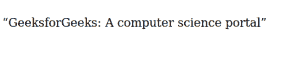

# CSS 悬挂标点属性

> 原文: [https://www.geeksforgeeks.org/css-hanging-punctuation-property/](https://www.geeksforgeeks.org/css-hanging-punctuation-property/)

CSS 中的 [`hanging-punctuation`](https://en.wikipedia.org/wiki/Hanging_punctuation) 属性为网页设计师在网页排版上提供了一些优势。悬挂标点符号属性指定标点符号是放在行框外的某一行文本的开头还是结尾。
基本上，它让网页设计者可以将项目符号或任何符号设置为向左或向右对齐，以便第一个字母与文档的其余部分正确对齐。
我们可以使用以下关键词和悬挂标点属性，可以使用不同的模式或类型:

*   关键字值
*   两个关键字值
*   三个关键字值
*   全局关键字值

## 语法: 关键字值

```html
hanging-punctuation: none;
hanging-punctuation: first;
hanging-punctuation: last;
hanging-punctuation: force-end;
hanging-punctuation: allow-end;
```

## 语法: 两个关键字值

```html
hanging-punctuation: first force-end;
hanging-punctuation: first allow-end;
hanging-punctuation: first last;
hanging-punctuation: last force-end;
hanging-punctuation: last allow-end;
```

## 语法: 三个关键词值

```html
hanging-punctuation: first force-end last;
hanging-punctuation: first allow-end last;
```

## 语法: 全局关键字值

```html
hanging-punctuation: inherit;
hanging-punctuation: initial;
hanging-punctuation: unset;
```

**默认值:**

*   `none`

**属性值:**

| 关键字 | 功能 |
| --- | --- |
| `none` | 这是此属性的默认值。没有字符悬挂。 |
| `first` | 使用可用字符悬挂在元素的第一格式化行的开头。 |
| `last` | 元素最后一格式化行末尾的可用字符被悬挂。 |
| `force-end` | 使用句点或逗号悬挂在行末。 |
| `allow-end` | 如果行末的句点或逗号在对齐前不合适，它将被悬挂。 |

## 示例

### HTML

```html
<!DOCTYPE HTML>
<html>
    <head>
        <title>
            CSS Hanging Punctuation Property
        </title>
        <style>
            p {
                 hanging-punctuation: first;
              } 
        </style>
    </head>

<body>

<p>“GeeksforGeeks: A computer science portal”</p>

</body>
</html>
```

## 输出



## 支持的浏览器

`hanging-punctuation` 属性支持的浏览器如下:

*   Safari 10.0+