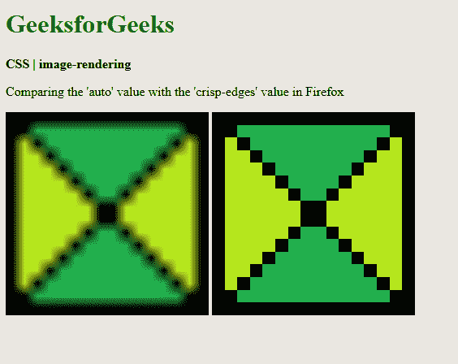
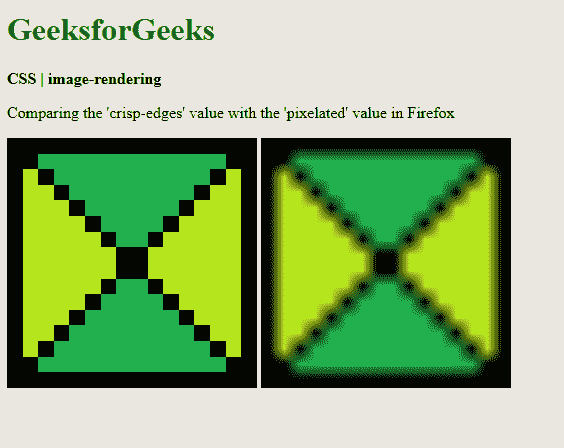
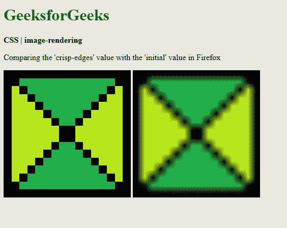

# CSS | 图像渲染属性

> 原文: [https://www.geeksforgeeks.org/css-image-rendering-property/](https://www.geeksforgeeks.org/css-image-rendering-property/)

`image-rendering` 属性用于设置用于图像缩放的算法类型。当用户将图像缩放到原始尺寸以上或以下时，此属性可用于修改缩放行为。

## 语法

```html
image-rendering: auto | crisp-edges | pixelated | initial | inherit
```

## 属性值

### `auto`
用于指示缩放算法将依赖于用户代理。不同的浏览器可能有不同的算法。

**示例:**

```html
<!DOCTYPE html>
<html>
<head>
  <title>
    CSS | image-rendering
  </title>
  <style>
    .image-crisp {
      /* Using the crisp-edges value for demonstration */
      image-rendering: crisp-edges;
    }
    .image-auto {
      image-rendering: auto;
    }
  </style>
</head>
<body>
  <h1 style="color: green">
    GeeksforGeeks
  </h1>
  <b>
    CSS | image-rendering
  </b>
  <p>
    Comparing the 'crisp-edges' value with the 'auto' value in Firefox
  </p>
  <div class="container">
    
    
  </div>
</body>
</html>
```

**输出:** 比较清晰边缘值和自动值


### `crisp-edges`
用于指示算法将保留图像中的对比度和边缘。它不会因使用抗锯齿而平滑颜色或模糊图像。这里使用的一些算法是最近邻和其他非平滑缩放算法。

**示例:**

```html
<!DOCTYPE html>
<html>
<head>
  <title>
    CSS | image-rendering
  </title>
  <style>
    .image-auto {
      image-rendering: auto;
    }
    .image-crisp {
      image-rendering: crisp-edges;
    }
  </style>
</head>
<body>
  <h1 style="color: green">
    GeeksforGeeks
  </h1>
  <b>
    CSS | image-rendering
  </b>
  <p>
    Comparing the 'auto' value with the 'crisp-edges' value in Firefox
  </p>
  <div class="container">
    
    
  </div>
</body>
</html>
```

**输出:** 将自动值与清晰边缘值进行比较


### `pixelated`
用于指示当图像放大时，对其使用最近邻算法。当图像缩小时，其行为与 `auto` 值相同。

**示例:**

```html
<!DOCTYPE html>
<html>
<head>
  <title>
    CSS | image-rendering
  </title>
  <style>
    .image-crisp {
      /* Using the crisp-edges value for demonstration */
      image-rendering: crisp-edges;
    }
    .image-pixelated {
      image-rendering: pixelated;
    }
  </style>
</head>
<body>
  <h1 style="color: green">
    GeeksforGeeks
  </h1>
  <b>
    CSS | image-rendering
  </b>
  <p>
    Comparing the 'crisp-edges' value with the 'pixelated' value in Firefox
  </p>
  <div class="container">
    
    
  </div>
</body>
</html>
```

**输出:** 比较清晰边缘值和像素化值


### `initial`
用于将属性设置为其默认值。

**示例:**

```html
<!DOCTYPE html>
<html>
<head>
  <title>
    CSS | image-rendering
  </title>
  <style>
    .image-crisp {
      /* Using the crisp-edges value for demonstration */
      image-rendering: crisp-edges;
    }
    .image-auto {
      image-rendering: initial;
    }
  </style>
</head>
<body>
  <h1 style="color: green">
    GeeksforGeeks
  </h1>
  <b>
    CSS | image-rendering
  </b>
  <p>
    Comparing the 'crisp-edges' value with the 'initial' value in Firefox
  </p>
  <div class="container">
    
    
  </div>
</body>
</html>
```

**输出:** 比较清晰边缘值和初始值


### `inherit`
用于设置属性从其父元素继承。

## 支持的浏览器
`image-rendering` 属性支持的浏览器如下:

*   Chrome
*   Firefox
*   Safari
*   Opera