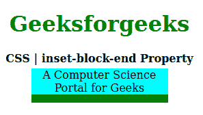
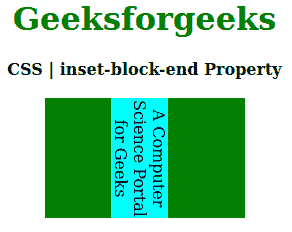

# CSS `inset-block-end` 属性

> 原文：[https://www.geeksforgeeks.org/css-inset-block-end-property/](https://www.geeksforgeeks.org/css-inset-block-end-property/)

CSS 中的 `inset-block-end` 属性用于定义逻辑块结束偏移量，而不是用于内联偏移量或逻辑块。此属性可以应用于任何写入模式属性。

## 语法

```html
inset-block-end: length | percentage | auto | inherit | initial | unset;
```

## 属性值

*   `length`：设置 `px`、`cm`、`pt` 等定义的固定值。也允许负值。它的默认值是 `0px`。
*   `percentage`：与长度相同，但以窗口大小的百分比设置。
*   `auto`：当希望浏览器确定嵌入块结束时使用。
*   `initial`：用于将嵌入块结束属性的值设置为默认值。
*   `inherit`：当需要元素从其父元素继承嵌入块结束属性时使用。
*   `unset`：用于取消设置默认插入块结束属性。

以下示例说明了 CSS 中的 `inset-block-end` 属性：

## 示例 1

```html
<!DOCTYPE html>
<html>
<head>
    <title>CSS | inset-block-end Property</title>
    <style>
        h1 {
            color: green;
        }
        div {
            background-color: green;
            width: 200px;
            height: 20px;
        }
        .one {
            position: relative;
            inset-block-end: 30px;
            background-color: cyan;
        }
    </style>
</head>
<body>
    <center>
        <h1>Geeksforgeeks</h1>
        <b>CSS | inset-block-end Property</b>
        <br><br>
        <div>
            <p class="one">
                A Computer Science Portal for Geeks
            </p>
        </div>
    </center>
</body>
</html>
```

**输出：**


## 示例 2

```html
<!DOCTYPE html>
<html>
<head>
    <title>CSS | inset-block-end Property</title>
    <style>
        h1 {
            color: green;
        }
        div {
            background-color: green;
            width: 200px;
            height: 120px;
        }
        .one {
            writing-mode: vertical-rl;
            position: relative;
            inset-block-end: 50px;
            background-color: cyan;
        }
    </style>
</head>
<body>
    <center>
        <h1>Geeksforgeeks</h1>
        <b>CSS | inset-block-end Property</b>
        <br><br>
        <div>
            <p class="one">
                A Computer Science Portal for Geeks
            </p>
        </div>
    </center>
</body>
</html>
```

**输出：**


## 支持的浏览器

`inset-block-end` 属性支持的浏览器如下：

*   Firefox
*   Google Chrome
*   Edge
*   Opera

## 参考

[https://developer.mozilla.org/en-US/docs/Web/CSS/inset-block-end](https://developer.mozilla.org/en-US/docs/Web/CSS/inset-block-end)