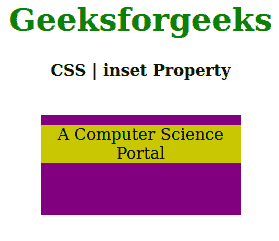
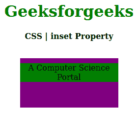

# CSS `inset` 属性

> 原文: [https://www.geeksforgeeks.org/css-inset-property/](https://www.geeksforgeeks.org/css-inset-property/)

CSS 中的 `inset` 属性用于定义物理偏移，而不是用于内联偏移或逻辑块。此属性可以应用于任何写入模式属性。

## 语法

```html
inset: length|percentage|auto|inherit|initial|unset;
```

## 属性值

*   `length`: 设置 `px`、`cm`、`pt` 等定义的固定值。也允许负值。它的默认值是 `0px`。
*   `percentage`: 与 `length` 相同，但以窗口大小的百分比设置大小。
*   `auto`: 当希望浏览器确定嵌入尺寸时使用。
*   `initial`: 用于将 `inset` 属性的值设置为默认值。
*   `inherit`: 它从其父元素继承 `inset` 属性值。
*   `unset`: 用于取消设置 `inset` 属性，为默认值。

以下示例说明了 CSS 中的 `inset` 属性:

## 例 1

```html
<!DOCTYPE html>
<html>

<head>
    <title>CSS | inset Property</title>
    <style>
        h1 {
            color: green;
        }

        div {
            background-color: purple;
            width: 200px;
            height: 100px;
            position: relative;
        }

        .one {
            position: relative;
            inset: 10px 40px 30px 0px;
            background-color: #c8c800;
        }
    </style>
</head>

<body>
    <center>
        <h1>Geeksforgeeks</h1>
        <b>CSS | inset Property</b>
        <br><br>
        <div>
            <p class="one">
                A Computer Science Portal
            </p>
        </div>
    </center>
</body>

</html>
```

### 输出



## 例 2

```html
<!DOCTYPE html>
<html>

<head>
    <title>CSS | inset Property</title>
    <style>
        h1 {
            color: green;
        }

        div {
            background-color: purple;
            width: 200px;
            height: 100px;
            position: relative;
        }

        .one {
            position: relative;
            inset: 10% 5% 5% 0%;
            background-color: green;
        }
    </style>
</head>

<body>
    <center>
        <h1>Geeksforgeeks</h1>
        <b>CSS | inset Property</b>
        <br><br>
        <div>
            <p class="one">
                A Computer Science Portal
            </p>
        </div>
    </center>
</body>

</html>
```

### 输出



## 支持的浏览器

`inset` 属性支持的浏览器如下:

*   火狐浏览器

## 参考

[https://developer.mozilla.org/en-US/docs/Web/CSS/inset](https://developer.mozilla.org/en-US/docs/Web/CSS/inset)