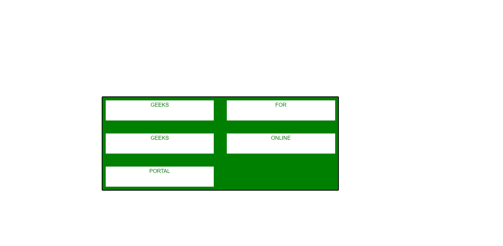
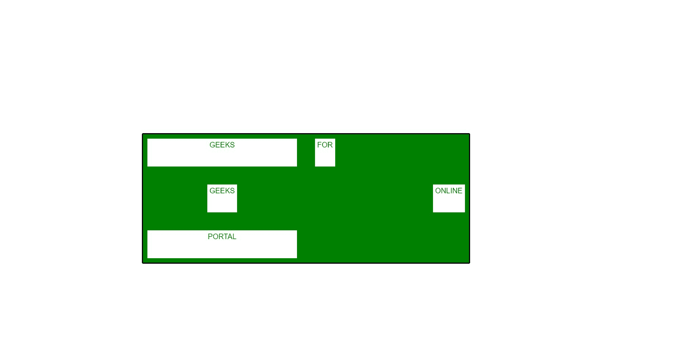

# CSS `justify-self` 属性

> 原文: [https://www.geeksforgeeks.org/css-justify-self-property/](https://www.geeksforgeeks.org/css-justify-self-property/)

`justify-self` 属性用于指定内容位置与 CSS 网格中适当轴的对齐方式。

**语法:**

> `justify-self: stretch | normal | auto | baseline | start | end | center | flex-start | flex-end | self-start | self-end | left | right | safe | unsafe`

## 属性值

*   `stretch`: 是该属性的默认值，它使内容填充单元格的整个宽度。
*   `normal`: 它是琐碎属性，即在块级布局中表现为 `start` 并在替换的绝对定位框中表现为 `stretch`。在其他绝对定位框中，在表格和 flex 布局中，它被忽略，在网格布局中表现为 `stretch`，除了在少数情况下，如具有纵横比的框中，它充当 `start` 值。
*   `auto`: 它是用于调整位于父元素中的项目属性的值，或者默认为 `normal` 值。这是默认值。
*   `baseline`: 将当前框的第一个或最后一个基线集的对齐基线对齐到其基线共享组中所有框的共享的第一个或最后一个基线集中的对应基线。`first` 基线的回退值是 `start`，`last` 基线的回退值是 `end`。
*   `start`: 允许内容自身对齐单元格左侧。
*   `end`: 它允许内容自身对齐单元格右侧。
*   `center`: 允许内容自身对齐单元格中心。
*   `flex-start`: 与 `start` 值相同。
*   `flex-end`: 与 `end` 值相同。
*   `self-start`: 它在项目开始时将项目对齐对齐容器的左侧。
*   `self-end`: 它将项目对齐到项目末尾对齐容器的右侧。
*   `left`: 使物品包与对齐容器左侧齐平。如果该属性的轴与内联轴不平行，则它的作用与 `start` 相同。
*   `right`: 它使物品包与对齐容器的右侧齐平。如果该属性的轴与内联轴不平行，则它的作用与 `end` 相同。
*   `safe`: 如果物品溢出对齐容器，则使物品对齐为 `start` 值。
*   `unsafe`: 它使物品按照给定值对齐，而不管对齐容器和物品的相对大小。

## 示例 1

在此示例中，`justify-self` 不用于对齐。

### HTML

```html
<!DOCTYPE html>
<html>
<head>
    <style>
        article {
            font-family: sans-serif;
            background-color: green;
            display: grid;
            grid-template-columns: 1fr 1fr;
            grid-auto-rows: 70px;
            grid-gap: 30px;
            width: 700px;
            justify-items: stretch;
            border: solid;
            margin: 20%;
        }

        article span {
            background-color: white;
            color: green;
            margin: 2px;
            text-align: center;
            border: solid;
        }

        article, span {
            padding: 5px;
            border-radius: 3px;
            border: solid;
        }
    </style>
</head>
<body>
    <article class="container">
        <span>GEEKS</span>
        <span>FOR</span>
        <span>GEEKS</span>
        <span>ONLINE</span>
        <span>PORTAL</span>
    </article>
</body>
</html>
```

**输出:**



## 示例 2

在此示例中，一些 `justify-self` 值用于对齐。

### HTML

```html
<!DOCTYPE html>
<html>
<head>
    <style>
        article {
            font-family: sans-serif;
            background-color: green;
            display: grid;
            grid-template-columns: 1fr 1fr;
            grid-auto-rows: 70px;
            grid-gap: 30px;
            width: 700px;
            justify-items: stretch;
            border: solid;
            margin: 20%;
        }

        span:nth-child(2) {
            justify-self: start;
        }

        span:nth-child(3) {
            justify-self: center;
        }

        span:nth-child(4) {
            justify-self: end;
        }

        article span {
            background-color: white;
            color: green;
            margin: 2px;
            text-align: center;
            border: solid;
        }

        article, span {
            padding: 5px;
            border-radius: 3px;
            border: solid;
        }
    </style>
</head>
<body>
    <article class="container">
        <span>GEEKS</span>
        <span>FOR</span>
        <span>GEEKS</span>
        <span>ONLINE</span>
        <span>PORTAL</span>
    </article>
</body>
</html>
```

**输出:**



## 支持的浏览器

*   谷歌 Chrome
*   火狐浏览器
*   歌剧
*   苹果 Safari