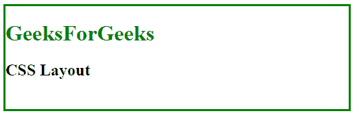
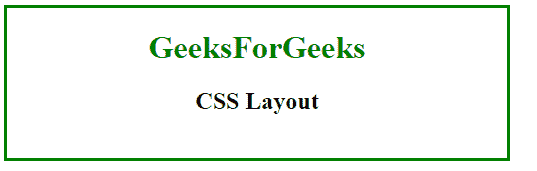
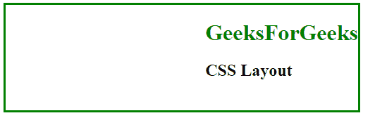
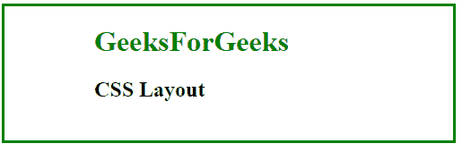
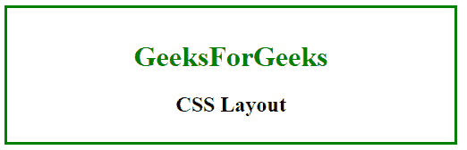
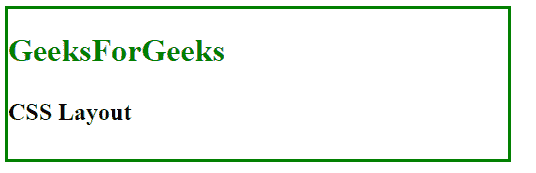
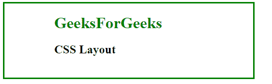
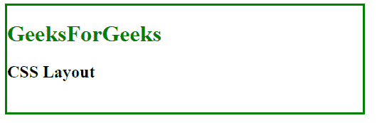
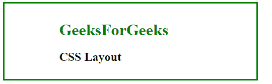

# CSS 布局 – 水平 & 垂直对齐

> 原文: [https://www.geeksforgeeks.org/css-layout-horizontal-vertical-align/](https://www.geeksforgeeks.org/css-layout-horizontal-vertical-align/)

CSS 中的布局用于控制元素在另一个元素中的流动。它设置元素在网页中的位置。元素的位置可以通过水平和垂直对齐来设置。有许多方法可以设置元素的位置，如下所示：

## 使用位置属性

使用 `position` 属性为 `absolute` 设置左右对齐。

**语法：**

```html
position: absolute;
```

**示例：**

```html
<!DOCTYPE html>
<html>
    <head>
        <title>
            CSS Layout
        </title>
        <style>
            body{
                width: 500px;
                height: 150px;
                border: 3px solid green;
            }
            #content{
                position: absolute;
            }
        </style>
    </head>
    <body>
        <div id="content">
            <h1 style = "color:green;" >
                GeeksForGeeks
            </h1>
            <h2>CSS Layout</h2>
        </div>
    </body>
</html>
```

**输出：**


## 使用文本对齐属性

使用 `text-align` 属性设置元素的水平对齐。`text-align` 属性可以设置为 `left`、`right` 或 `center`。

**语法：**

```html
text-align: center;
```

**示例：**

```html
<!DOCTYPE html>
<html>
    <head>
        <title>
            CSS Layout
        </title>
        <style>
            body{
                width: 500px;
                height: 150px;
                border: 3px solid green;
            }
            #content{
                text-align: center;
            }
        </style>
    </head>
    <body>
        <div id="content">
            <h1 style = "color:green;" >
                GeeksForGeeks
            </h1>
            <h2>CSS Layout</h2>
        </div>
    </body>
</html>
```

**输出：**


## 使用 float 属性

使用 `float` 属性设置元素的对齐方式。`float` 值可以设置为 `left` 或 `right`。

**语法：**

```html
float: right;
```

**示例：**

```html
<!DOCTYPE html>
<html>
    <head>
        <title>
            CSS Layout
        </title>
        <style>
            body{
                width: 500px;
                height: 150px;
                border: 3px solid green;
            }
            #content{
                float: right;
            }
        </style>
    </head>
    <body>
        <div id="content">
            <h1 style = "color:green;" >
                GeeksForGeeks
            </h1>
            <h2>CSS Layout</h2>
        </div>
    </body>
</html>
```

**输出：**


## 水平使用填充属性

`padding` 属性用于通过使用左右填充将元素对齐设置为水平。

**语法：**

```html
padding: 0 100px;
```

**示例：**

```html
<!DOCTYPE html>
<html>
    <head>
        <title>
            CSS Layout
        </title>
        <style>
            body{
                width: 500px;
                height: 150px;
                border: 3px solid green;
            }
            #content{
                padding: 0 100px;
            }
        </style>
    </head>
    <body>
        <div id="content">
            <h1 style = "color:green;" >
                GeeksForGeeks
            </h1>
            <h2>CSS Layout</h2>
        </div>
    </body>
</html>
```

**输出：**


## 垂直使用填充属性

`padding` 属性用于通过使用顶部和底部填充将元素对齐设置为垂直。

**语法：**

```html
padding: 15px 0;
```

**示例：**

```html
<!DOCTYPE html>
<html>
    <head>
        <title>
            CSS Layout
        </title>
        <style>
            body{
                width: 500px;
                height: 150px;
                border: 3px solid green;
            }
            #content{
                padding: 15px 0;
                text-align: center;
            }
        </style>
    </head>
    <body>
        <div id="content">
            <h1 style = "color:green;" >
                GeeksForGeeks
            </h1>
            <h2>CSS Layout</h2>
        </div>
    </body>
</html>
```

**输出：**


## 行高属性

`line-height` 用于垂直设置对齐方式。

**语法：**

```html
line-height: 40px;
```

**示例：**

```html
<!DOCTYPE html>
<html>
    <head>
        <title>
            CSS Layout
        </title>
        <style>
            body {
                width: 500px;
                height: 150px;
                border: 3px solid green;
            }
            #content {
                line-height: 40px;
            }
        </style>
    </head>
    <body>
        <div id="content">
            <h1 style = "color:green;" >
                GeeksForGeeks
            </h1>
            <h2>CSS Layout</h2>
        </div>
    </body>
</html>
```

**输出：**


## 使用边距属性

`margin` 属性用于设置自动水平对齐块元素。

**语法：**

```html
margin: auto;
```

**示例：**

```html
<!DOCTYPE html>
<html>
    <head>
        <title>
            CSS Layout
        </title>
        <style>
            body {
                width: 500px;
                height: 150px;
                border: 3px solid green;
            }
            #content {
                margin: auto;
                width: 300px;
                height: 100px;
            }
        </style>
    <head>
    <body>
        <div id="content">
            <h1 style = "color:green;" >
                GeeksForGeeks
            </h1>
            <h2>CSS Layout</h2>
        </div>
    </body>
</html>
```

**输出：**


## 使用 Clearfix

如果任何元素比它的父元素高，并且它是浮动的，那么它将溢出到它的容器之外。`overflow` 被设置为 `auto` 修复这个问题。

**语法：**

```html
overflow: auto;
```

**示例：**

```html
<!DOCTYPE html>
<html>
    <head>
        <title>
            CSS Layout
        </title>
        <style>
            body {
                width: 500px;
                height: 150px;
                border: 3px solid green;
            }
            #content {
                overflow: auto;
            }
        </style>
    </head>
    <body>
        <div id="content">
            <h1 style = "color:green;" >
                GeeksForGeeks
            </h1>
            <h2>CSS Layout</h2>
        </div>
    </body>
</html>
```

**输出：**


## 使用变换和定位

`transform` 属性用于将元素相对于其父元素以及 `position` 变换为 `absolute`。

**语法：**

```html
position: absolute;
transform: translate(X%, Y%);
```

**示例：**

```html
<!DOCTYPE html>
<html>
    <head>
        <title>
            CSS Layout
        </title>
        <style>
            body {
                width: 500px;
                height: 150px;
                border: 3px solid green;
            }
            #content {
                position: absolute;
                transform: translate(50%, 10%);
            }
        </style>
    </head>
    <body>
        <div id="content">
            <h1 style = "color:green;" >
                GeeksForGeeks
            </h1>
            <h2>CSS Layout</h2>
        </div>
    </body>
</html>
```

**输出：**
