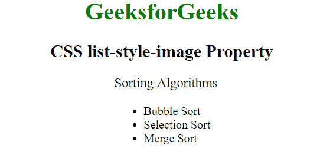
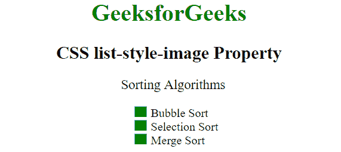

# CSS 列表样式-图像属性

> 原文: [https://www.geeksforgeeks.org/css-list-style-image-property/](https://www.geeksforgeeks.org/css-list-style-image-property/)

CSS 中的列表样式图像属性用于设置将用作列表项标记的图像。

## 语法:

```css
list-style-image: none|url|initial|inherit;
```

## 属性值

### `none`
该值指定没有图像用作标记。如果设置了该值，则使用列表样式类型中定义的标记。这是默认值。

**语法:**

```css
list-style-image: none;
```

**示例:**

```html
<!DOCTYPE html>
<html>
    <head>
    <title>
        CSS list-style-image Property
    </title>
    <style>
        ul  {
          list-style-image: none;
        }
    </style>
    </head>
    <body style = "">
        <h1 style = "color:green;">
            GeeksforGeeks
        </h1>
        <h2>
            CSS list-style-image Property
        </h2>
        <p>Sorting Algorithms</p>
        <ul>
          <li>Bubble Sort</li>
          <li>Selection Sort</li>
          <li>Merge Sort</li>
        </ul>
    </body>
</html>
```

**输出:**


### `url`
在此值中，图像的路径被用作列表项标记。

**语法:**

```css
list-style-image: url("image_path");
```

**示例:**

```html
<!DOCTYPE html>
<html>
    <head>
    <title>
        CSS list-style-image Property
    </title>
    <style>
        ul  {
          list-style-image: url("https://contribute.geeksforgeeks.org/wp-content/uploads/listitem-1.png");
        }
    </style>
    </head>
    <body style = "">
        <h1 style = "color:green;">
            GeeksforGeeks
        </h1>
        <h2>
            CSS list-style-image Property
        </h2>
        <p>Sorting Algorithms</p>
        <ul>
          <li>Bubble Sort</li>
          <li>Selection Sort</li>
          <li>Merge Sort</li>
        </ul>
    </body>
</html>
```

**输出:**


### `initial`
此模式将此属性设置为其默认值。

**语法:**

```css
list-style-image: initial;
```

## 支持的浏览器

`list-style-image` 属性支持的浏览器如下:

*   谷歌 Chrome 1.0
*   Internet Explorer 4.0
*   Firefox 1.0
*   Opera 7.0
*   苹果 Safari 1.0