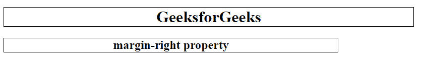
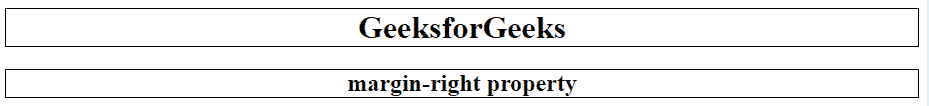

# CSS margin-right 属性

> 原文: [https://www.geeksforgeeks.org/css-margin-right-property/](https://www.geeksforgeeks.org/css-margin-right-property/)

CSS 中的 `margin-right` 属性用于设置元素的右边距。它设置元素右侧的边距区域。也允许负值。`margin-right` 属性的默认值为零。

## 语法:

```html
margin-right: length|auto|initial|inherit;
```

## 属性值:

*   **length:** 此属性用于设置以 `px`、`cm`、`pt` 等单位定义的固定值。允许负值，默认值为 `0px`。

### 语法:

```html
margin-right: length;
```

### 示例:

```html
<!DOCTYPE html>
<html>
    <head>
        <title>
            margin-right property
        </title>
        <!-- margin-right property -->
        <style>
            h1 {
                margin-right: 100px;
                border: 1px solid black;
            }
            h2 {
                margin-right: 250px;
                border: 1px solid black;
            }
        </style>
    </head>
    <body style = "text-align:center">
        <h1>GeeksforGeeks</h1>
        <h2>margin-right property</h2>
    </body>
</html>
```

### 输出:


*   **auto:** 当需要时使用此属性，其值由浏览器决定。

### 语法:

```html
margin-right: auto;
```

### 示例:

```html
<!DOCTYPE html>
<html>
    <head>
        <title>
            margin-right property
        </title>
        <!-- margin-right property -->
        <style>
            h1 {
                margin-right: auto;
                border: 1px solid black;
            }
            h2 {
                margin-right: auto;
                border: 1px solid black;
            }
        </style>
    </head>
    <body style = "text-align:center">
        <h1>GeeksforGeeks</h1>
        <h2>margin-right property</h2>
    </body>
</html>
```

### 输出:


*   **initial:** 它将 `margin-right` 的值设置为其默认值。

### 语法:

```html
margin-right: initial;
```

### 示例:

```html
<!DOCTYPE html>
<html>
    <head>
        <title>
            margin-right property
        </title>
        <!-- margin-right property -->
        <style>
            h1 {
                margin-right: initial;
                border: 1px solid black;
            }
            h2 {
                margin-right: initial;
                border: 1px solid black;
            }
        </style>
    </head>
    <body style = "text-align:center">
        <h1>GeeksforGeeks</h1>
        <h2>margin-right property</h2>
    </body>
</html>
```

### 输出:


*   **inherit:** 此属性从其父级继承。

## 支持的浏览器:

`margin-right` 属性支持的浏览器如下:

*   谷歌 Chrome 1.0
*   Internet Explorer 6.0
*   Firefox 1.0
*   Safari 1.0
*   歌剧 3.5