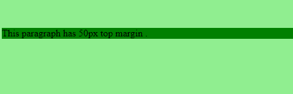
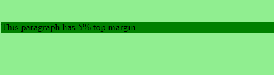
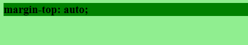
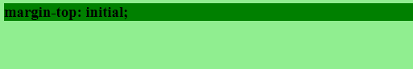
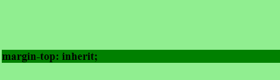

# CSS 页边距顶端属性

> 原文: [https://www.geeksforgeeks.org/css-margin-top-property/](https://www.geeksforgeeks.org/css-margin-top-property/)

CSS 中的上边距属性用于设置元素的上边距。它设置元素顶部的边距区域。上边距属性的默认值为 `0`。

## 语法

```html
margin-top: length|auto|initial|inherit;
```

## 属性值

### length
用于指定具有固定值的边距长度。该值可以是正数、负数或零。

**语法:**

```html
margin-top: length;
```

**示例:**

```html
<!DOCTYPE html>
<html>
    <head>
        <title>margin-top property</title>
        <!-- margin-top CSS property -->
        <style>
            p {
                margin-top:50px; 
                background-color:green;
            }
        </style>
    </head>
    <body style = "background-color:lightgreen;">
        <!-- margin-top property used here -->
        <p style = "">
            This paragraph has 50px top margin .
        </p>
    </body>
</html>
```

**输出:**


### percentage (%)
用于指定边距的百分比值，相对于包含元素的宽度。

**语法:**

```html
margin-top: %;
```

**示例:**

```html
<!DOCTYPE html>
<html>
    <head>
        <title>margin-top property</title>
        <!-- margin-top CSS property -->
        <style>
            p {
                margin-top:5%; 
                background-color:green;
            }
        </style>
    </head>
    <body style = "background-color:lightgreen;">
        <!-- margin-top property used here -->
        <p style = "">
            This paragraph has 5% top margin .
        </p>
    </body>
</html>
```

**输出:**


### auto
当 `margin-top` 由浏览器决定时使用此属性。

**语法:**

```html
margin-top: auto;
```

**示例:**

```html
<!DOCTYPE html>
<html>
    <head>
        <title>margin-top property</title>
        <!-- margin-top CSS property -->
        <style>
            h3 {
                margin-top:auto; 
                background-color:green;
            }
        </style>
    </head>
    <body style = "background-color:lightgreen;">
        <!-- margin-top property used here -->
        <h3 style = "">
            margin-top: auto;
        </h3>
    </body>
</html>
```

**输出:**


### initial
用于将 `margin-top` 属性设置为其默认值。

**语法:**

```html
margin-top: initial;
```

**示例:**

```html
<!DOCTYPE html>
<html>
    <head>
        <title>margin-top property</title>
        <!-- margin-top CSS property -->
        <style>
            h3 {
                margin-top:initial; 
                background-color:green;
            }
        </style>
    </head>
    <body style = "background-color:lightgreen;">
        <!-- margin-top property used here -->
        <h3 style = "">
            margin-top: initial;
        </h3>
    </body>
</html>
```

**输出:**


### inherit
当 `margin-top` 属性从其父元素继承时使用。

**语法:**

```html
margin-top: inherit;
```

**示例:**

```html
<!DOCTYPE html>
<html>
    <head>
        <title>margin-top property</title>
        <!-- margin-top CSS property -->
        <style>
            .gfg {
                margin-top:100px;
            }
            h3 {
                margin-top:inherit; 
                background-color:green;
            }
        </style>
    </head>
    <body style = "background-color:lightgreen;">
        <div class = "gfg">
            <!-- margin-top property used here -->
            <h3 style = "">
                margin-top: inherit;
            </h3>
        </div>
    </body>
</html>
```

**输出:**


**注意:** 元素的上边距和下边距有时会折叠成一个边距，该边距等于两个边距中最大的一个。这不会发生在水平（左和右）页边距上，而只会发生在垂直（上和下）页边距上。这叫做边际崩溃。

## 支持的浏览器
`margin-top` 属性支持的浏览器如下:

*   谷歌 Chrome 1.0
*   Internet Explorer 6.0
*   Firefox 1.0
*   歌剧 3.5
*   Safari 1.0