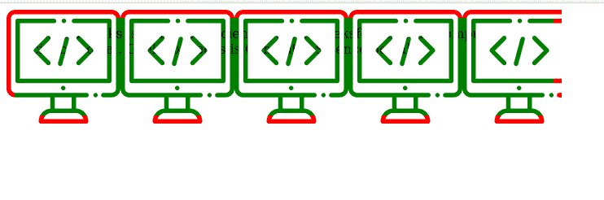
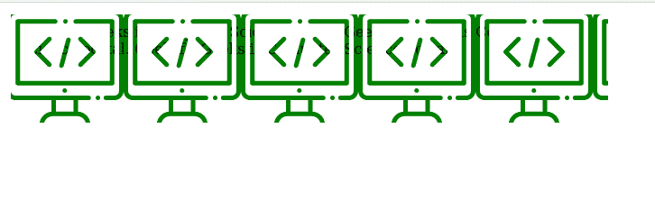

# CSS 遮罩剪辑属性

> 原文: [https://www.geeksforgeeks.org/css-mask-clip-property/](https://www.geeksforgeeks.org/css-mask-clip-property/)

## 蒙版剪辑

CSS 属性指定受蒙版影响的区域。

## 语法

```html
mask-clip: geometry-box values
/* Or */
mask-clip: Keyword values
/* Or */
mask-clip: Non-standard keyword values
/* Or */
mask-clip: Multiple values
/* Or */
mask-clip: Global values
```

## 属性值

该属性接受上面提到的和下面描述的值:

*   **几何框值:** 该属性值是指用`content-box`、`padding-box`、`border-box`、`margin-box`、`fill-box`、`stroke-box`、`view-box`等单位定义的值。
*   **关键字值:** 该属性值是指用`no-clip`等单位定义的值。
*   **非标准关键字值:** 该属性值是指用`border`、`padding`、`content`、`text`等单位定义的值。
*   **多个值:** 该属性值是指用`padding-box`、`no-clip`、`view-box`、`fill-box`、`border-box`等单位定义的值。
*   **全局值:** 该属性值是指用`inherit`、`initial`、`unset`等单位定义的值。

## 示例 1

以下示例使用`border-box`说明了**遮罩剪辑**属性:

```html
<!DOCTYPE html>
<html>

<head>
      <style>

.geeks{
              width:50%;
              height:100px;
              background:green;
              border:10px solid red;
              padding:10px;
              -webkit-mask-image:url(image.svg);
              mask-clip: border-box;
        }
        </style>
    </head>
<body>

<div class="geeks" >
          GeeksforGeeks is Computer Science portal.
          GeeksforGeeks is Computer Science portal.
          GeeksforGeeks is Computer Science portal.
    </div>

</body>

</html>
```

**输出:**



## 示例 2

以下示例使用`padding-box`说明了**遮罩剪辑**属性:

```html
<!DOCTYPE html>
<html>
    <head>
       <style>
          .geeks{
                width:50%;
                height:100px;
                background:green;
                border: 5px solid red;
                padding:10px;
                -webkit-mask-image:url(image.svg);
                mask-clip: padding-box;
          }

</style>
    </head>
<body>

<div class="geeks" >
            GeeksforGeeks is Computer Science portal.
            GeeksforGeeks is Computer Science portal.
            GeeksforGeeks is Computer Science portal.
      </div>

</body>

</html>
```

**输出:**



## 支持的浏览器

*   Chrome
*   Edge
*   Opera
*   Safari
*   Internet Explorer (不支持)。
*   Firefox (部分支持)。