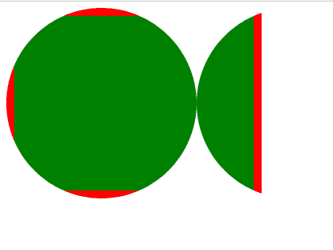
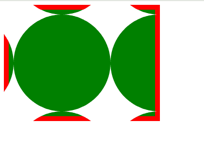

# CSS 遮罩原点属性

> 原文: [https://www.geeksforgeeks.org/css-mask-origin-property/](https://www.geeksforgeeks.org/css-mask-origin-property/)

`mask-origin` 属性设置遮罩图像相对于长方体模型不同组件的位置。

## 语法

```html
mask-origin: Keyword values
/* Or */
mask-origin: Multiple values
/* Or */
mask-origin: Non-standard keyword values
/* Or */
mask-origin: Global values
```

## 属性值

该属性接受上面提到的和下面描述的值:

*   **关键字值:** 该属性值是指用 `content-box`、`padding-box`、`margin-box`、`border-box`、`fill-box`、`stroke-box`、`view-box` 等单位定义的值。
*   **非标准关键字值:** 该属性值是指用 `padding`、`border`、`content` 等单位定义的值。
*   **多个值:** 该属性值是指用 `padding-box`、`fill-box`、`view-box`、`border-box` 等单位定义的值。
*   **全局值:** 该属性值是指用 `inherit`、`unset`、`initial` 等单位定义的值。

## 示例 1

以下是使用 `border-box` 说明 `mask-origin` 属性的示例。

```html
<!DOCTYPE html>
<html>

<head>
        <style>

.geeks{
              width: 22%;
              height: 200px;
              background: green;
              border: 10px solid red;
              padding: 10px;
              color:white;
              -webkit-mask-image: 
              url("image.svg");
              -webkit-mask-repeat:repeat;
              mask-origin: border-box;        
        }

</style>
    </head>
<body>

<div class="geeks"></div>

</body>

</html>
```

**输出:**



## 示例 2

以下是使用 `content-box` 说明 `mask-origin` 属性的示例。

```html
<!DOCTYPE html>
<html>

<head>
        <style>

.geeks{
              width: 22%;
              height: 200px;
              background: green;
              border: 10px solid red;
              padding: 10px;
              color:white;
              -webkit-mask-image: 
              url("image.svg");
              -webkit-mask-repeat:repeat;
              mask-origin: content-box;        
        }

</style>
    </head>
<body>

<div class="geeks"></div>

</body>

</html>
```

**输出:**



## 支持的浏览器

*   Chrome
*   Firefox
*   Safari
*   Edge
*   Opera
*   Internet Explorer (不支持)。