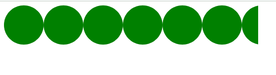
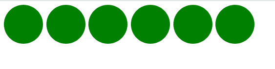

# CSS `mask-repeat` 属性

> 原文: [https://www.geeksforgeeks.org/css-mask-repeat-property/](https://www.geeksforgeeks.org/css-mask-repeat-property/)

CSS `mask-repeat` 属性设置遮罩图像在调整大小和位置后的放置方式。掩模图像可以沿垂直或水平或两个轴重复，也可以不重复。

## 语法

```html
mask-repeat: One-values
/* Or */
mask-repeat: Two-values
/* Or */
mask-repeat: Multiple values
/* Or */
mask-repeat: Global values
```

## 属性值

该属性接受上面提到的和下面描述的值：

### 一值
该属性值是指用 `space`、`round`、`repeat`、`repeat-x`、`repeat-y`、`no-repeat` 等单位定义的值。

### 双值
该属性值是指用 `repeat space`、`round space`、`repeat round` 等单位定义的值。

### 多个值
该属性值是指用 `space round`、`no-repeat` 等单位定义的值。

### 全局值
该属性值是指用 `inherit`、`initial`、`unset` 等单位定义的值。

## 示例 1

以下示例使用单值说明了 `mask-repeat` 属性：

```html
<!DOCTYPE html>
<html>

<head>
        <style>

.geeks{
                width: 40%;
                height:80px;
                background: green;
                -webkit-mask-image: 
                url("image.svg");
                mask-repeat: repeat-x;        
            }

</style>
    </head>

<body>

<div class="geeks"></div>

</body>

</html>
```

**输出:**



## 示例 2

以下示例使用双值说明了 `mask-repeat` 属性：

```html
<!DOCTYPE html>
<html>

<head>
        <style>

.geeks{
                width: 40%;
                height:80px;
                background: green;
                -webkit-mask-image: 
                url("image.svg");
                mask-repeat: space repeat;        
            }

</style>
    </head>
<body>

<div class="geeks"></div>

</body>

</html>
```

**输出:**



## 支持的浏览器

*   Chrome
*   Firefox
*   Safari
*   Opera
*   Edge
*   Internet Explorer (不支持)。