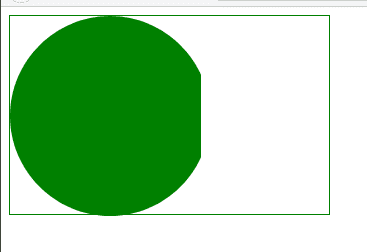
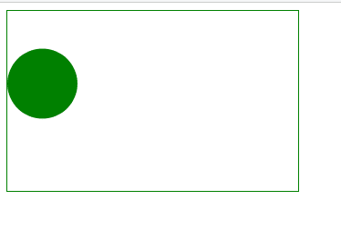

# CSS 掩码大小属性

> 原文: [https://www.geeksforgeeks.org/css-mask-size-property/](https://www.geeksforgeeks.org/css-mask-size-property/)

CSS `mask-size` 属性设置蒙版绘画区域上蒙版图像的大小。

## 语法

```html
mask-size: Keyword values
/* Or */
mask-size: One-values
/* Or */
mask-size: Two-values
/* Or */
mask-size: Multiple-values
/* Or */
mask-size: Global values
```

## 属性值

该属性接受上面提到的和下面描述的值:

*   **关键字值:** 该属性值是指用 `cover`、`contain` 等单位定义的值。
*   **单值:** 该属性值是指用 `%`、`em`、`px` 等单位定义的值。高度设置为 `auto`。它的基本语法是 `mask-size: 图像的宽度;`
*   **双值:** 该属性值是指用 `%`、`em`、`px` 等单位定义的值。高度设置为 `auto`。其基本语法是 `mask-size: 图像的宽度 图像的高度;`
*   **多个值:** 该属性值是指用 `%`、`px`、`em`、`auto` 等单位定义的值。
*   **全局值:** 该属性值是指用 `inherit`、`initial`、`unset` 等单位定义的值。

## 示例 1

以下示例使用单值说明了 `mask-size` 属性。

```html
<!DOCTYPE html>
<html>
<head>
    <style>
        .Container{
            width:25%;
            height:200px;
            box-sizing:border-box;
            border:1px solid green;    
        }
        .geeks{
            width: 60%;
            height:200px;
            background: green;
            -webkit-mask-image: url("image.svg");
            -webkit-mask-repeat:no-repeat;
            mask-size: cover;            
        }
    </style>
</head>
<body>
    <div class="Container">
        <div class="geeks"></div>
    </div>
</body>
</html>
```

**输出:**



## 示例 2

以下示例使用双值说明了 `mask-size` 属性。

```html
<!DOCTYPE html>
<html>
<head>
    <style>
        .Container{
            width:25%;
            height:200px;
            box-sizing:border-box;
            border:1px solid green;    
        }
        .geeks{
            width: 60%;
            height:200px;
            background: green;
            -webkit-mask-image: url("image.svg");
            -webkit-mask-repeat:no-repeat;
            mask-size: 40% 80%;            
        }
    </style>
</head>
<body>
    <div class="Container">
        <div class="geeks"></div>
    </div>
</body>
</html>
```

**输出:**



## 支持的浏览器

*   `Chrome`
*   `Firefox`
*   `Safari`
*   `Opera`
*   `Edge`
*   `Internet Explorer` (不支持)