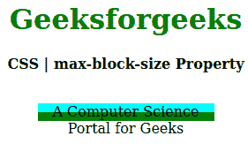
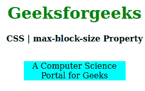

# CSS max-block-size 属性

> 原文: [https://www.geeksforgeeks.org/css-max-block-size-property/](https://www.geeksforgeeks.org/css-max-block-size-property/)

`max-block-size` 属性用于在与写入方向相反的方向上创建元素的最大大小。比如如果书写方向是水平的，那么 `max-block-size` 相当于 `max-height`，如果是垂直模式，那么等于 `max-width`。

## 语法

```html
max-block-size: length | percentage | auto | none | min-content | 
                max-content | fit-content | inherit | initial | unset;
```

## 属性值

*   `length`: 设置 `px`、`cm`、`pt` 等定义的固定值。允许负值。它的默认值是 `0px`。
*   `percentage`: 与 `length` 相同，但大小是根据窗口大小的百分比设置。
*   `auto`: 当希望浏览器确定块大小时使用。
*   `none`: 不想限制盒子大小时使用。
*   `max-content`: 当你喜欢盒子大小的最大宽度时使用。
*   `min-content`: 当你喜欢盒子大小的最小宽度时使用。
*   `fit-content`: 当你喜欢盒子大小的精确宽度时使用。
*   `initial`: 用于将 `max-block-size` 属性的值设置为默认值。
*   `inherit`: 当希望元素继承其父元素的 `max-block-size` 属性作为自己的属性时使用。
*   `unset`: 用于取消设置默认 `max-block-size`。

以下示例说明了 CSS 中的 `max-block-size` 属性。

## 示例

### 例 1

```html
<!DOCTYPE html> 
<html>

<head> 
    <title>CSS | max-block-size Property</title> 
    <style> 
        h1 { 
            color: green; 
        }

        div { 
            background-color: green; 
            width: 200px; 
            height: 20px; 
        }

        .one { 
            position: relative; 
            max-block-size: 10px; 
            background-color: cyan; 
        } 
    </style> 
</head>

<body> 
    <center> 
        <h1>Geeksforgeeks</h1> 
        <b>CSS | max-block-size Property</b> 
        <br> 
        <br> 
        <div> 
            <p class="one"> 
                A Computer Science Portal for Geeks 
            </p> 
        </div> 
    </center> 
</body>

</html>
```

**输出:**


### 例 2

```html
<!DOCTYPE html> 
<html>

<head> 
    <title>CSS | max-block-size Property</title> 
    <style> 
        h1 { 
            color: green; 
        }

        div { 
            background-color: green; 
            width: 200px; 
            height: 20px; 
        }

        .one { 
            position: relative; 
            max-block-size: auto; 
            background-color: cyan; 
        } 
    </style> 
</head>

<body> 
    <center> 
        <h1>Geeksforgeeks</h1> 
        <b>CSS | max-block-size Property</b> 
        <br> 
        <br> 
        <div> 
            <p class="one"> 
                A Computer Science Portal for Geeks 
            </p> 
        </div> 
    </center> 
</body>

</html>
```

**输出:**


## 支持的浏览器

`max-block-size` 属性支持的浏览器如下:

*   Firefox
*   Google Chrome
*   Edge
*   Opera

## 参考

[https://developer.mozilla.org/en-US/docs/Web/CSS/max-block-size](https://developer.mozilla.org/en-US/docs/Web/CSS/max-block-size)