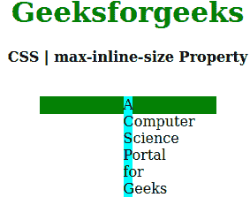
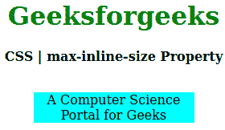

# CSS max-inline-size 属性

> 原文：[https://www.geeksforgeeks.org/css-max-inline-size-property/](https://www.geeksforgeeks.org/css-max-inline-size-property/)

CSS `max-inline-size` 属性用于在与写入方向相反的方向上设置元素的最大尺寸。例如，如果书写方向是水平的，那么 `max-inline-size` 相当于 `max-height`；如果是垂直模式，则等于 `max-width`。

## 语法

```html
max-inline-size: length | percentage | auto | none | min-content | max-content | fit-content | inherit | initial | unset;
```

## 属性值

*   `length`：设置由 `px`、`cm`、`pt` 等单位定义的固定值。允许负值。默认值是 `0px`。
*   `percentage(%)`：与长度相同，但大小是根据窗口大小的百分比设置的。
*   `auto`：当希望浏览器确定块大小时使用。
*   `none`：不想限制盒子大小时使用。
*   `max-content`：当你喜欢盒子大小的最大宽度时使用。
*   `min-content`：当你喜欢盒子大小的最小宽度时使用。
*   `fit-content`：当你喜欢盒子大小的精确宽度时使用。
*   `initial`：用于将 `max-inline-size` 属性的值设置为默认值。
*   `inherit`：当希望元素继承其父元素的 `max-inline-size` 属性作为自己的属性时使用。
*   `unset`：用于取消设置默认的 `max-inline-size`。

## 示例

以下示例说明了 CSS 中的 `max-inline-size` 属性。

### 示例 1

```html
<!DOCTYPE html>
<html>
<head>
    <title>CSS | max-inline-size Property</title>
    <style>
        h1 {
            color: green;
        }
        div {
            background-color: green;
            width: 200px;
            height: 20px;
        }
        .one {
            position: relative;
            max-inline-size: 10px;
            background-color: cyan;
        }
    </style>
</head>
<body>
    <center>
        <h1>Geeksforgeeks</h1>
        <b>CSS | max-inline-size Property</b>
        <br>
        <br>
        <div>
            <p class="one">
                A Computer Science Portal for Geeks
            </p>
        </div>
    </center>
</body>
</html>
```

**输出：**


### 示例 2

```html
<!DOCTYPE html>
<html>
<head>
    <title>CSS | max-inline-size Property</title>
    <style>
        h1 {
            color: green;
        }
        div {
            background-color: green;
            width: 200px;
            height: 20px;
        }
        .one {
            position: relative;
            max-inline-size: auto;
            background-color: cyan;
        }
    </style>
</head>
<body>
    <center>
        <h1>Geeksforgeeks</h1>
        <b>CSS | max-inline-size Property</b>
        <br>
        <br>
        <div>
            <p class="one">
                A Computer Science Portal for Geeks
            </p>
        </div>
    </center>
</body>
</html>
```

**输出：**


## 支持的浏览器

`max-inline-size` 属性支持的浏览器如下：

*   Firefox
*   Google Chrome
*   Edge
*   Opera

## 参考

[https://developer.mozilla.org/en-US/docs/Web/CSS/max-inline-size](https://developer.mozilla.org/en-US/docs/Web/CSS/max-inline-size)