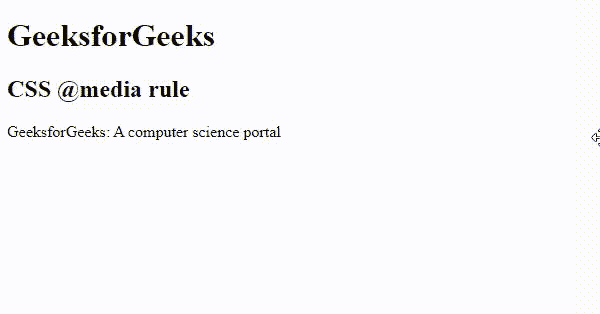

# CSS @媒体规则

> 原文: [https://www.geeksforgeeks.org/css-media-rule/](https://www.geeksforgeeks.org/css-media-rule/)

`@media` [CSS at-rule](https://www.geeksforgeeks.org/css-at-rules/) 用于使用 [Media query](https://www.geeksforgeeks.org/css-media-queries/) 为不同的媒体/设备应用不同的样式集。媒体查询主要用于检查设备的高度、宽度、分辨率和方向(纵向/横向)。这一 CSS 规则通过为特定屏幕类型或设备(如智能手机、个人电脑)提供更优化的设计，为响应性设计提供了一条出路。媒体查询也可用于仅为打印文档或屏幕阅读器指定某些样式。

## 语法

```html
@media not|only mediatype and (media feature and|or|not mediafeature) 
{
    // CSS Property
}
```

## 使用的关键词

*   `not`: 它恢复整个媒体查询。
*   `only`: 防止旧浏览器(不支持的浏览器)应用指定的样式。
*   `and`: 用于组合两种媒体类型或媒体功能。

## 媒体类型

*   `all`: 默认媒体类型。它用于所有媒体类型设备。
*   `print`: 用于打印机设备。
*   `screen`: 用于电脑屏幕、手机屏幕等。
*   `speech`: 用于阅读页面的屏幕阅读器。

## 媒体功能

媒体查询中有很多媒体功能，下面列出了其中一些:

*   `any-hover`: 任何可用的输入机制都允许用户悬停在任何元素上。
*   `any-pointer`: 它定义任何可用的输入机制为指向设备，如果是，它有多准确？
*   `aspect-ratio`: 用于设置视口的宽高比。
*   [`color`](https://www.geeksforgeeks.org/css-colors/): 用于设置输出设备的颜色成分。
*   `color-gamut`: 用于设置用户代理或输出设备支持的颜色范围。
*   `color-index`: 用于设置设备可以显示的颜色数量。
*   [`grid`](https://www.geeksforgeeks.org/css-grid-property/): 用于指定行和列的大小。
*   [`height`](https://www.geeksforgeeks.org/css-height-property/): 用于设置视口的高度。
*   `hover`: 它允许用户悬停在任何元素上。
*   `inverted-colors`: 这定义了任何设备是否反转颜色。
*   `light-level`: 定义光照水平。
*   `max-aspect-ratio`: 用于设置最大宽高比。
*   `max-color`: 用于设置输出设备每个颜色分量的最大位数。
*   `max-color-index`: 用于设置设备可以显示的最大颜色数。
*   [`max-height`](https://www.geeksforgeeks.org/css-max-height-property/): 设置浏览器显示区域的最大高度。
*   `max-monochrome`: 用于设置单色设备上每个“颜色”的最大位数。
*   `max-resolution`: 用于设置输出设备的最大分辨率。
*   [`max-width`](https://www.geeksforgeeks.org/css-max-width-property/): 设置浏览器显示区域的最大宽度。
*   `min-aspect-ratio`: 用于设置最小宽高比。
*   `min-color`: 用于设置输出设备每个颜色分量的最小位数。
*   `min-color-index`: 用于设置设备可以显示的最小颜色数。
*   [`min-height`](https://www.geeksforgeeks.org/css-min-height-property/): 设置浏览器显示区域的最小高度。
*   `min-monochrome`: 用于设置单色设备上每个“颜色”的最小位数。
*   `min-resolution`: 用于设置输出设备的最小分辨率。
*   [`min-width`](https://www.geeksforgeeks.org/css-min-width-property/): 设置浏览器显示区域的最小宽度。
*   `monochrome`: 用于设置单色设备上每个“颜色”的位数。
*   `orientation`: 用于设置视口的方向，即横向或纵向。
*   `overflow-block`: 用于控制内容溢出视口的情况。
*   `overflow-inline`: 用于控制内容沿着待滚动的内联轴溢出视口的情况。
*   `pointer`: 它是指向设备的主要输入机制。
*   [`resolution`](https://www.geeksforgeeks.org/css-value-resolution/): 使用 `dpi` 或 `dpcm` 设置设备的分辨率。
*   `scan`: 用于做输出设备的扫描过程。
*   `script`: 有没有类似 `JS` 这样的脚本可用。
*   `update`: 用于快速更新更新输出设备。
*   [`width`](https://www.geeksforgeeks.org/css-width-property/): 用于设置视口的宽度。

## 示例

该示例说明了使用 `@media` 规则基于一个或多个媒体查询的结果来实现各种样式属性。`@media` 规则仅在媒体查询与使用内容的设备相匹配时有效。

### HTML

```html
<!DOCTYPE html>
<html>

<head>
    <title> CSS @media rule </title>
    <style>
    @media screen and (max-width: 600px) {
        h1,
        h2 {
            color: green;
            font-size: 25px;
        }
        p {
            background-color: green;
            color: white;
        }
    }
    </style>
</head>

<body>
    <h1>GeeksforGeeks</h1>
    <h2>CSS @media rule</h2>

<p>GeeksforGeeks: A computer science portal</p>

</body>

</html>
```

## 输出

从输出中我们可以看到，当屏幕宽度调整到小于等于 `600px` 时，那么文本颜色也会变为绿色。



## 支持的浏览器

`@media` 规则支持的浏览器如下:

*   `Google Chrome 21.0`
*   `Internet Explorer 9.0`
*   `Microsoft Edge`
*   `Firefox 3.5`
*   `Opera 9`
*   `Safari 4.0`