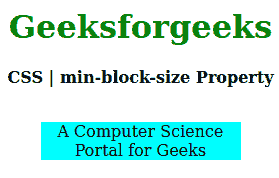
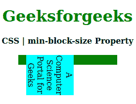

# CSS `min-block-size` 属性

> 原文: [https://www.geeksforgeeks.org/css-min-block-size-property/](https://www.geeksforgeeks.org/css-min-block-size-property/)

CSS 中的 `min-block-size` 属性用于创建元素的最小水平或垂直大小。如果书写方向是水平的，那么 `min-block-size` 相当于 `min-height` 属性，如果是垂直模式，那么等于 `min-width` 属性。

## 语法:

```html
min-block-size: length| percentage| auto| none| min-content| 
                max-content| fit-content| inherit| initial| unset;
```

## 属性值:

*   `length`: 设置 `px`、`cm`、`pt` 等定义的固定值。也允许负值。它的默认值是 `0px`。
*   `percentage`: 与 `length` 相同，但大小是根据窗口大小的百分比设置的。
*   `auto`: 当希望浏览器确定块大小时使用。
*   `none`: 不想限制盒子大小时使用。
*   `max-content`: 当你喜欢盒子大小的最小宽度时使用。
*   `min-content`: 当你喜欢盒子大小的最小宽度时使用。
*   `fit-content`: 当你喜欢盒子大小的精确宽度时使用。
*   `initial`: 用于将 `min-block-size` 属性的值设置为默认值。
*   `inherit`: 当希望元素从其父元素继承 `min-block-size` 属性时使用。
*   `unset`: 用于取消设置默认混合块大小。

以下示例说明了 CSS 中的 `min-block-size` 属性:

## 示例 1:

```html
<!DOCTYPE html> 
<html>

<head> 
    <title>CSS | min-block-size Property</title> 
    <style> 
        h1 { 
            color: green; 
        }

        div { 
            background-color: green; 
            width: 200px; 
            height: 20px; 
        }

        .one { 
            position: relative; 
            min-block-size: 10px; 
            background-color: cyan; 
        } 
    </style> 
</head>

<body> 
    <center> 
        <h1>Geeksforgeeks</h1> 
        <b>CSS | min-block-size Property</b> 
        <br><br> 
        <div> 
            <p class="one"> 
                A Computer Science Portal for Geeks 
            </p> 
        </div> 
    </center> 
</body>

</html>
```

**输出:**


## 示例 2:

```html
<!DOCTYPE html> 
<html>

<head> 
    <title>CSS | min-block-size Property</title> 
    <style> 
        h1 { 
            color: green; 
        }

        div { 
            background-color: green; 
            width: 200px; 
            height: 20px; 
        }

        .one { 
            position: relative; 
            writing-mode: vertical-rl;
            min-block-size: auto; 
            background-color: cyan; 
        } 
    </style> 
</head>

<body> 
    <center> 
        <h1>Geeksforgeeks</h1> 
        <b>CSS | min-block-size Property</b> 
        <br><br> 
        <div> 
            <p class="one"> 
                A Computer Science Portal for Geeks 
            </p> 
        </div> 
    </center> 
</body>

</html>
```

**输出:**


## 支持的浏览器:

`min-block-size` 属性支持的浏览器如下:

*   `Firefox`
*   `Google Chrome`
*   `Edge`
*   `Opera`

## 参考:

[https://developer.mozilla.org/en-US/docs/Web/CSS/min-block-size](https://developer.mozilla.org/en-US/docs/Web/CSS/min-block-size)